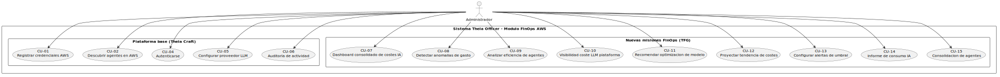
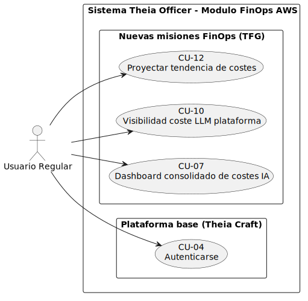
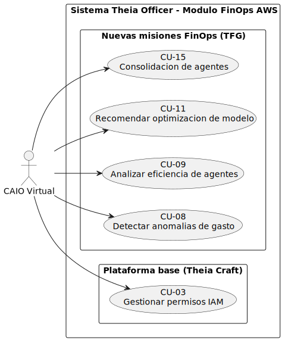
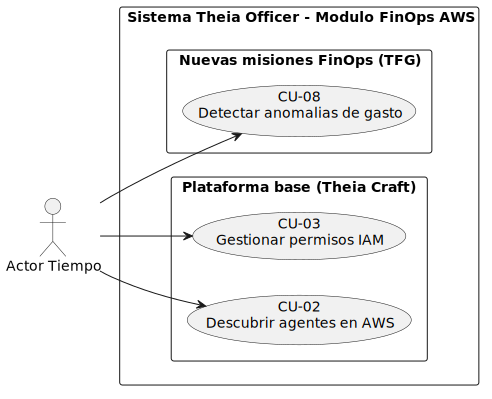
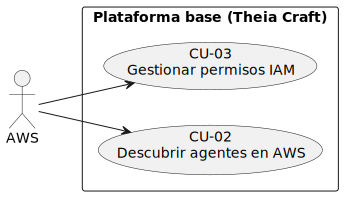
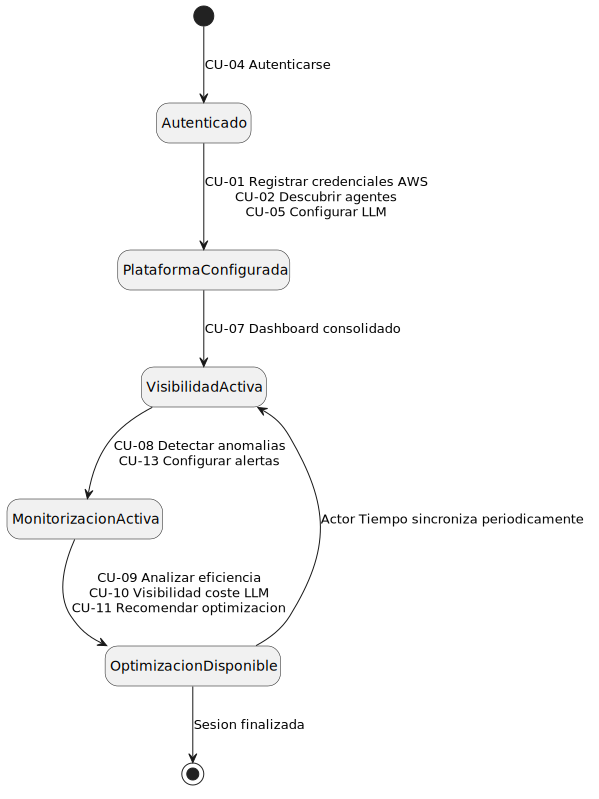

# 3. Modelo del Dominio y Disciplina de Requisitos

## 3.1 Introducción

El modelo del dominio es una representación visual de las clases conceptuales más importantes del mundo real en el contexto de la solución que se está desarrollando. No se trata de las clases del software ni de los objetos que lo implementan, sino de las abstracciones del negocio: ideas, entidades y relaciones que existen en la realidad del problema que se quiere resolver.

Como se identificó en el capítulo anterior, el problema central de este TFG es la falta de visibilidad y control financiero sobre los agentes de IA desplegados en la nube. El modelo de dominio recoge exactamente esas entidades: quién usa la plataforma, qué agentes tiene, cuánto cuestan y cómo se gobiernan. Se ha construido a partir del sistema real ya implementado en Theia Craft y se centra exclusivamente en el subdominio FinOps sobre AWS. El dominio abarca desde las entidades organizacionales básicas hasta las entidades específicas de control financiero: agentes de IA en Amazon Bedrock, misiones autónomas de seguimiento de costes, datos de facturación de AWS Cost Explorer y registros de uso de los propios modelos de lenguaje.

## 3.2 Clases conceptuales del dominio

A continuación se describen las clases conceptuales identificadas, agrupadas por área de responsabilidad.

### 3.2.1 Entidades organizacionales

**Organización:**
Representa a la empresa cliente que contrata y utiliza la plataforma. Es la unidad raíz del sistema: toda la información queda aislada por organización, garantizando que los datos de un cliente nunca son visibles para otro. Sus atributos más relevantes para el dominio FinOps son el nombre, la industria, el tamaño y el nivel de tolerancia al riesgo, datos que informan las recomendaciones del CAIO Virtual.

**Usuario:**
Una persona que interactúa con la plataforma. Pertenece a una organización y tiene uno de dos roles: administrador, con capacidad para configurar credenciales y lanzar misiones, o usuario regular, con acceso de solo lectura a los datos de coste.

### 3.2.2 Entidades cloud y de descubrimiento

**Credencial AWS:**
Las claves de acceso que permiten al sistema conectarse a los servicios de AWS en nombre de la organización. Son la puerta de entrada a todos los servicios cloud: sin una credencial válida no es posible descubrir agentes ni acceder a los datos de facturación.

**Agente de IA (Trabajador Digital):**
Un agente de Inteligencia Artificial descubierto y registrado en la plataforma. En AWS corresponde a un agente orquestado por Amazon Bedrock. Sus atributos clave son el nombre, el estado de actividad, la región de despliegue y el modelo fundacional que utiliza.

### 3.2.3 Entidades de misiones FinOps

**Misión FinOps:**
Una tarea autónoma que ejecuta el CAIO Virtual para llevar a cabo operaciones de seguimiento y optimización de costes. Sus atributos principales son el tipo de misión, el estado del ciclo de vida y el modo de ejecución (puntual o continuo). Los permisos de acceso que necesita son siempre temporales, lo que garantiza que el sistema opera bajo el principio de mínimo privilegio.

**Evento de Permiso:**
Una entrada inmutable del registro que se crea cada vez que cambian los permisos asociados a una misión. Registra la acción realizada, el rol afectado y el tipo de permiso. Garantiza la trazabilidad completa de todas las operaciones de acceso, requisito imprescindible para auditorías financieras.

### 3.2.4 Entidades de control financiero

**Dato de Facturación:**
Un registro del coste real de un agente de IA en AWS durante un periodo determinado, obtenido de AWS Cost Explorer. Sus atributos conceptuales son el recurso al que se refiere, el periodo cubierto, el importe y la moneda. Cada registro es único por combinación de organización, recurso y periodo.

**Registro de Uso de LLM:**
Un log de cada llamada a un modelo de lenguaje realizada desde la propia plataforma. Registra los tokens consumidos, el coste estimado, el proveedor y la fuente que originó la llamada. Cierra el círculo del control financiero: no solo se controla el gasto de los agentes del cliente, sino también el gasto que la plataforma genera al usar IA para gobernarlos.

**Configuración LLM:**
La configuración del proveedor de inteligencia artificial de la organización. Define qué modelo se usa para cada rol funcional: el rol de *razonamiento* (para análisis profundos) y el rol de *conversación* (para el chat con el CAIO Virtual). Una organización puede tener configurados varios proveedores simultáneamente.

### 3.2.5 Entidades de soporte

**Registro de Auditoría:**
Una traza inmutable de las operaciones relevantes realizadas en la plataforma: operaciones de análisis FinOps, cambios en credenciales y modificaciones de políticas. Es de solo escritura: nunca se modifica ni elimina, garantizando una pista de auditoría fiable para cumplimiento normativo.

## 3.3 Diagrama de clases del dominio

El siguiente diagrama muestra las clases conceptuales del dominio FinOps/AWS, sus atributos principales y las asociaciones entre ellas. La relación central es la que une el Agente de IA con el Dato de Facturación a través de la Organización: todo gasto registrado pertenece a un agente concreto dentro del contexto de una organización, lo que hace posible el desglose por agente que exigen las nuevas misiones. Merece la pena fijarse también en el Registro de Uso de LLM, que cierra un bucle que raramente aparece en soluciones FinOps convencionales: no solo se controla lo que gastan los agentes del cliente, sino también lo que gasta la propia plataforma al gobernarlos.

| Diagrama | Código Fuente |
| :--- | :--- |
|  | [Ver código PlantUML](./MdD/DiagramaClases/MdD.puml) |

## 3.4 Diagrama de objetos

El diagrama de objetos lleva el modelo abstracto a tierra firme: muestra cómo quedarían enlazados los datos reales de una organización concreta. La organización ficticia *Empresa_A* tiene dos agentes Bedrock activos en AWS, una misión de seguimiento en curso y los registros de facturación del último mes ya disponibles. El objetivo es verificar que el modelo de clases es consistente y que las relaciones tienen sentido cuando se instancian con datos reales, antes de pasar al diseño del sistema.

| Diagrama | Código Fuente |
| :--- | :--- |
|  | [Ver código PlantUML](./MdD/DiagramaObjetos/DdO.puml) |

## 3.5 Diagramas de estados

### 3.5.1 Estados de una Misión FinOps

Una misión FinOps no es simplemente una tarea que se ejecuta y termina: tiene un ciclo de vida con estados bien definidos que reflejan en cada momento qué permisos tiene activos y qué está haciendo. La transición más relevante es la secuencia `in_progress` → `waiting_reduction` → `monitoring`: una vez que la tarea concluye, el sistema reduce automáticamente los permisos IAM sin que el administrador tenga que intervenir, y si la misión es de tipo continuo, pasa al estado `monitoring` donde se mantiene activa con salud verificable. Si la misión opera sobre varios proyectos, puede pasar por `partial_complete` cuando solo algunos han terminado, o directamente a `complete` si es de tipo puntual; ambos estados convergen en `waiting_reduction` para la reducción de permisos. Cuando el *health check* falla, la misión transita a `degraded` y puede recuperarse si el problema se resuelve.

| Diagrama | Código Fuente |
| :--- | :--- |
|  | [Ver código PlantUML](./MdD/DiagramasEstado/MisionFinOps/MisionFinOps.puml) |

### 3.5.2 Estados de un Agente Bedrock

Amazon Bedrock expone sus propios estados internos para los agentes, que no siempre son intuitivos ni consistentes con el vocabulario de negocio. Este diagrama documenta cómo se mapean esos estados al vocabulario común de la plataforma. La razón práctica es que las nuevas misiones FinOps necesitan saber si un agente está activo para decidir si tiene sentido analizar su gasto; sin esta normalización, cada proveedor requeriría lógica específica y el análisis multi-cloud se volvería inmanejable.

| Diagrama | Código Fuente |
| :--- | :--- |
|  | [Ver código PlantUML](./MdD/DiagramasEstado/AgenteBedrock/AgenteBedrock.puml) |

## 3.6 Glosario del dominio FinOps

El glosario completo de términos del dominio FinOps se encuentra en el archivo [Glosario.md](./Glosario.md).

## 3.7 Requisitos suplementarios

Los requisitos suplementarios, también denominados no funcionales, especifican propiedades del sistema que no se expresan como comportamientos observables sino como restricciones de entorno, implementación o calidad.

| Categoría | Requisito |
| :--- | :--- |
| **Seguridad** | Las credenciales AWS se cifran en reposo. Nunca se devuelven en texto plano en ninguna respuesta de la API. |
| **Seguridad** | Los permisos de acceso para las misiones son siempre temporales: se adjuntan al inicio de la misión y se eliminan automáticamente al finalizar o tras un periodo de inactividad configurable. Implementa el principio de mínimo privilegio. |
| **Seguridad** | La autenticación en la plataforma es sin contraseña: se envía un código al correo electrónico del usuario, válido durante un tiempo limitado. El acceso se protege mediante token firmado. |
| **Rendimiento** | Todas las operaciones sobre APIs externas tienen timeouts definidos para garantizar que un fallo del proveedor no bloquea el sistema indefinidamente. |
| **Rendimiento** | Las misiones con ciclo de vida continuo ejecutan sus análisis de forma periódica con un intervalo configurable, sin requerir intervención del administrador. |
| **Multi-tenancy** | Toda consulta a la base de datos queda obligatoriamente acotada a la organización del usuario autenticado, garantizando el aislamiento completo de datos entre clientes. |
| **Trazabilidad** | Los Eventos de Permiso y los Registros de Auditoría son inmutables: nunca se actualizan ni se eliminan. Garantizan una pista de auditoría fiable para cumplimiento normativo y auditorías financieras. |
| **Idempotencia** | Las operaciones de recopilación de datos pueden ejecutarse varias veces sobre el mismo periodo sin generar registros duplicados. |
| **Extensibilidad** | El sistema de conectores permite incorporar nuevos proveedores cloud sin modificar el código existente. Aunque este TFG se centra en AWS, la arquitectura no debe impedir que en el futuro se añadan GCP o Azure con el mismo nivel de análisis FinOps. |

---

## 3.8 Introducción

Una vez definido el modelo de dominio, la disciplina de requisitos concreta qué debe hacer el sistema desde la perspectiva de los actores que interactúan con él. Las misiones FinOps identificadas en los apartados anteriores como respuesta al problema de visibilidad de costes se traducen aquí en casos de uso concretos, priorizados y trazables. Se adopta un enfoque en dos capas diferenciadas:

- **Capa base (Theia Craft)**: funcionalidades ya implementadas en la plataforma Theia Officer por el equipo de Theia Craft. Se documentan como dependencias preexistentes sobre las que se construirá el trabajo de este TFG.
- **Nuevas misiones FinOps (TFG)**: casos de uso diseñados e implementados en el marco de este trabajo. Constituyen la aportación principal y extienden la plataforma con capacidades de visibilidad y optimización de costes de inteligencia artificial.

El sistema que se especifica es el módulo de Misiones FinOps de Theia Officer, con foco en la plataforma AWS.

## 3.9 Actores del sistema

Un actor representa el rol que adopta una entidad externa cuando interactúa con el sistema. Los actores no son personas concretas sino roles: el mismo usuario puede actuar como Administrador en un contexto y como Usuario Regular en otro.

| Actor | Tipo | Descripción |
| :--- | :--- | :--- |
| **Administrador** | Primario | Gestor de la organización. Configura las credenciales AWS, lanza misiones y accede a todas las funcionalidades de análisis y configuración. |
| **Usuario Regular** | Primario | Empleado de la organización. Puede consultar costes y visualizar los dashboards, pero no puede modificar la configuración del sistema. |
| **CAIO Virtual** | Sistema | El agente de IA de la plataforma. Ejecuta misiones de forma autónoma, analiza patrones de gasto y responde a consultas sobre costes. |
| **AWS** | Externo | Proveedor de nube. Expone las APIs de Cost Explorer, Bedrock, IAM y STS que la plataforma base consume para obtener datos de facturación y gestionar agentes. |
| **Actor Tiempo** | Temporal | Representa la ejecución de tareas programadas: sincronizaciones periódicas, análisis automáticos y reducción de permisos inactivos. |

## 3.10 Plataforma base — Capacidades existentes (Theia Craft)

Las siguientes capacidades están implementadas en el repositorio por el equipo de Theia Craft. **No son aportación de este TFG**, pero son prerequisito funcional para las nuevas misiones.

| ID | Capacidad | Actor principal | Estado | Relevancia para las nuevas misiones |
| :--- | :--- | :--- | :--- | :--- |
| CU-01 | Registrar credenciales AWS | Administrador | ✅ Theia Craft | Prerequisito: sin credenciales no hay acceso a datos |
| CU-02 | Descubrir agentes en AWS | Administrador / Actor Tiempo | ✅ Theia Craft | Proporciona el catálogo de agentes sobre el que operar |
| CU-03 | Gestionar permisos IAM | CAIO Virtual | ✅ Theia Craft | Infraestructura de seguridad reutilizable por nuevas misiones |
| CU-04 | Autenticarse en la plataforma | Administrador / Usuario Regular | ✅ Theia Craft | Identifica la organización del usuario y acota los datos de coste visibles |
| CU-05 | Configurar proveedor LLM | Administrador | ✅ Theia Craft | El CAIO Virtual necesita un proveedor LLM para ejecutar los análisis y las recomendaciones |
| CU-06 | Auditoría de actividad | Administrador | ✅ Theia Craft | Registra las operaciones de las nuevas misiones para trazabilidad y cumplimiento normativo |

## 3.11 Nuevas misiones FinOps — Contribución del TFG

Los siguientes casos de uso representan la contribución de este TFG. Se han priorizado mediante **MoSCoW** atendiendo al valor de visibilidad y optimización de costes que aportan y a las dependencias entre ellos.

### Must — Visibilidad de costes

| ID | Nombre | Actor principal | Descripción |
| :--- | :--- | :--- | :--- |
| CU-07 | Dashboard consolidado de costes IA | Administrador / Usuario Regular | Vista central con KPIs de gasto IA, desglose por agente y evolución temporal. Responde a F1 y F3. |
| CU-08 | Detectar y alertar anomalías de gasto | CAIO Virtual / Actor Tiempo | Detecta picos de gasto inusuales respecto al histórico y genera alertas proactivas. Responde a F4. |

### Should — Optimización de costes

| ID | Nombre | Actor principal | Descripción |
| :--- | :--- | :--- | :--- |
| CU-09 | Analizar eficiencia de agentes | CAIO Virtual | Ranking de agentes por ratio coste/uso; marca candidatos a optimización. Responde a F2. |
| CU-10 | Visibilidad del coste LLM de la plataforma | Administrador / Usuario Regular | Muestra cuánto cuesta operar el propio CAIO Virtual, cerrando el círculo del control financiero. |
| CU-11 | Recomendar optimización de modelo | CAIO Virtual | Detecta si agentes usan modelos costosos para tareas que un modelo más económico resolvería igual. Responde a F5. |

### Could — Proyección y configuración

| ID | Nombre | Actor principal | Descripción |
| :--- | :--- | :--- | :--- |
| CU-12 | Proyectar tendencia de costes | Administrador / Usuario Regular | Estimación de gasto futuro a partir del histórico disponible. Responde a F10. |
| CU-13 | Configurar alertas de umbral de gasto | Administrador | Permite definir límites de gasto por agente o periodo y recibir notificaciones al superarlos. Responde a F4 y F9. |

### Won't (esta iteración)

| ID | Nombre | Actor principal | Descripción |
| :--- | :--- | :--- | :--- |
| CU-14 | Informe de consumo IA | Administrador | Generación automática de informes de consumo IA para la dirección. Responde a F11. |
| CU-15 | Consolidación de catálogo de agentes | CAIO Virtual | Detecta agentes duplicados o con fuentes de datos redundantes y recomienda consolidación. Responde a F6, F7 y F8. |

## 3.12 Diagramas de Casos de Uso

Se presentan cinco diagramas, uno por actor, mostrando los casos de uso de la plataforma base (Theia Craft) y las nuevas misiones FinOps con los que cada actor interactúa. Dividir el diagrama por actor en lugar de hacer uno único con los quince casos de uso es una decisión deliberada: un solo diagrama de esa escala sería ilegible, y lo que realmente importa es entender qué puede hacer cada rol y qué es nuevo en este TFG.

### 3.12.1 Administrador

El Administrador es el actor con mayor alcance: configura la plataforma base y tiene acceso a todas las nuevas misiones FinOps, tanto las de visibilidad como las de optimización y configuración. Es el principal destinatario de las alertas y los informes generados por el CAIO Virtual.

| Diagrama | Código Fuente |
| :--- | :--- |
|  | [Ver código PlantUML](./CdU/Administrador/Administrador.puml) |

### 3.12.2 Usuario Regular

El Usuario Regular tiene un acceso más restringido: puede consumir los dashboards y proyecciones de costes, pero no puede modificar la configuración ni lanzar misiones. Es el perfil pensado para un analista financiero o un responsable de área que necesita visibilidad sin necesidad de intervenir en la operativa.

| Diagrama | Código Fuente |
| :--- | :--- |
|  | [Ver código PlantUML](./CdU/UsuarioRegular/UsuarioRegular.puml) |

### 3.12.3 CAIO Virtual

El CAIO Virtual actúa como sistema autónomo, no como usuario. Su diagrama concentra los casos de uso que requieren razonamiento: la gestión de permisos IAM de la plataforma base y el grueso de las misiones de análisis nuevas. No visualiza datos, los produce.

| Diagrama | Código Fuente |
| :--- | :--- |
|  | [Ver código PlantUML](./CdU/CAIOVirtual/CAIOVirtual.puml) |

### 3.12.4 Actor Tiempo

El Actor Tiempo representa la ejecución programada. Su papel es disparar los análisis periódicos que no requieren intervención humana: el descubrimiento continuo de agentes y la detección automática de anomalías de gasto. Sin este actor, las misiones de monitorización continua no tendrían cómo ejecutarse.

| Diagrama | Código Fuente |
| :--- | :--- |
|  | [Ver código PlantUML](./CdU/ActorTiempo/ActorTiempo.puml) |

### 3.12.5 AWS

AWS es un actor externo que no inicia ninguna interacción: responde a las llamadas de la plataforma. Su diagrama muestra únicamente los casos de uso de la capa base que dependen directamente de sus APIs, y confirma que las nuevas misiones FinOps no requieren que AWS cambie nada: operan sobre los datos que la plataforma ya recopila.

| Diagrama | Código Fuente |
| :--- | :--- |
|  | [Ver código PlantUML](./CdU/AWS/AWS.puml) |

## 3.13 Diagrama de contexto de las nuevas misiones

Este es el diagrama más útil para entender cómo encajan los casos de uso en el tiempo. Mientras los diagramas de la sección anterior muestran qué puede hacer cada actor, este muestra cuándo: los estados por los que pasa el sistema desde que un usuario se autentica hasta que el ciclo de optimización está activo. El punto de entrada es CU-04 (autenticación), tras el cual CU-01 y CU-02 configuran la plataforma base. Solo entonces es posible activar el dashboard (CU-07) y, a partir de ahí, la monitorización continua y la optimización. Una vez en marcha, el ciclo se retroalimenta periódicamente gracias al Actor Tiempo.

| Diagrama | Código Fuente |
| :--- | :--- |
|  | [Ver código PlantUML](./CdU/DiagramaContexto/Contexto.puml) |

## 3.14 Detalle de las nuevas misiones Must y Should (CU-07 a CU-11)

### CU-07 — Dashboard consolidado de costes IA

| Campo | Detalle |
| :--- | :--- |
| **Actor principal** | Administrador / Usuario Regular |
| **Actores secundarios** | — |
| **Precondiciones** | Existen Datos de Facturación disponibles en el sistema. |
| **Postcondiciones** | El usuario visualiza KPIs consolidados de gasto IA, desglose por agente y modelo, y evolución temporal del gasto. |

**Camino básico:**
1. El usuario accede al dashboard de costes IA.
2. El sistema agrega los Datos de Facturación del periodo seleccionado por proveedor, agente y modelo.
3. El sistema calcula los KPIs principales: coste total, agente más costoso, modelo más utilizado y variación respecto al periodo anterior.
4. El sistema presenta los KPIs, la tabla de desglose y la gráfica de evolución temporal.
5. El usuario puede filtrar por agente, modelo o rango de fechas y los datos presentados se ajustan a la selección.

**Caminos alternativos:**
- **2a.** No existen datos para el periodo seleccionado: el dashboard muestra los KPIs a cero y sugiere ejecutar una sincronización de facturación.
- **2b.** Solo existe un proveedor con datos: el desglose por proveedor se omite y se muestra directamente el desglose por agente.

---

### CU-08 — Detectar y alertar anomalías de gasto

| Campo | Detalle |
| :--- | :--- |
| **Actor principal** | CAIO Virtual / Actor Tiempo |
| **Actores secundarios** | Administrador |
| **Precondiciones** | Existen Datos de Facturación de al menos dos semanas para calcular una media histórica significativa. |
| **Postcondiciones** | Las anomalías detectadas quedan registradas. El administrador recibe una notificación con el agente afectado, el gasto observado y la desviación respecto a la media. |

**Camino básico:**
1. El Actor Tiempo dispara el análisis periódico de anomalías.
2. El CAIO Virtual calcula la media y la desviación típica de gasto por agente para el histórico disponible.
3. Para cada agente, compara el gasto del periodo reciente con el umbral estadístico calculado.
4. Si un agente supera el umbral, genera una alerta con el agente afectado, el importe observado y la desviación porcentual.
5. La alerta queda registrada en el Registro de Auditoría y se notifica al administrador.

**Caminos alternativos:**
- **2a.** Histórico insuficiente para calcular la media: el sistema omite el análisis y registra que no hay suficientes datos, sin generar alertas falsas.
- **4a.** No se detecta ninguna anomalía: el análisis concluye sin notificaciones.

---

### CU-09 — Analizar eficiencia de agentes

| Campo | Detalle |
| :--- | :--- |
| **Actor principal** | CAIO Virtual |
| **Actores secundarios** | Administrador |
| **Precondiciones** | Existen Datos de Facturación sincronizados y Registros de Uso de LLM asociados a los agentes. |
| **Postcondiciones** | Se genera un ranking de agentes ordenado por ratio coste/uso. Los agentes con ratio elevado quedan marcados como candidatos a optimización. |

**Camino básico:**
1. El CAIO Virtual analiza la relación entre el coste y el volumen de uso de cada agente.
2. Calcula el ratio coste/uso para cada agente del periodo analizado.
3. Ordena los agentes de mayor a menor ratio y clasifica como candidatos a optimización los que superen el umbral configurado.
4. Genera el informe de eficiencia y lo presenta al administrador con recomendaciones concretas.

**Caminos alternativos:**
- **1a.** No existen Registros de Uso de LLM para un agente: ese agente se excluye del ranking y se indica la ausencia de datos de uso.

---

### CU-10 — Visibilidad del coste LLM de la plataforma

| Campo | Detalle |
| :--- | :--- |
| **Actor principal** | Administrador / Usuario Regular |
| **Actores secundarios** | — |
| **Precondiciones** | Existen Registros de Uso de LLM de la propia plataforma. |
| **Postcondiciones** | El usuario visualiza cuánto cuesta operar el CAIO Virtual: desglose por funcionalidad, proveedor LLM y periodo. |

**Camino básico:**
1. El usuario accede a la sección de costes de plataforma.
2. El sistema agrega los Registros de Uso de LLM por funcionalidad (análisis, conversación, misiones) y proveedor.
3. Calcula el coste total de gobernanza IA y el desglose por componente.
4. Presenta los datos junto con el coste de los agentes del cliente, permitiendo comparar el coste de gobernar la IA con el coste de ejecutarla.

**Caminos alternativos:**
- **2a.** No existen registros de uso: el sistema muestra el módulo vacío e indica que aún no se han generado costes de plataforma.

---

### CU-11 — Recomendar optimización de modelo

| Campo | Detalle |
| :--- | :--- |
| **Actor principal** | CAIO Virtual |
| **Actores secundarios** | Administrador |
| **Precondiciones** | Existen Registros de Uso de LLM con suficiente histórico para identificar patrones de uso por funcionalidad. |
| **Postcondiciones** | Se generan recomendaciones concretas de cambio de modelo para las funcionalidades donde el análisis detecta que un modelo más económico podría cumplir la misma función. |

**Camino básico:**
1. El CAIO Virtual analiza los patrones de uso de cada configuración LLM por funcionalidad y periodo.
2. Identifica funcionalidades donde el coste por tarea es elevado en relación con la complejidad observada.
3. Compara las opciones de modelo disponibles para esas funcionalidades según coste y capacidades.
4. Genera recomendaciones ordenadas por ahorro potencial estimado y las presenta al administrador.

**Caminos alternativos:**
- **2a.** El análisis no detecta oportunidades de ahorro significativas: el sistema informa que la configuración actual es eficiente para los patrones de uso observados.

---

## 3.15 Trazabilidad Casos de Uso × Pantalla × API

Los CU-01 a CU-06 corresponden a endpoints ya implementados en la plataforma base. Los CU-07 a CU-15 son los endpoints que se diseñarán e implementarán en este TFG.

| Caso de Uso | Pantalla | Endpoint API |
| :--- | :--- | :--- |
| CU-01 Registrar credenciales AWS | `/credentials` | `POST /credentials` |
| CU-02 Descubrir agentes | `/credentials` | `POST /sync` |
| CU-03 Gestionar permisos IAM | `/missions` (hitos) | `POST /autonomous-missions/{id}/attach-roles` |
| CU-04 Autenticarse | `/login` | `POST /auth/login` + `POST /auth/verify` |
| CU-05 Configurar LLM | `/settings/ai` | `POST /llm/configure` |
| CU-06 Auditoría de actividad | `/activity` | `GET /audit-logs` |
| CU-07 Dashboard consolidado | `/costs/dashboard` | `GET /billing/dashboard` |
| CU-08 Detectar anomalías | `/missions` (hitos) | `GET /billing/anomalies` |
| CU-09 Analizar eficiencia | `/missions` (hitos) | `GET /billing/efficiency` |
| CU-10 Visibilidad coste LLM | `/costs/platform` | `GET /llm/costs` |
| CU-11 Recomendar optimización | `/missions` (hitos) | `GET /llm/optimization` |
| CU-12 Proyectar tendencia | `/costs/dashboard` | `GET /billing/projection` |
| CU-13 Configurar alertas | `/settings/alerts` | `POST /billing/alerts` |
| CU-14 Informe de consumo IA | `/reports` | `GET /reports/consumption` |
| CU-15 Consolidación de agentes | `/agents` | `GET /agents/consolidation` |

## 3.16 Marco de Decisiones Estratégicas FinOps (F1–F11)

El framework de gobernanza propio de Theia Officer organiza el control financiero de la IA en once preguntas estratégicas que el CAIO Virtual evalúa para cada organización. Cada decisión se mapea a misiones concretas del catálogo.

| Decisión | Pregunta estratégica | Misión asociada |
| :--- | :--- | :--- |
| **F1** | ¿Cuánto cuesta cada agente de IA al mes? | CU-07 |
| **F2** | ¿Hay agentes que gastan mucho pero se usan poco? | CU-09 |
| **F3** | ¿Existe una vista consolidada de todos los costes de IA? | CU-07 |
| **F4** | ¿Hay alertas que avisen antes de una factura inesperada? | CU-08 + CU-13 |
| **F5** | ¿Se usan modelos premium para tareas que un modelo más barato resolvería igual? | CU-11 |
| **F6** | ¿Existen dos o más agentes que hacen exactamente lo mismo? | CU-15 *(posible futuro)* |
| **F7** | ¿Las mismas fuentes de datos están cargadas en múltiples agentes innecesariamente? | CU-15 *(posible futuro)* |
| **F8** | ¿Podría consolidarse el catálogo de agentes en un número menor más optimizado? | CU-15 *(posible futuro)* |
| **F9** | ¿Existe un presupuesto de IA asignado por equipo o departamento? | CU-13 |
| **F10** | ¿Cómo evolucionará el gasto de IA en los próximos meses? | CU-12 |
| **F11** | ¿Recibe la dirección informes periódicos del consumo de IA? | CU-14 *(posible futuro)* |

Las misiones marcadas como *(posible futuro)* representan trabajo identificado para iteraciones posteriores. Su implementación no está garantizada en el alcance de este TFG.

> **Nota:** F1 y F3 se mapean ambas a CU-07 de forma deliberada. El dashboard consolidado es la vista central única que responde simultáneamente a "¿cuánto cuesta cada agente?" (F1) y "¿existe una vista unificada de todos los costes?" (F3): no son misiones separadas, sino dos perspectivas de la misma necesidad.
