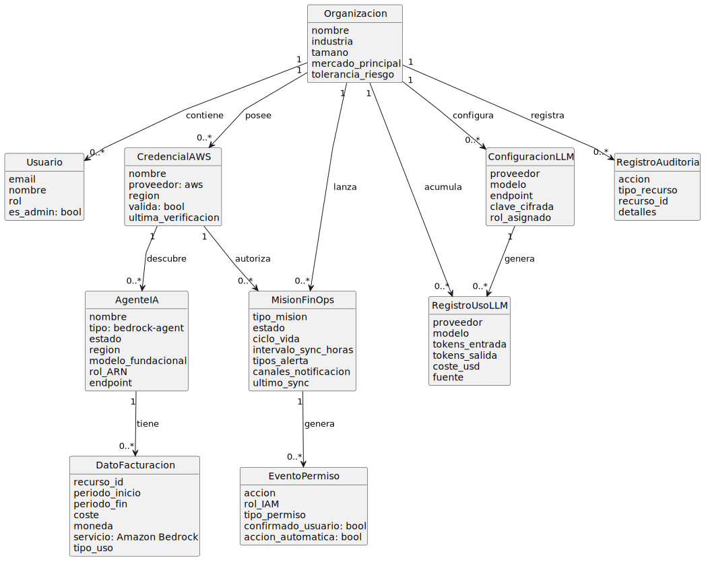
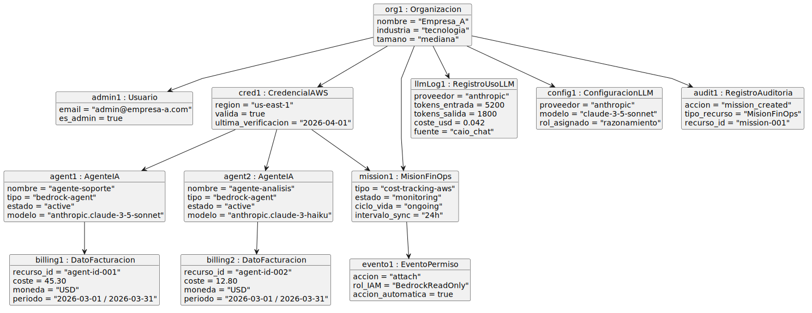
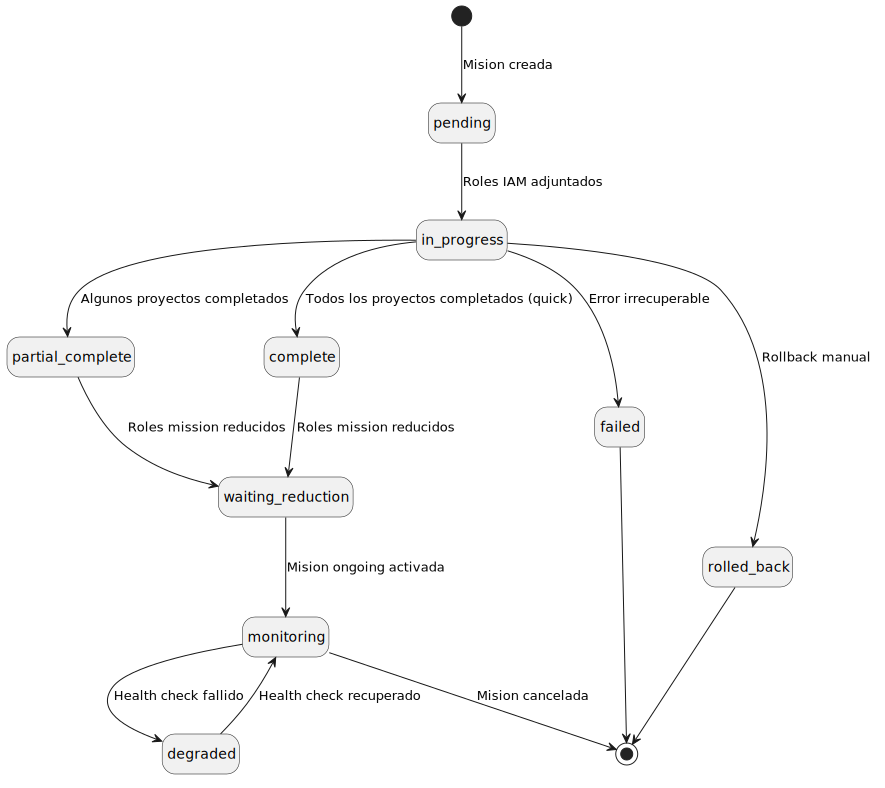
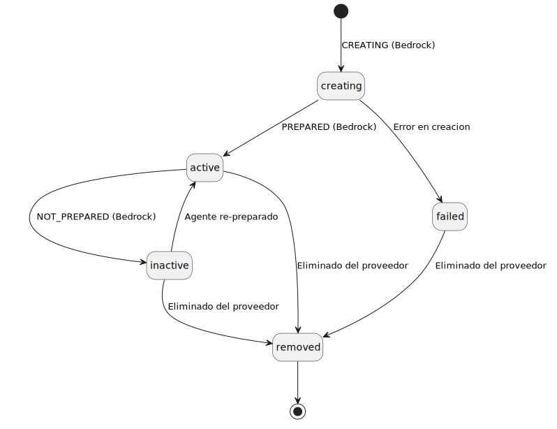

# 3. Modelo del Dominio

## 3.1 Introducción

El modelo del dominio es una representación visual de las clases conceptuales más importantes del mundo real en el contexto de la solución que se está desarrollando. No se trata de las clases del software ni de los objetos que lo implementan, sino de las abstracciones del negocio: ideas, entidades y relaciones que existen en la realidad del problema que se quiere resolver.

Como se identificó en el capítulo anterior, el problema central de este TFG es la falta de visibilidad y control financiero sobre los agentes de IA desplegados en la nube. El modelo de dominio recoge exactamente esas entidades: quién usa la plataforma, qué agentes tiene, cuánto cuestan y cómo se gobiernan. Se ha construido a partir del sistema real ya implementado en Theia Craft y se centra exclusivamente en el subdominio FinOps sobre AWS. El dominio abarca desde las entidades organizacionales básicas hasta las entidades específicas de control financiero: agentes de IA en Amazon Bedrock, misiones autónomas de seguimiento de costes, datos de facturación de AWS Cost Explorer y registros de uso de los propios modelos de lenguaje.

## 3.2 Clases conceptuales del dominio

A continuación se describen las clases conceptuales identificadas, agrupadas por área de responsabilidad.

### 3.2.1 Entidades organizacionales

**Organización:**
Representa a la empresa cliente que contrata y utiliza la plataforma. Es la unidad raíz del sistema: toda la información queda aislada por organización, garantizando que los datos de un cliente nunca son visibles para otro. Sus atributos más relevantes para el dominio FinOps son el nombre, la industria, el tamaño y el nivel de tolerancia al riesgo, datos que informan las recomendaciones del CAIO Virtual.

**Usuario:**
Una persona que interactúa con la plataforma. Pertenece a una organización y tiene uno de dos roles: administrador, con capacidad para configurar credenciales y lanzar misiones, o usuario regular, con acceso de solo lectura a los datos de coste.

### 3.2.2 Entidades cloud y de descubrimiento

**Credencial AWS:**
Las claves de acceso que permiten al sistema conectarse a los servicios de AWS en nombre de la organización. Son la puerta de entrada a todos los servicios cloud: sin una credencial válida no es posible descubrir agentes ni acceder a los datos de facturación.

**Agente de IA (Trabajador Digital):**
Un agente de Inteligencia Artificial descubierto y registrado en la plataforma. En AWS corresponde a un agente orquestado por Amazon Bedrock. Sus atributos clave son el nombre, el estado de actividad, la región de despliegue y el modelo fundacional que utiliza.

### 3.2.3 Entidades de misiones FinOps

**Misión FinOps:**
Una tarea autónoma que ejecuta el CAIO Virtual para llevar a cabo operaciones de seguimiento y optimización de costes. Sus atributos principales son el tipo de misión, el estado del ciclo de vida y el modo de ejecución (puntual o continuo). Los permisos de acceso que necesita son siempre temporales, lo que garantiza que el sistema opera bajo el principio de mínimo privilegio.

**Evento de Permiso:**
Una entrada inmutable del registro que se crea cada vez que cambian los permisos asociados a una misión. Registra la acción realizada, el rol afectado y el tipo de permiso. Garantiza la trazabilidad completa de todas las operaciones de acceso, requisito imprescindible para auditorías financieras.

### 3.2.4 Entidades de control financiero

**Dato de Facturación:**
Un registro del coste real de un agente de IA en AWS durante un periodo determinado, obtenido de AWS Cost Explorer. Sus atributos conceptuales son el recurso al que se refiere, el periodo cubierto, el importe y la moneda. Cada registro es único por combinación de organización, recurso y periodo.

**Registro de Uso de LLM:**
Un log de cada llamada a un modelo de lenguaje realizada desde la propia plataforma. Registra los tokens consumidos, el coste estimado, el proveedor y la fuente que originó la llamada. Cierra el círculo del control financiero: no solo se controla el gasto de los agentes del cliente, sino también el gasto que la plataforma genera al usar IA para gobernarlos.

**Configuración LLM:**
La configuración del proveedor de inteligencia artificial de la organización. Define qué modelo se usa para cada rol funcional: el rol de *razonamiento* (para análisis profundos) y el rol de *conversación* (para el chat con el CAIO Virtual). Una organización puede tener configurados varios proveedores simultáneamente.

### 3.2.5 Entidades de soporte

**Registro de Auditoría:**
Una traza inmutable de las operaciones relevantes realizadas en la plataforma: operaciones de análisis FinOps, cambios en credenciales y modificaciones de políticas. Es de solo escritura: nunca se modifica ni elimina, garantizando una pista de auditoría fiable para cumplimiento normativo.

## 3.3 Diagrama de clases del dominio

El siguiente diagrama muestra las clases conceptuales del dominio FinOps/AWS, sus atributos principales y las asociaciones entre ellas. La relación central es la que une el Agente de IA con el Dato de Facturación a través de la Organización: todo gasto registrado pertenece a un agente concreto dentro del contexto de una organización, lo que hace posible el desglose por agente que exigen las nuevas misiones. Merece la pena fijarse también en el Registro de Uso de LLM, que cierra un bucle que raramente aparece en soluciones FinOps convencionales: no solo se controla lo que gastan los agentes del cliente, sino también lo que gasta la propia plataforma al gobernarlos.

| Diagrama | Código Fuente |
| :--- | :--- |
|  | [Ver código PlantUML](./MdD/DiagramaClases/MdD.puml) |

## 3.4 Diagrama de objetos

El diagrama de objetos lleva el modelo abstracto a tierra firme: muestra cómo quedarían enlazados los datos reales de una organización concreta. La organización ficticia *Empresa_A* tiene dos agentes Bedrock activos en AWS, una misión de seguimiento en curso y los registros de facturación del último mes ya disponibles. El objetivo es verificar que el modelo de clases es consistente y que las relaciones tienen sentido cuando se instancian con datos reales, antes de pasar al diseño del sistema.

| Diagrama | Código Fuente |
| :--- | :--- |
|  | [Ver código PlantUML](./MdD/DiagramaObjetos/DdO.puml) |

## 3.5 Diagramas de estados

### 3.5.1 Estados de una Misión FinOps

Una misión FinOps no es simplemente una tarea que se ejecuta y termina: tiene un ciclo de vida con estados bien definidos que reflejan en cada momento qué permisos tiene activos y qué está haciendo. La transición más relevante es la secuencia `in_progress` → `waiting_reduction` → `monitoring`: una vez que la tarea concluye, el sistema reduce automáticamente los permisos IAM sin que el administrador tenga que intervenir, y si la misión es de tipo continuo, pasa al estado `monitoring` donde se mantiene activa con salud verificable. Si la misión opera sobre varios proyectos, puede pasar por `partial_complete` cuando solo algunos han terminado, o directamente a `complete` si es de tipo puntual; ambos estados convergen en `waiting_reduction` para la reducción de permisos. Cuando el *health check* falla, la misión transita a `degraded` y puede recuperarse si el problema se resuelve.

| Diagrama | Código Fuente |
| :--- | :--- |
|  | [Ver código PlantUML](./MdD/DiagramasEstado/MisionFinOps/MisionFinOps.puml) |

### 3.5.2 Estados de un Agente Bedrock

Amazon Bedrock expone sus propios estados internos para los agentes, que no siempre son intuitivos ni consistentes con el vocabulario de negocio. Este diagrama documenta cómo se mapean esos estados al vocabulario común de la plataforma. La razón práctica es que las nuevas misiones FinOps necesitan saber si un agente está activo para decidir si tiene sentido analizar su gasto; sin esta normalización, cada proveedor requeriría lógica específica y el análisis multi-cloud se volvería inmanejable.

| Diagrama | Código Fuente |
| :--- | :--- |
|  | [Ver código PlantUML](./MdD/DiagramasEstado/AgenteBedrock/AgenteBedrock.puml) |

## 3.6 Glosario del dominio FinOps

El glosario completo de términos del dominio FinOps se encuentra en el archivo [Glosario.md](./Glosario.md).

## 3.7 Requisitos suplementarios

Los requisitos suplementarios, también denominados no funcionales, especifican propiedades del sistema que no se expresan como comportamientos observables sino como restricciones de entorno, implementación o calidad.

| Categoría | Requisito |
| :--- | :--- |
| **Seguridad** | Las credenciales AWS se cifran en reposo. Nunca se devuelven en texto plano en ninguna respuesta de la API. |
| **Seguridad** | Los permisos de acceso para las misiones son siempre temporales: se adjuntan al inicio de la misión y se eliminan automáticamente al finalizar o tras un periodo de inactividad configurable. Implementa el principio de mínimo privilegio. |
| **Seguridad** | La autenticación en la plataforma es sin contraseña: se envía un código al correo electrónico del usuario, válido durante un tiempo limitado. El acceso se protege mediante token firmado. |
| **Rendimiento** | Todas las operaciones sobre APIs externas tienen timeouts definidos para garantizar que un fallo del proveedor no bloquea el sistema indefinidamente. |
| **Rendimiento** | Las misiones con ciclo de vida continuo ejecutan sus análisis de forma periódica con un intervalo configurable, sin requerir intervención del administrador. |
| **Multi-tenancy** | Toda consulta a la base de datos queda obligatoriamente acotada a la organización del usuario autenticado, garantizando el aislamiento completo de datos entre clientes. |
| **Trazabilidad** | Los Eventos de Permiso y los Registros de Auditoría son inmutables: nunca se actualizan ni se eliminan. Garantizan una pista de auditoría fiable para cumplimiento normativo y auditorías financieras. |
| **Idempotencia** | Las operaciones de recopilación de datos pueden ejecutarse varias veces sobre el mismo periodo sin generar registros duplicados. |
| **Extensibilidad** | El sistema de conectores permite incorporar nuevos proveedores cloud sin modificar el código existente. Aunque este TFG se centra en AWS, la arquitectura no debe impedir que en el futuro se añadan GCP o Azure con el mismo nivel de análisis FinOps. |