# 3. Modelo del Dominio y Disciplina de Requisitos

## 3.1 Introducción

El modelo del dominio es una representación visual de las clases conceptuales más importantes del mundo real en el contexto de la solución que se está desarrollando. No se trata de las clases del software ni de los objetos que lo implementan, sino de las abstracciones del negocio: ideas, entidades y relaciones que existen en la realidad del problema que se quiere resolver.

Como se identificó en el capítulo anterior, el problema central de este TFG es la falta de visibilidad y control financiero sobre los agentes de IA desplegados en la nube. El modelo de dominio recoge exactamente esas entidades: quién usa la plataforma, qué agentes tiene, cuánto cuestan y cómo se gobiernan. Se centra exclusivamente en el subdominio FinOps sobre AWS, pero describe el problema desde el punto de vista del negocio antes de introducir decisiones técnicas. El dominio abarca desde las entidades organizacionales básicas hasta las entidades específicas de control financiero: agentes de IA en Amazon Bedrock, misiones guiadas de seguimiento de costes, datos de facturación de AWS Cost Explorer y registros de uso de los propios modelos de lenguaje.

## 3.2 Clases conceptuales del dominio

A continuación se describen las clases conceptuales identificadas, agrupadas por área de responsabilidad.

### 3.2.1 Entidades organizacionales

**Organización:**
Representa a la empresa cliente que contrata y utiliza la plataforma. Es la unidad raíz del sistema: toda la información queda aislada por organización, garantizando que los datos de un cliente nunca son visibles para otro. Sus atributos más relevantes para el dominio FinOps son el nombre, la industria, el tamaño y el nivel de tolerancia al riesgo, datos que informan las recomendaciones del CAIO Virtual.

**Usuario:**
Una persona que interactúa con la plataforma. Pertenece a una organización y tiene uno de dos roles: administrador, con capacidad para configurar credenciales y lanzar misiones, o usuario regular, con acceso de consulta y simulación no mutante según la operación.

### 3.2.2 Entidades cloud y de descubrimiento

**Credencial AWS:**
Las claves de acceso que permiten al sistema conectarse a los servicios de AWS en nombre de la organización. Son la puerta de entrada a todos los servicios cloud: sin una credencial válida no es posible descubrir agentes ni acceder a los datos de facturación.

**Agente de IA (Trabajador Digital):**
Un agente de Inteligencia Artificial descubierto y registrado en la plataforma. En AWS corresponde a un agente orquestado por Amazon Bedrock. Sus atributos clave son el nombre, el estado de actividad, la región de despliegue y el modelo fundacional que utiliza.

### 3.2.3 Entidades de misiones FinOps

**Misión FinOps:**
Una tarea guiada de la plataforma orientada al seguimiento y optimización de costes de IA. En este TFG representa el estado visible para el usuario dentro del catálogo de misiones: identificador, progreso, pasos completados, pantalla de revisión y ciclo de vida funcional. No debe confundirse con las misiones autónomas de infraestructura que gestionan permisos IAM temporales en la plataforma base.

**Evento de Permiso:**
Una entrada del registro de permisos usada por la plataforma base cuando una misión autónoma adjunta o retira permisos IAM. Se menciona como contexto de seguridad, pero no forma parte del núcleo conceptual de las misiones FinOps CU-07 a CU-12, que se trazan mediante estado de misión de usuario y registros de auditoría.

### 3.2.4 Entidades de control financiero

**Dato de Facturación:**
Un registro de coste de IA en AWS durante un periodo determinado, obtenido de AWS Cost Explorer. Puede estar asociado a un agente concreto cuando existe atribución fiable, o quedar sin agente asociado cuando AWS solo permite observar el gasto agregado. Sus atributos conceptuales son el proveedor, el recurso al que se refiere, el periodo cubierto, el importe, la moneda, el servicio y el tipo de uso. Cada registro es único por combinación de organización, proveedor, recurso y periodo.

**Registro de Uso de LLM:**
Un log de cada llamada a un modelo de lenguaje realizada desde la propia plataforma. Registra los tokens consumidos, el coste estimado, el proveedor y la fuente que originó la llamada. Cierra el círculo del control financiero: no solo se controla el gasto de los agentes del cliente, sino también el gasto que la plataforma genera al usar IA para gobernarlos.

**Configuración LLM:**
La configuración del proveedor de inteligencia artificial de la organización. Define qué modelo se usa para cada rol funcional: el rol de *razonamiento* (para análisis profundos) y el rol de *conversación* (para el chat con el CAIO Virtual). Una organización puede tener configurados varios proveedores simultáneamente.

### 3.2.5 Entidades de soporte

**Registro de Auditoría:**
Una traza de las operaciones relevantes realizadas en la plataforma: operaciones de análisis FinOps, cambios en credenciales y modificaciones de configuración. En operación normal se trata como registro de solo escritura para garantizar una pista de auditoría fiable.

## 3.3 Diagrama de clases del dominio

El siguiente diagrama muestra las clases conceptuales del dominio FinOps/AWS, sus atributos principales y las asociaciones entre ellas. La relación entre Agente de IA y Dato de Facturación es opcional: cuando AWS expone una señal de atribución, el registro se asocia al agente; cuando no existe esa señal, el coste se conserva como no asociado para que CU-07, CU-08 y CU-09 no oculten gasto real. Merece la pena fijarse también en el Registro de Uso de LLM, que cierra un bucle que raramente aparece en soluciones FinOps convencionales: no solo se controla lo que gastan los agentes del cliente, sino también lo que gasta la propia plataforma al gobernarlos.

| Diagrama | Código Fuente |
| :--- | :--- |
| 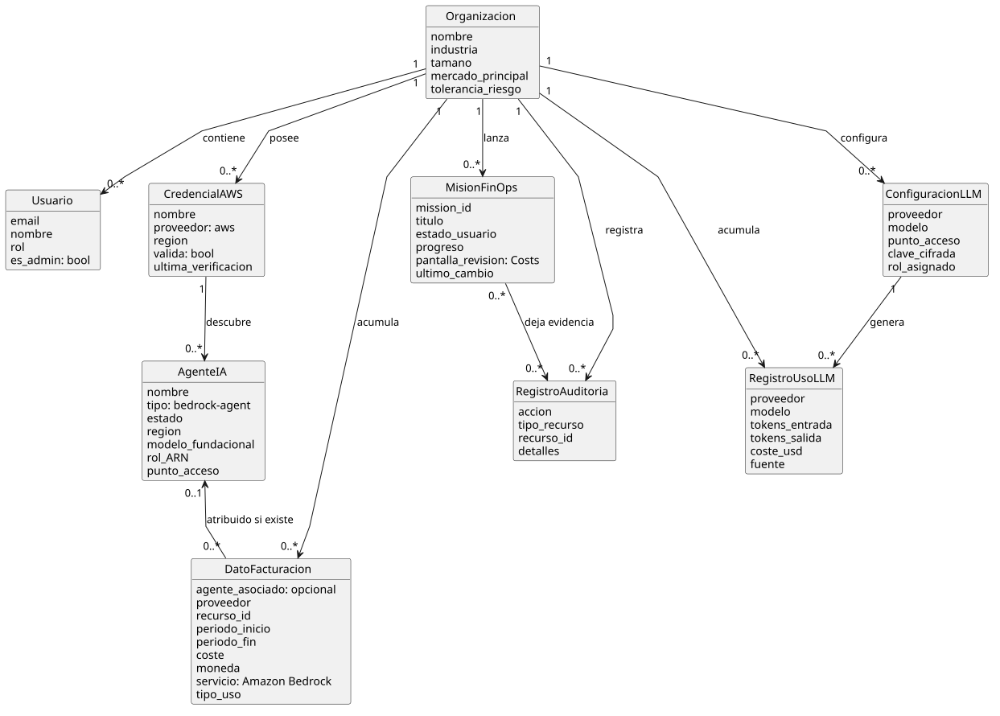 | [Ver código PlantUML](./MdD/DiagramaClases/MdD.puml) |

## 3.4 Diagrama de objetos

El diagrama de objetos lleva el modelo abstracto a tierra firme: muestra cómo quedarían enlazados los datos reales de una organización concreta. La organización ficticia *Empresa_A* tiene dos agentes Bedrock activos en AWS, una misión de seguimiento en curso y los registros de facturación del último mes ya disponibles. El objetivo es verificar que el modelo de clases es consistente y que las relaciones tienen sentido cuando se instancian con datos reales, antes de pasar al diseño del sistema.

| Diagrama | Código Fuente |
| :--- | :--- |
| 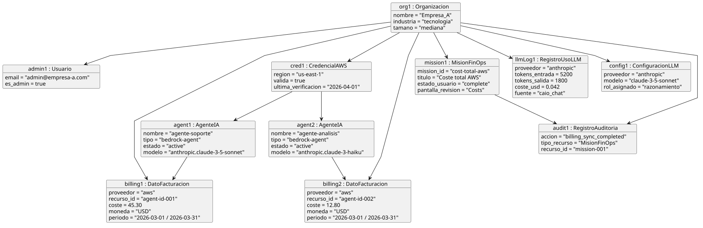 | [Ver código PlantUML](./MdD/DiagramaObjetos/DdO.puml) |

## 3.5 Diagramas de estados

### 3.5.1 Estados de una Misión FinOps

Una misión FinOps no es simplemente una tarea que se ejecuta y termina: tiene un ciclo de vida con estados bien definidos que reflejan el avance visible para el usuario. En este TFG esos estados pertenecen al progreso persistido de la misión guiada: preparada, en preparación, en análisis, en progreso, esperando una condición externa, completada o fallida. Las operaciones con efecto administrativo se protegen por permisos de usuario y auditoría; no forman parte del ciclo de adjuntar y reducir roles IAM temporales propio de las misiones autónomas de infraestructura.

| Diagrama | Código Fuente |
| :--- | :--- |
| 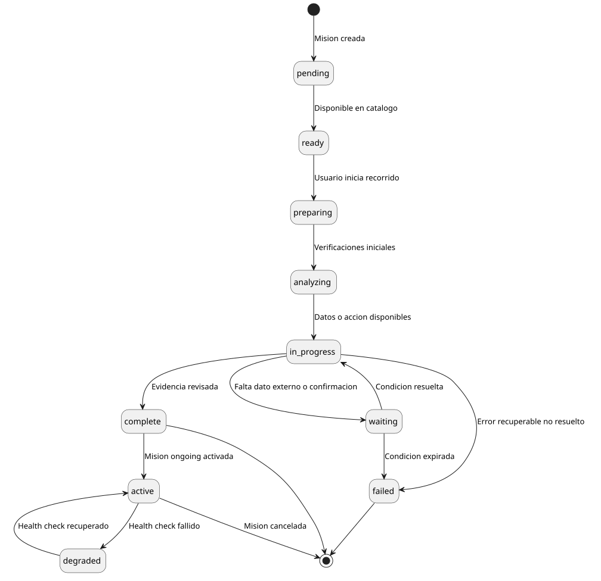 | [Ver código PlantUML](./MdD/DiagramasEstado/MisionFinOps/MisionFinOps.puml) |

### 3.5.2 Estados de un Agente Bedrock

Amazon Bedrock expone sus propios estados internos para los agentes, que no siempre son intuitivos ni consistentes con el vocabulario de negocio. Este diagrama documenta cómo se mapean esos estados al vocabulario común de la plataforma. La razón práctica es que las nuevas misiones FinOps necesitan saber si un agente está activo para decidir si tiene sentido analizar su gasto; sin esta normalización, cada proveedor requeriría lógica específica y el análisis multi-cloud se volvería inmanejable.

| Diagrama | Código Fuente |
| :--- | :--- |
| 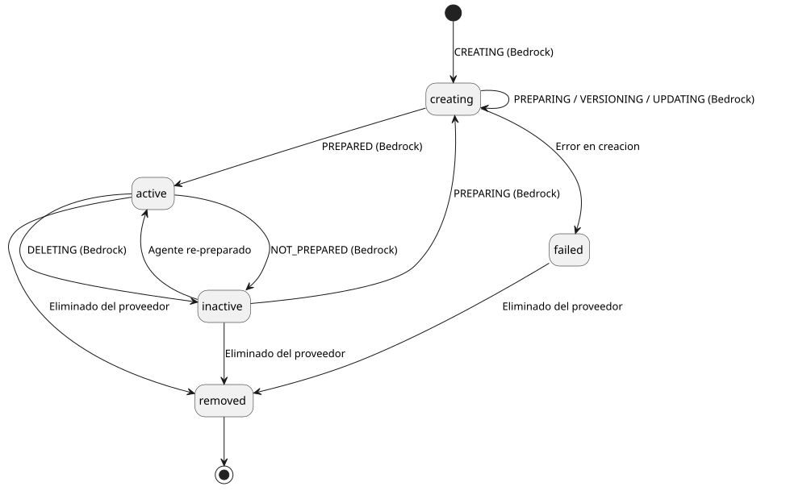 | [Ver código PlantUML](./MdD/DiagramasEstado/AgenteBedrock/AgenteBedrock.puml) |

## 3.6 Glosario del dominio FinOps

El glosario completo de términos del dominio FinOps se encuentra en el archivo [Glosario.md](./Glosario.md).

## 3.7 Requisitos suplementarios

Los requisitos suplementarios, también denominados no funcionales, especifican propiedades del sistema que no se expresan como comportamientos observables sino como restricciones de entorno, implementación o calidad.

| ID | Categoría | Requisito |
| :--- | :--- | :--- |
| RS-01 | **Seguridad** | Las credenciales AWS se cifran en reposo. Nunca se devuelven en texto plano en ninguna respuesta del sistema. |
| RS-02 | **Seguridad** | La plataforma aplica el principio de mínimo privilegio según la operación. En la Misión FinOps de este TFG, las operaciones sensibles se limitan mediante credenciales cifradas, comprobaciones de administrador y auditoría; los flujos de adjuntar y retirar permisos temporales pertenecen a misiones autónomas de infraestructura fuera del núcleo implementado. |
| RS-03 | **Seguridad** | La autenticación en la plataforma es sin contraseña: se envía un código al correo electrónico del usuario, válido durante un tiempo limitado. El acceso se protege mediante token firmado. |
| RS-04 | **Rendimiento** | Todas las operaciones sobre servicios externos tienen tiempos máximos definidos para garantizar que una incidencia del proveedor no bloquee el sistema indefinidamente. |
| RS-05 | **Rendimiento** | Las misiones con ciclo de vida continuo ejecutan sus análisis de forma periódica con un intervalo configurable, sin requerir intervención del administrador. |
| RS-06 | **Multi-tenancy** | Toda consulta de información queda obligatoriamente acotada a la organización del usuario autenticado, garantizando el aislamiento completo de datos entre clientes. |
| RS-07 | **Trazabilidad** | Los Registros de Auditoría se tratan como registros append-only en el flujo normal de la aplicación: se crean nuevas entradas para las operaciones relevantes y no se modifican durante el recorrido funcional. Los eventos de permiso quedan reservados a la plataforma base cuando una misión autónoma modifica roles IAM. |
| RS-08 | **Idempotencia** | Las operaciones de recopilación de datos pueden ejecutarse varias veces sobre el mismo periodo sin generar registros duplicados. |
| RS-09 | **Extensibilidad** | El sistema de conectores permite incorporar nuevos proveedores cloud sin modificar el código existente. Aunque este TFG se centra en AWS, la arquitectura no debe impedir que en el futuro se añadan GCP o Azure con el mismo nivel de análisis FinOps. |

---

## 3.8 Introducción a requisitos

Una vez definido el modelo de dominio, la disciplina de requisitos concreta qué debe hacer el sistema desde la perspectiva de los actores que interactúan con él. Las misiones FinOps identificadas en los apartados anteriores como respuesta al problema de visibilidad de costes se traducen aquí en casos de uso concretos, priorizados y trazables. Se adopta un enfoque en dos capas diferenciadas:

- **Capa base (Theia Craft)**: funcionalidades ya implementadas en la plataforma base por el equipo de Theia Craft. Se documentan como dependencias preexistentes sobre las que se construirá el trabajo de este TFG.
- **Nuevas misiones FinOps (TFG)**: casos de uso diseñados e implementados en el marco de este trabajo. Constituyen la aportación principal y extienden la plataforma con capacidades de visibilidad y optimización de costes de inteligencia artificial.

El sistema que se especifica es el módulo de Misiones FinOps de la plataforma, con foco en AWS.

## 3.9 Actores del sistema

Un actor representa el rol que adopta una entidad externa cuando interactúa con el sistema. Los actores no son personas concretas sino roles: el mismo usuario puede actuar como Administrador en un contexto y como Usuario Regular en otro.

| Actor | Tipo | Descripción |
| :--- | :--- | :--- |
| **Administrador** | Primario | Gestor de la organización. Configura las credenciales AWS, lanza misiones y accede a todas las funcionalidades de análisis y configuración. |
| **Usuario Regular** | Primario | Empleado de la organización. Puede consultar costes, visualizar resultados y ejecutar simulaciones no mutantes, pero no puede modificar configuración ni aplicar cambios en AWS. |
| **CAIO Virtual** | Sistema | El agente de IA de la plataforma. Apoya misiones, analiza patrones de gasto y responde a consultas sobre costes a partir de datos estructurados. |
| **AWS** | Externo | Proveedor de nube. Proporciona información de costes, agentes, permisos y configuración bajo autorización de la organización. |
| **Actor Tiempo** | Temporal | Representa la ejecución de tareas programadas: sincronizaciones periódicas, análisis automáticos y reducción de permisos inactivos. |

## 3.10 Plataforma base — Capacidades existentes (Theia Craft)

Las siguientes capacidades forman parte de la plataforma base desarrollada por Theia Craft. **No son aportación de este TFG**, pero son prerrequisito funcional para las nuevas misiones.

| ID | Capacidad | Actor principal | Estado | Relevancia para las nuevas misiones |
| :--- | :--- | :--- | :--- | :--- |
| CU-01 | Registrar credenciales AWS | Administrador | ✅ Theia Craft | Prerequisito: sin credenciales no hay acceso a datos |
| CU-02 | Descubrir agentes en AWS | Administrador / Actor Tiempo | ✅ Theia Craft | Proporciona el catálogo de agentes sobre el que operar |
| CU-03 | Gestionar permisos IAM | CAIO Virtual | ✅ Theia Craft | Infraestructura de seguridad reutilizable por nuevas misiones |
| CU-04 | Autenticarse en la plataforma | Administrador / Usuario Regular | ✅ Theia Craft | Identifica la organización del usuario y acota los datos de coste visibles |
| CU-05 | Configurar proveedor LLM | Administrador | ✅ Theia Craft | El CAIO Virtual necesita un proveedor LLM para ejecutar los análisis y las recomendaciones |
| CU-06 | Auditoría de actividad | Administrador | ✅ Theia Craft | Registra las operaciones de las nuevas misiones para trazabilidad y cumplimiento normativo |

## 3.11 Nuevas misiones FinOps — Contribución del TFG

Los siguientes casos de uso representan la contribución de este TFG. Se han priorizado mediante **MoSCoW** atendiendo al valor de visibilidad y optimización de costes que aportan y a las dependencias entre ellos.

### Must — Visibilidad de costes

| ID | Nombre | Actor principal | Descripción |
| :--- | :--- | :--- | :--- |
| CU-07 | Consultar coste total de IA en AWS | Administrador / Usuario Regular | Vista operativa con el coste total de IA en Amazon Bedrock. Responde a F3 sin depender de atribución por agente, proyecciones ni análisis avanzados. |
| CU-08 | Consultar coste por agente de IA en AWS | Administrador / Usuario Regular | Ranking de coste por agente y coste no asociado. Responde a F1 y depende de una señal de atribución preparada en AWS. |
| CU-09 | Detectar anomalías de gasto | Administrador / Actor Tiempo | Detecta picos de gasto inusuales respecto al histórico y deja evidencia auditable. Responde a F4. |

### Should — Optimización de costes

| ID | Nombre | Actor principal | Descripción |
| :--- | :--- | :--- | :--- |
| CU-10 | Coste LLM estimado del CAIO Virtual | Administrador / Usuario Regular | Muestra el coste estimado de las llamadas LLM registradas por la plataforma. No equivale a factura oficial ni a coste de infraestructura. |
| CU-11 | Optimizar recuperación RAG de agentes Bedrock | Administrador / Usuario Regular | Prueba perfiles de recuperación sobre Knowledge Bases antes de invocar un agente Bedrock. La simulación es revisable por ambos roles; la invocación de prueba queda reservada a administrador. Responde a F2. |
| CU-12 | Optimizar agentes Bedrock mediante prompt caching controlado | Administrador / Usuario Regular | Simula prompt caching en agentes candidatos y aplica cambios solo con confirmación administrativa, con limitaciones visibles de modelo, región, TTL y reutilización del prompt. Responde a F5. |

### Could — Proyección y configuración

| ID | Nombre | Actor principal | Descripción |
| :--- | :--- | :--- | :--- |
| CU-13 | Proyectar tendencia de costes | Administrador / Usuario Regular | Estimación de gasto futuro a partir del histórico disponible. Responde a F10. |
| CU-14 | Configurar alertas de umbral de gasto | Administrador | Permite definir límites de gasto por agente o periodo y recibir notificaciones al superarlos. Responde a F4 y F9. |

### Won't (fuera del alcance implementado)

| ID | Nombre | Actor principal | Descripción |
| :--- | :--- | :--- | :--- |
| CU-15 | Informe de consumo IA | Administrador | Generación automática de informes de consumo IA para la dirección. Responde a F11. |
| CU-16 | Consolidación de catálogo de agentes | CAIO Virtual | Detecta agentes duplicados o con fuentes de datos redundantes y recomienda consolidación. Responde a F6, F7 y F8. |

### 3.11.5 Estimación previa del proyecto

Antes de iniciar el desarrollo se realizó una estimación preliminar para acotar el alcance del TFG y separar el trabajo imprescindible de las ampliaciones futuras. La estimación no se plantea como una medición final de esfuerzo, sino como una herramienta de planificación para decidir qué casos de uso debían entrar en la entrega implementada.

| ID | Bloque de trabajo | Casos o artefactos asociados | Esfuerzo estimado | Riesgo inicial |
| :--- | :--- | :--- | :--- | :--- |
| EST-01 | Modelo de dominio y glosario FinOps | Entidades de organización, agente, coste, auditoría y uso LLM | 2 jornadas | Bajo |
| EST-02 | Requisitos, actores y casos de uso | CU-01 a CU-16, priorización MoSCoW y trazabilidad | 4 jornadas | Medio |
| EST-03 | Diseño técnico backend/frontend | Servicios, endpoints, hooks, vista Costs y persistencia | 5 jornadas | Medio |
| EST-04 | Implementación de visibilidad de costes | CU-07, CU-08 y CU-09 | 6 jornadas | Alto por dependencia de Cost Explorer |
| EST-05 | Implementación de observabilidad y optimización | CU-10, CU-11 y CU-12 | 5 jornadas | Alto por compatibilidad de agentes Bedrock |
| EST-06 | Validación, evidencias y memoria | Pruebas, capturas, contratos Swagger y documentación final | 4 jornadas | Medio |

La estimación llevó a considerar CU-07, CU-08 y CU-09 como núcleo Must, porque aportan visibilidad financiera mínima. CU-10, CU-11 y CU-12 quedaron como Should al añadir valor de observabilidad y optimización sin bloquear el objetivo principal. CU-13 a CU-16 se mantienen documentados como evolución, pero fuera del alcance implementado.

## 3.12 Diagramas de Casos de Uso

Se presentan primero dos diagramas generales separados por entorno. Esta separación evita un diagrama único demasiado denso y permite distinguir con claridad las capacidades ya existentes de la Plataforma Base y las nuevas misiones FinOps desarrolladas en este TFG. Después se conservan diagramas por actor como apoyo para revisar permisos e interacciones específicas.

### 3.12.1 Entorno Plataforma Base

La Plataforma Base agrupa las capacidades preexistentes de Theia Craft que hacen posible ejecutar la Misión FinOps: autenticación, credenciales, descubrimiento, permisos, configuración LLM y auditoría. Estas funciones no son la aportación principal del TFG, pero actúan como prerrequisito operativo.

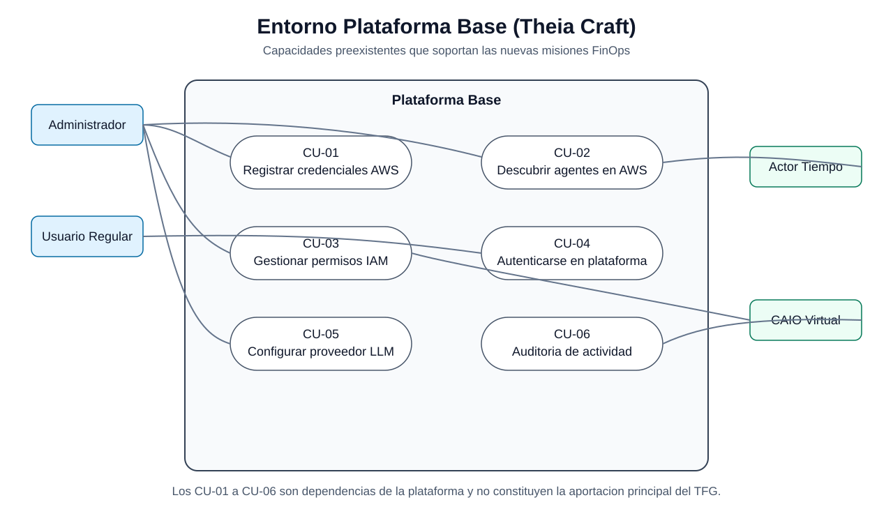

*Figura 3.5. Entorno Plataforma Base de Theia Craft: casos CU-01 a CU-06 usados como soporte para las nuevas misiones FinOps.*

### 3.12.2 Entorno Nuevas Misiones FinOps

El entorno de Nuevas Misiones FinOps recoge la contribución directa del TFG. El diagrama separa las misiones implementadas de visibilidad y optimización de las ampliaciones futuras, manteniendo visible qué actores pueden consultar, simular o ejecutar operaciones administrativas.

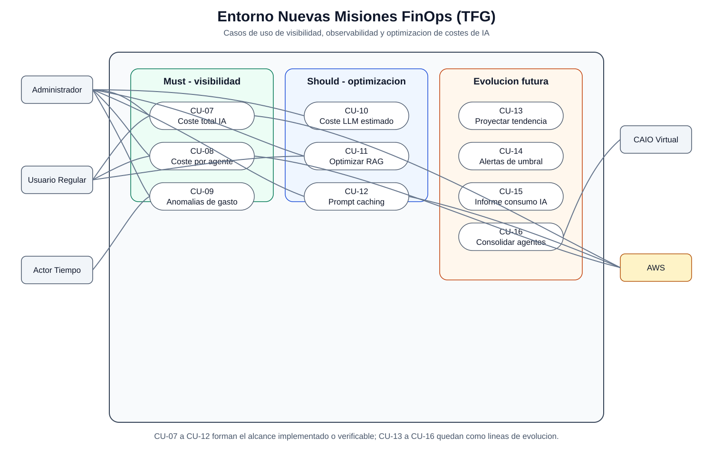

*Figura 3.6. Entorno Nuevas Misiones FinOps: casos CU-07 a CU-16, con CU-07 a CU-12 como alcance implementado o verificable y CU-13 a CU-16 como evolución futura.*

### 3.12.3 Administrador

El Administrador es el actor con mayor alcance: configura la plataforma base y tiene acceso a todas las nuevas misiones FinOps, tanto las de visibilidad como las de optimización y configuración. Es el perfil que puede ejecutar acciones administrativas como sincronizar costes, lanzar detectores o aplicar cambios controlados en agentes Bedrock.

| Diagrama | Código Fuente |
| :--- | :--- |
| 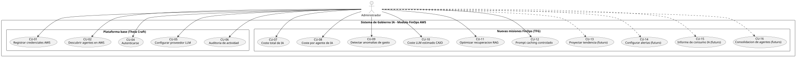 | [Ver código PlantUML](./CdU/Administrador/Administrador.puml) |

### 3.12.4 Usuario Regular

El Usuario Regular tiene un acceso más restringido: puede consultar resultados, abrir misiones de lectura o simulación y revisar la vista de costes, pero no puede ejecutar mutaciones administrativas como sincronizar costes reales, lanzar detectores persistidos, invocar agentes Bedrock de prueba o aplicar cambios en AWS. Es el perfil pensado para un analista financiero o un responsable de área que necesita visibilidad sin modificar la operativa.

| Diagrama | Código Fuente |
| :--- | :--- |
| 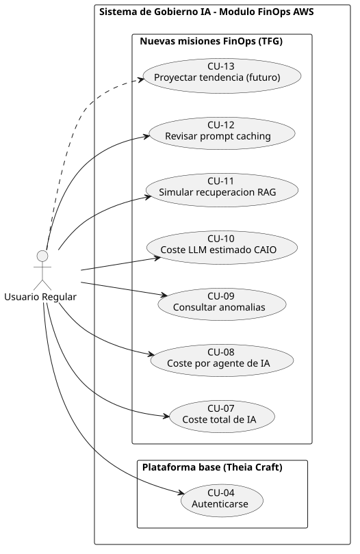 | [Ver código PlantUML](./CdU/UsuarioRegular/UsuarioRegular.puml) |

### 3.12.5 CAIO Virtual

El CAIO Virtual actúa como sistema de apoyo, no como usuario humano. Su diagrama concentra los casos de uso que requieren análisis o asistencia sobre datos ya estructurados, sin sustituir las comprobaciones deterministas del sistema.

| Diagrama | Código Fuente |
| :--- | :--- |
| 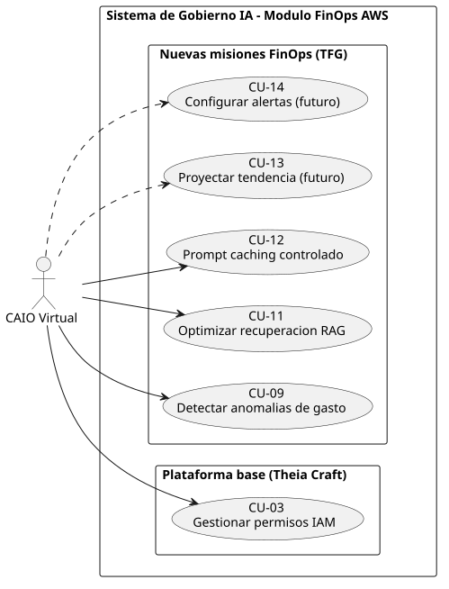 | [Ver código PlantUML](./CdU/CAIOVirtual/CAIOVirtual.puml) |

### 3.12.6 Actor Tiempo

El Actor Tiempo representa la ejecución programada. Su papel es disparar análisis periódicos que no requieren intervención humana directa, como el descubrimiento continuo de agentes y la comprobación recurrente de anomalías de gasto.

| Diagrama | Código Fuente |
| :--- | :--- |
| 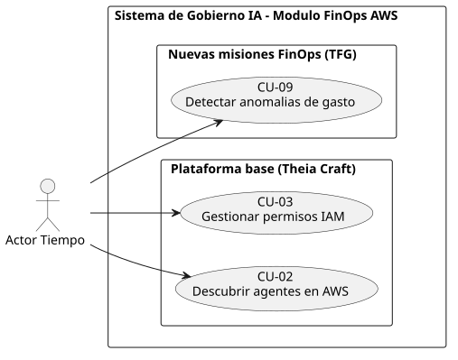 | [Ver código PlantUML](./CdU/ActorTiempo/ActorTiempo.puml) |

### 3.12.7 AWS

AWS es un actor externo que no inicia ninguna interacción: responde a las solicitudes autorizadas de la plataforma. Su diagrama muestra únicamente los casos de uso que dependen de información o configuración proporcionada por el proveedor cloud. Las misiones de visibilidad operan sobre datos de coste recopilados; CU-11 usa una invocación controlada con configuración de sesión, y CU-12 solo modifica configuración Bedrock tras confirmación explícita del administrador.

| Diagrama | Código Fuente |
| :--- | :--- |
| 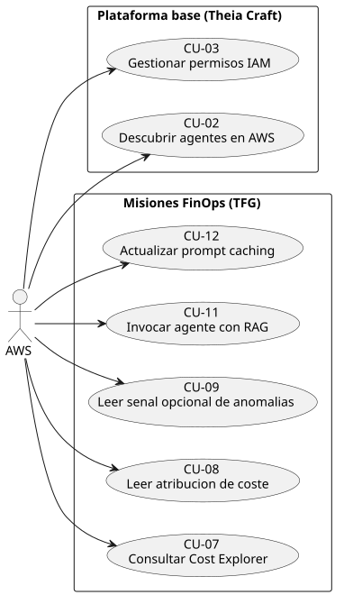 | [Ver código PlantUML](./CdU/AWS/AWS.puml) |

### 3.12.8 Matriz funcional de permisos por operación

Los diagramas anteriores muestran la relación principal entre actor y caso de uso, pero no distinguen entre consultar, simular y ejecutar una acción con efecto administrativo. Esa diferencia es relevante en la Misión FinOps: un Usuario Regular puede revisar resultados y ejecutar simulaciones sin modificar AWS, mientras que el Administrador conserva las operaciones que sincronizan datos, generan auditoría persistida o aplican cambios de configuración. La siguiente matriz no sustituye a los diagramas de casos de uso; aclara el límite operativo de cada rol.

| Operación funcional | Usuario Regular | Administrador | Alcance |
| :--- | :---: | :---: | :--- |
| Consultar coste total, coste por agente y coste LLM estimado. | Sí | Sí | Lectura de información ya disponible en la organización. |
| Consultar anomalías calculadas. | Sí | Sí | Revisión de resultados sin crear una nueva ejecución auditada. |
| Sincronizar costes desde Cost Explorer. | No | Sí | Operación administrativa porque consulta AWS y persiste nuevos datos de facturación. |
| Ejecutar el detector de anomalías y registrar auditoría. | No | Sí | Crea una ejecución verificable y registros asociados. |
| Simular optimización RAG. | Sí | Sí | Evaluación sin persistir cambios en la configuración del agente. |
| Invocar un agente Bedrock de prueba para RAG. | No | Sí | Operación administrativa porque llama a AWS con una configuración de sesión. |
| Revisar elegibilidad o simular prompt caching. | Sí | Sí | Dry-run sin modificación real de AWS. |
| Aplicar prompt caching en un agente Bedrock. | No | Sí | Mutación real condicionada por compatibilidad y confirmación administrativa. |

## 3.13 Diagrama de contexto de las nuevas misiones

Este es el diagrama más útil para entender cómo encajan los casos de uso en el tiempo. Mientras los diagramas de la sección anterior muestran qué puede hacer cada actor, este muestra cuándo: los estados por los que pasa el sistema desde que un usuario se autentica hasta que el módulo FinOps está preparado. El punto de entrada es CU-04 (autenticación), tras el cual CU-01 y CU-02 configuran la plataforma base. Solo entonces es posible revisar costes en la vista de costes mediante CU-07 y continuar con atribución, anomalías y optimización controlada. Una vez en marcha, algunas comprobaciones pueden repetirse periódicamente gracias al Actor Tiempo.

| Diagrama | Código Fuente |
| :--- | :--- |
| 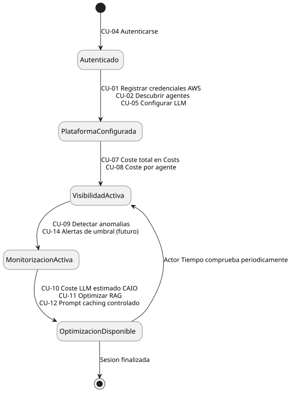 | [Ver código PlantUML](./CdU/DiagramaContexto/Contexto.puml) |

## 3.14 Prototipo conceptual y avance RUP

Antes de detallar los casos de uso se define un prototipo conceptual de la vista de costes. No es una captura de la aplicación final ni un diseño visual cerrado; su función es validar que todos los casos CU-07 a CU-12 caben en una misma experiencia de revisión FinOps. Las capturas reales de la solución implementada se reservan para el capítulo de descripción de la solución.

| Artefacto | Código fuente |
| :--- | :--- |
| 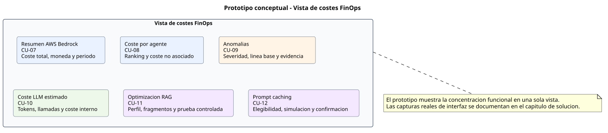 | [Ver código PlantUML](./CdU/Prototipo/CostsConceptual.puml) |

También se incorpora un mapa de avance RUP para indicar qué artefactos acompañan a los casos de uso principales del TFG: especificación de requisitos, prototipo conceptual, análisis MVC, diseño técnico y evidencia de implementación.

| Artefacto | Código fuente |
| :--- | :--- |
| 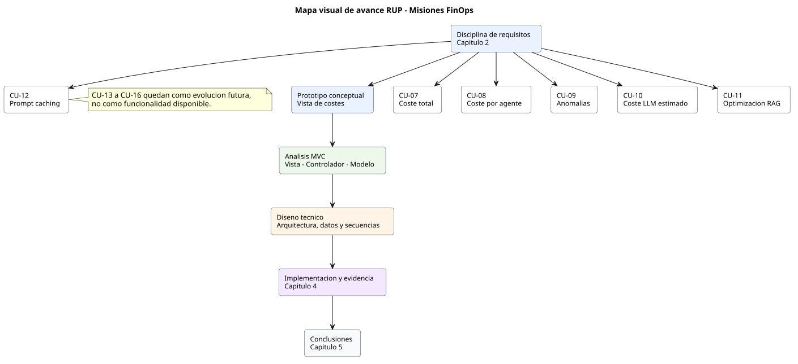 | [Ver código PlantUML](./CdU/MapaRUP/MapaRUP.puml) |

## 3.15 Detalle de las nuevas misiones Must y Should (CU-07 a CU-12)

La especificación de los casos de uso se redacta en lenguaje de requisitos. Por ello, el actor solicita, proporciona o confirma información, mientras que el sistema presenta, permite, muestra o registra resultados. Los contratos técnicos y componentes internos se describen posteriormente en la disciplina de diseño.

### CU-07 — Consultar coste total de IA en AWS

| Campo | Detalle |
| :--- | :--- |
| **Actor primario** | Administrador / Usuario Regular |
| **Actores secundarios** | AWS |
| **Objetivo** | Consultar el coste total de IA de la organización en AWS para un periodo disponible. |
| **Tipo** | Primario, esencial |
| **Nivel** | Objetivo de usuario |
| **Precondición** | La organización dispone de acceso válido a la información de costes de AWS. |
| **Postcondición exitosa** | El usuario visualiza el coste total del periodo, incluyendo gasto asociado y no asociado a agente. |
| **Postcondición alternativa** | El sistema informa de la ausencia de permisos o de datos recientes sin ocultar el último estado disponible. |
| **Diagrama** | 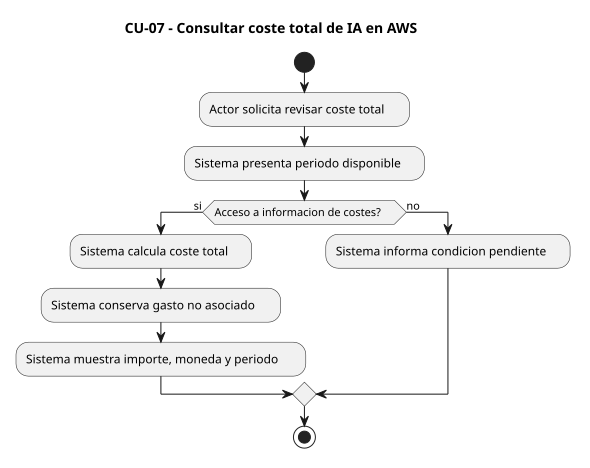 |

#### Conversación principal

| Actor | Sistema |
| :--- | :--- |
| Solicita revisar el coste total de IA. | Presenta el periodo efectivo disponible. |
| Revisa el periodo efectivo mostrado por la plataforma. | Comprueba que la organización puede consultar información de costes. |
| Espera el resultado agregado. | Calcula el coste total incluyendo gasto asociado y no asociado. |
| Revisa el importe final. | Muestra moneda, periodo, coste total y fecha de actualización. |

#### Flujos alternativos

- **A1. Permisos insuficientes:** el sistema informa de la condición necesaria para continuar y no presenta datos parciales como definitivos.
- **A2. Datos recientes no publicados:** el sistema muestra el último estado disponible e indica que la publicación de costes puede tener retraso.
- **A3. Coste sin atribución por agente:** el sistema conserva ese importe dentro del total para no ocultar gasto real.

#### Vocabulario actor/sistema

El actor habla de coste total, periodo y moneda. El sistema responde con importe agregado, última actualización y coste no asociado cuando proceda.

#### Conexión con el diagrama de contexto

CU-07 se ejecuta después de la autenticación y de la configuración básica de credenciales. Es el primer caso FinOps porque no depende de granularidad por agente.

### CU-08 — Consultar coste por agente de IA en AWS

| Campo | Detalle |
| :--- | :--- |
| **Actor primario** | Administrador / Usuario Regular |
| **Actores secundarios** | AWS |
| **Objetivo** | Consultar el coste atribuido a cada agente de IA y separar el gasto que no puede asignarse. |
| **Tipo** | Primario, esencial |
| **Nivel** | Objetivo de usuario |
| **Precondición** | Existen costes recopilados y la cuenta AWS dispone de una señal de atribución visible en Cost Explorer. |
| **Postcondición exitosa** | El usuario visualiza un ranking por agente y un bloque de coste no asociado. |
| **Postcondición alternativa** | Si AWS no devuelve granularidad por agente, el sistema conserva el gasto como no asociado. |
| **Diagrama** | 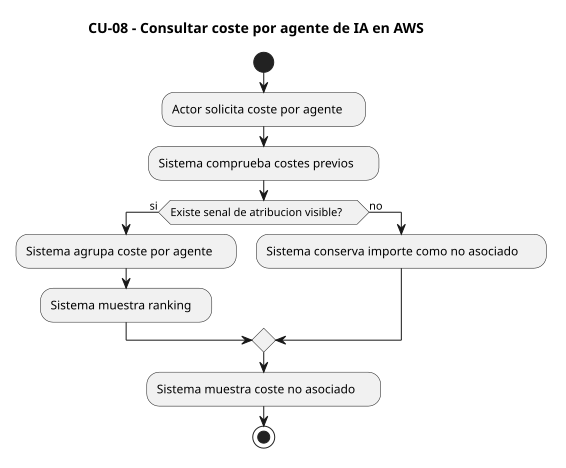 |

#### Conversación principal

| Actor | Sistema |
| :--- | :--- |
| Solicita revisar el coste por agente. | Comprueba que existe una base de costes previa. |
| Revisa el periodo efectivo usado por la consulta. | Comprueba si existe una señal de atribución visible en Cost Explorer. |
| Revisa los resultados. | Agrupa el coste atribuido por agente y separa el gasto no asociado. |
| Compara agentes y gasto pendiente de atribuir. | Muestra ranking, moneda, periodo y total no asociado. |

#### Flujos alternativos

- **A1. No hay costes previos:** el sistema solicita completar antes la recopilación de costes.
- **A2. La señal de atribución aún no aparece:** el sistema conserva el importe como coste no asociado.
- **A3. AWS solo devuelve coste agregado:** el sistema informa de la limitación y no inventa una relación agente-coste.

#### Vocabulario actor/sistema

El actor habla de agente, ranking y gasto sin asignar. El sistema habla de señal de atribución visible, coste atribuido y coste no asociado.

#### Conexión con el diagrama de contexto

CU-08 se apoya en CU-07. La separación evita que la consulta del coste total quede bloqueada cuando la granularidad por agente todavía no está disponible.

### CU-09 — Detectar anomalías de gasto

| Campo | Detalle |
| :--- | :--- |
| **Actor primario** | Administrador / Actor Tiempo |
| **Actores secundarios** | CAIO Virtual |
| **Objetivo** | Detectar desviaciones relevantes de gasto frente al comportamiento histórico. |
| **Tipo** | Primario, esencial |
| **Nivel** | Objetivo de usuario y tarea temporal |
| **Precondición** | Existen registros diarios suficientes para comparar un día observado con los catorce días anteriores. |
| **Postcondición exitosa** | Las anomalías detectadas se muestran al usuario y quedan registradas como evidencia auditable. |
| **Postcondición alternativa** | Si no hay histórico suficiente, el sistema explica la condición pendiente y no fuerza conclusiones. |
| **Diagrama** | 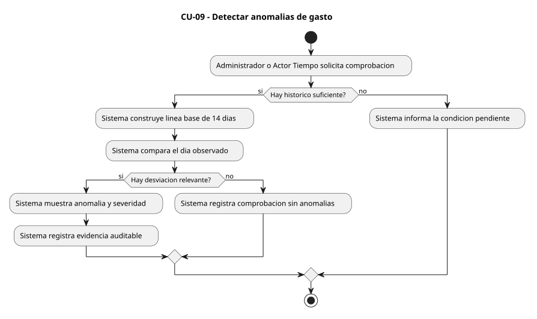 |

#### Conversación principal

| Actor | Sistema |
| :--- | :--- |
| Solicita revisar anomalías o espera la comprobación periódica. | Comprueba que existe histórico suficiente. |
| Revisa el periodo observado. | Construye una línea base con los catorce días anteriores. |
| Espera la evaluación. | Compara el día observado con la línea base y el umbral definido. |
| Revisa anomalías, severidad y alcance. | Muestra total observado, referencia histórica, umbral y evidencia auditable. |

#### Flujos alternativos

- **A1. Histórico insuficiente:** el sistema bloquea el análisis real y explica cuántos días faltan.
- **A2. Sin atribución por agente:** el sistema evalúa total y coste no asociado, y marca el análisis por agente como pendiente.
- **A3. No hay anomalías:** el sistema registra la comprobación y muestra que no se han detectado desviaciones.

#### Vocabulario actor/sistema

El actor habla de picos, desviaciones y severidad. El sistema habla de línea base, día observado, umbral, ámbito y evidencia.

#### Conexión con el diagrama de contexto

CU-09 puede iniciarse por un administrador o repetirse mediante el Actor Tiempo cuando el módulo FinOps ya dispone de histórico.

### CU-10 — Coste LLM estimado del CAIO Virtual

| Campo | Detalle |
| :--- | :--- |
| **Actor primario** | Administrador / Usuario Regular |
| **Actores secundarios** | CAIO Virtual |
| **Objetivo** | Consultar el coste estimado de las llamadas a modelos de lenguaje realizadas por la propia plataforma. |
| **Tipo** | Secundario, esencial para observabilidad interna |
| **Nivel** | Objetivo de usuario |
| **Precondición** | La plataforma ha registrado llamadas a modelos de lenguaje durante el periodo consultado. |
| **Postcondición exitosa** | El usuario visualiza tokens, llamadas y coste estimado por fuente, proveedor, modelo y periodo. |
| **Postcondición alternativa** | Si no hay registros, el sistema muestra el estado vacío y mantiene claro que no se trata de una factura oficial. |
| **Diagrama** | 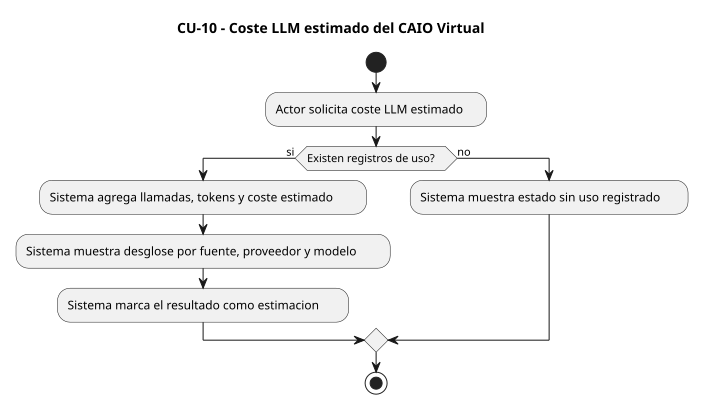 |

#### Conversación principal

| Actor | Sistema |
| :--- | :--- |
| Solicita revisar el coste LLM estimado. | Presenta el periodo efectivo disponible. |
| Revisa el periodo efectivo de observabilidad. | Agrega llamadas, tokens y coste estimado. |
| Revisa el resultado. | Muestra desglose por fuente, proveedor, modelo y día. |
| Interpreta el coste como estimación interna. | Mantiene visible la diferencia entre estimación y factura oficial. |

#### Flujos alternativos

- **A1. Sin uso registrado:** el sistema informa de que no existen llamadas de plataforma en el periodo.
- **A2. Uso externo a la plataforma:** el sistema no lo incluye en la estimación porque no tiene evidencia interna.

#### Vocabulario actor/sistema

El actor habla de coste del CAIO Virtual, tokens y llamadas. El sistema habla de coste estimado, fuente, proveedor, modelo y periodo.

#### Conexión con el diagrama de contexto

CU-10 complementa CU-07: CU-07 cubre coste cloud observado y CU-10 cubre el coste estimado generado por la propia plataforma al operar.

### CU-11 — Optimizar recuperación RAG de agentes Bedrock

| Campo | Detalle |
| :--- | :--- |
| **Actor primario** | Administrador / Usuario Regular |
| **Actores secundarios** | AWS |
| **Objetivo** | Evaluar perfiles de recuperación RAG para reducir contexto potencial sin modificar de forma persistente la configuración del agente. |
| **Tipo** | Secundario, optimización controlada |
| **Nivel** | Objetivo de usuario |
| **Precondición** | Existe un agente Bedrock de la organización con una base de conocimiento asociada. |
| **Postcondición exitosa** | El usuario obtiene una recomendación o una prueba controlada de recuperación con fragmentos limitados. |
| **Postcondición alternativa** | Si el agente no tiene base de conocimiento, el sistema marca la misión como no aplicable. |
| **Diagrama** | 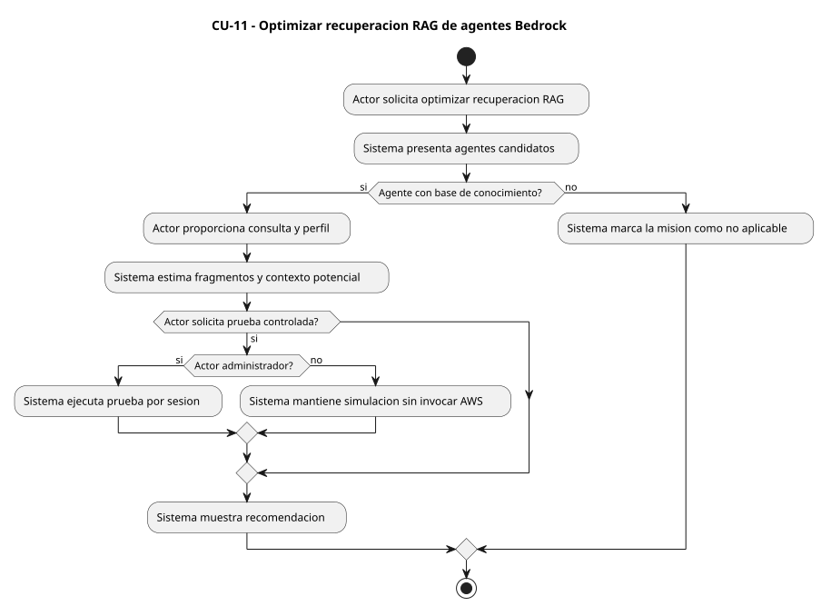 |

#### Conversación principal

| Actor | Sistema |
| :--- | :--- |
| Solicita optimizar la recuperación RAG. | Presenta agentes candidatos. |
| Selecciona un agente y proporciona una consulta de prueba. | Comprueba si existe base de conocimiento asociada. |
| Elige un perfil de recuperación. | Estima el número de fragmentos y el contexto potencial. |
| Revisa la recomendación. | Muestra comparación entre valor base y valor recomendado. |
| Puede solicitar una prueba controlada. | Ejecuta la prueba con configuración por sesión cuando procede y el actor tiene permisos administrativos. |

#### Flujos alternativos

- **A1. Agente sin base de conocimiento:** el sistema informa de que la optimización no aplica a ese agente.
- **A2. No se ejecuta prueba real:** el sistema conserva la simulación como resultado evaluable.
- **A3. Error de permisos o configuración:** el sistema muestra la causa y no altera configuración persistente.

#### Vocabulario actor/sistema

El actor habla de consulta, perfil y fragmentos recuperados. El sistema habla de base de conocimiento, contexto potencial, valor base y recomendación.

#### Conexión con el diagrama de contexto

CU-11 se ejecuta cuando ya existen agentes descubiertos y la organización desea evaluar una mejora de eficiencia sin comprometer cambios persistentes.

### CU-12 — Optimizar agentes Bedrock mediante prompt caching controlado

| Campo | Detalle |
| :--- | :--- |
| **Actor primario** | Administrador / Usuario Regular para evaluación; Administrador para aplicación. |
| **Actores secundarios** | AWS |
| **Objetivo** | Evaluar y aplicar prompt caching solo cuando el agente, el modelo, la región y la configuración avanzada sean compatibles. |
| **Tipo** | Secundario, operación administrativa controlada |
| **Nivel** | Objetivo de usuario |
| **Precondición** | Existe un agente Bedrock candidato. Para aplicar cambios, el administrador debe tener permisos para consultar, actualizar y preparar su configuración. |
| **Postcondición exitosa** | El usuario visualiza elegibilidad y simulación previa; si un administrador confirma la aplicación, el sistema muestra el estado final auditado. |
| **Postcondición alternativa** | Si falta compatibilidad real, el sistema conserva únicamente la simulación y bloquea cambios. |
| **Diagrama** | 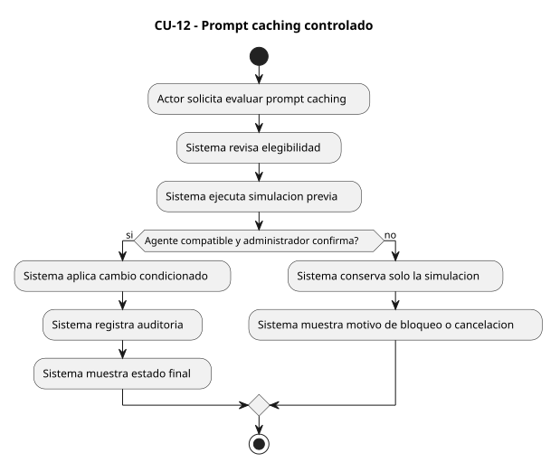 |

#### Conversación principal

| Actor | Sistema |
| :--- | :--- |
| Solicita evaluar prompt caching en un agente. | Presenta estado actual y condiciones de elegibilidad. |
| Selecciona el estado deseado. | Ejecuta una simulación previa sin modificar AWS. |
| Revisa limitaciones, beneficio potencial y riesgos. | Informa si el agente es candidato y qué condiciones afectan al ahorro. |
| Confirma la operación administrativa. | Aplica el cambio solo si el actor es administrador, existe configuración compatible y registra auditoría. |
| Revisa el resultado final. | Muestra estado aplicado o motivo de bloqueo. |

#### Flujos alternativos

- **A1. Agente no elegible:** el sistema muestra el motivo y no permite aplicar cambios.
- **A2. Estado ya aplicado:** el sistema informa de que no hay cambios necesarios.
- **A3. Falta configuración avanzada compatible:** el sistema bloquea la mutación real y conserva la simulación.
- **A4. Error del proveedor cloud:** el sistema registra la incidencia y muestra el estado sin prometer ahorro.

#### Vocabulario actor/sistema

El actor habla de activar, desactivar, confirmar y revisar impacto. El sistema habla de elegibilidad, simulación previa, configuración compatible, auditoría y condiciones de ahorro.

#### Conexión con el diagrama de contexto

CU-12 aparece después de tener agentes descubiertos. La evaluación puede revisarse sin mutar AWS, pero la aplicación real exige permisos administrativos. Es una optimización condicionada, no una promesa automática de reducción de gasto.

## 3.16 Trazabilidad de requisitos y artefactos

Los CU-01 a CU-06 corresponden a capacidades ya implementadas en la plataforma base. En este TFG se implementan y explican CU-07 a CU-12; CU-13 a CU-16 quedan descritos como evolución posible y no deben leerse como funcionalidad disponible.

| Caso de uso | Especificación | Prototipo conceptual | Análisis esperado | Diseño posterior |
| :--- | :--- | :--- | :--- | :--- |
| CU-07 Coste total IA | Detalle RUP del caso | Vista de costes, bloque de resumen | Vista de costes, controlador de coste total y modelo financiero | Capítulo 4, diseño de coste total |
| CU-08 Coste por agente IA | Detalle RUP del caso | Vista de costes, ranking por agente | Vista de costes, controlador de atribución y modelo financiero | Capítulo 4, diseño de atribución |
| CU-09 Detectar anomalías | Detalle RUP del caso | Vista de costes, alertas y severidad | Vista de costes, controlador de anomalías y modelo de auditoría | Capítulo 4, diseño de detección |
| CU-10 Coste LLM estimado | Detalle RUP del caso | Vista de costes, sección LLM | Vista de costes, controlador de observabilidad LLM y modelo de uso | Capítulo 4, diseño de coste estimado |
| CU-11 Optimizar RAG Bedrock | Detalle RUP del caso | Vista de costes, panel RAG | Panel de optimización en la vista de costes, controlador RAG y modelo de agente | Capítulo 4, diseño de invocación controlada |
| CU-12 Prompt caching Bedrock | Detalle RUP del caso | Vista de costes, panel prompt caching | Panel de optimización en la vista de costes, controlador de caching y modelo de agente | Capítulo 4, diseño de cambio controlado |
| CU-13 Proyectar tendencia | Evolución futura | Ampliación futura de vista de costes | Pendiente | Fuera del alcance implementado |
| CU-14 Configurar alertas | Evolución futura | Configuración futura de alertas | Pendiente | Fuera del alcance implementado |
| CU-15 Informe de consumo IA | Evolución futura | Informe futuro | Pendiente | Fuera del alcance implementado |
| CU-16 Consolidación de agentes | Evolución futura | Catálogo futuro de agentes | Pendiente | Fuera del alcance implementado |

## 3.17 Marco de Decisiones Estratégicas FinOps (F1–F11)

El framework de gobernanza propio de la solución organiza el control financiero de la IA en once preguntas estratégicas que el CAIO Virtual evalúa para cada organización. Cada decisión se mapea a misiones concretas del catálogo.

| Decisión | Pregunta estratégica | Misión asociada |
| :--- | :--- | :--- |
| **F1** | ¿Cuánto cuesta cada agente de IA al mes? | CU-08 |
| **F2** | ¿Puede reducirse contexto en agentes RAG controlando el impacto sobre la respuesta? | CU-11 |
| **F3** | ¿Existe una vista consolidada de todos los costes de IA? | CU-07 para total AWS y CU-10 para coste estimado de plataforma |
| **F4** | ¿Se detectan desviaciones relevantes antes de que pasen inadvertidas? | CU-09 + CU-14 |
| **F5** | ¿Hay agentes Bedrock con prompts repetidos donde prompt caching podría reducir coste o latencia? | CU-12 |
| **F6** | ¿Existen dos o más agentes que hacen exactamente lo mismo? | CU-16 *(posible futuro)* |
| **F7** | ¿Las mismas fuentes de datos están cargadas en múltiples agentes innecesariamente? | CU-16 *(posible futuro)* |
| **F8** | ¿Podría consolidarse el catálogo de agentes en un número menor más optimizado? | CU-16 *(posible futuro)* |
| **F9** | ¿Existe un presupuesto de IA asignado por equipo o departamento? | CU-14 *(posible futuro)* |
| **F10** | ¿Cómo evolucionará el gasto de IA en los próximos meses? | CU-13 |
| **F11** | ¿Recibe la dirección informes periódicos del consumo de IA? | CU-15 *(posible futuro)* |

Las misiones marcadas como *(posible futuro)* representan trabajo identificado para iteraciones posteriores. Su implementación no está garantizada en el alcance de este TFG.

> **Nota:** F3 queda separado en CU-07 porque el coste total puede obtenerse sin atribución por agente. F1 queda separado en CU-08 porque exige preparar AWS para asociar gasto a agentes concretos mediante una señal visible en Cost Explorer. Los costes reales que AWS no permita asociar a un agente se muestran como no asociados.
