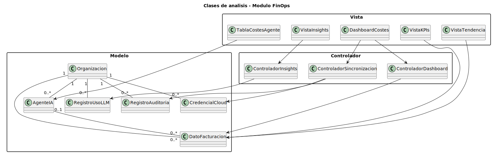
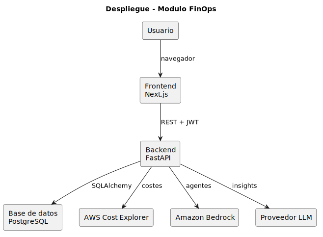
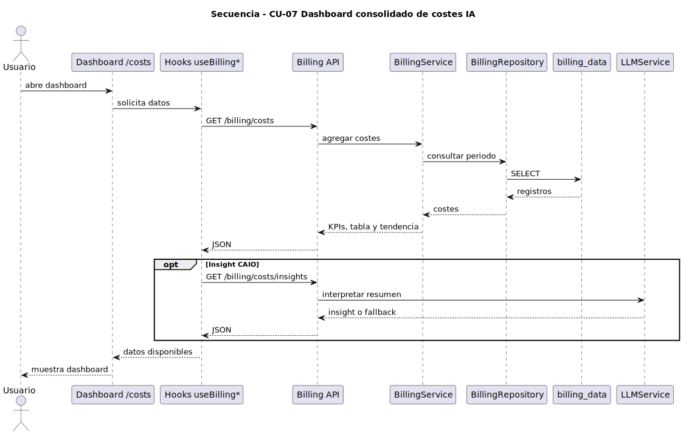
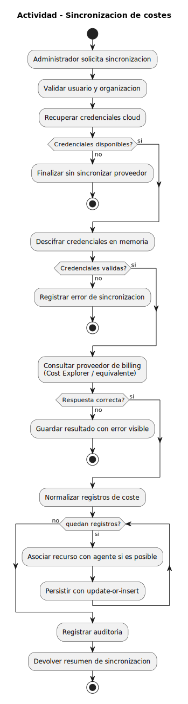

# 5. Disciplina de Análisis

## 5.1 Introducción

La disciplina de análisis toma como punto de partida el modelo de dominio y los casos de uso definidos en el capítulo 2. Su objetivo no es repetir qué necesita el usuario, sino refinar esos requisitos con un lenguaje más cercano al desarrollo: arquitectura, colaboraciones entre componentes, clases conceptuales y organización lógica del módulo.

En este TFG el sistema no se desarrolla desde cero. Theia Officer ya existe como plataforma de gobierno de agentes de IA y este trabajo se centra en una parte concreta: el módulo FinOps para visibilidad y control financiero de agentes de IA en AWS. Por tanto, el análisis no redefine la aplicación completa, sino que estudia cómo encajan las capacidades financieras dentro de la arquitectura existente.

El capítulo 2 prioriza los nuevos casos de uso FinOps mediante MoSCoW. CU-07 y CU-08 aparecen como Must, CU-09 a CU-11 como Should y CU-12 a CU-13 como Could. En este capítulo se analizan todos ellos, pero con distinto nivel de profundidad: CU-07 se detalla por ser la base de datos, pantallas y agregaciones sobre las que se apoyan los demás; CU-08 se diseña de forma condicionada porque requiere histórico real; CU-09 a CU-13 se tratan como evolución del módulo.

## 5.2 Análisis de la arquitectura

### 5.2.1 Arquitectura existente de Theia Officer

Theia Officer utiliza una arquitectura por capas: frontend Next.js, backend FastAPI, servicios de dominio, repositorios de acceso a datos y modelos SQLAlchemy. La documentación técnica del proyecto describe el flujo general como `Frontend -> API -> Service -> Repository -> ORM`, con inyección de dependencias mediante `Depends()` y sesiones de base de datos por petición.

El módulo FinOps debe respetar esa estructura para no introducir una arquitectura paralela. La responsabilidad de cada capa queda así:

| Capa | Responsabilidad en Theia Officer | Responsabilidad FinOps |
|------|----------------------------------|-------------------------|
| Frontend | Presentar pantallas, estado cliente y llamadas HTTP | Dashboard de costes, estados de carga/error y filtros |
| API | Exponer endpoints autenticados | Contrato REST de costes, sincronización e insights |
| Service | Orquestar reglas de negocio | Agregación de costes, sincronización y análisis financiero |
| Repository | Encapsular acceso a datos | Consultas e idempotencia sobre datos de facturación |
| Model | Persistencia ORM | Entidades financieras y relaciones con organización/agentes |
| Integraciones | Conectores cloud y proveedores LLM | AWS Cost Explorer, Bedrock y proveedor LLM del CAIO |

### 5.2.2 Encaje del módulo FinOps

El módulo FinOps se apoya en entidades ya existentes de la plataforma: organizaciones, usuarios, credenciales cloud, agentes descubiertos, registros de auditoría y configuración LLM. La aportación del TFG consiste en añadir una vista financiera sobre esos elementos, no en sustituirlos.

La relación central es:

```text
Organización
  -> Credenciales AWS
  -> Agentes Bedrock descubiertos
  -> Datos de facturación
  -> Agregaciones FinOps
  -> Dashboard / análisis CAIO
```

Este encaje permite que la visibilidad de costes se mantenga aislada por organización, reutilice credenciales ya configuradas y pueda evolucionar hacia otros proveedores cloud sin cambiar el modelo conceptual principal.

### 5.2.3 Sistemas externos implicados

El análisis identifica tres sistemas externos relevantes:

| Sistema | Papel en el módulo | Observación de diseño |
|---------|--------------------|-----------------------|
| AWS Cost Explorer | Fuente de datos de coste | Proporciona coste histórico, no datos en tiempo real |
| Amazon Bedrock | Fuente de agentes IA | Permite relacionar costes con agentes descubiertos |
| Proveedor LLM del CAIO | Interpretación de datos | Analiza datos ya estructurados; no debe extraer datos de AWS |

La distinción es importante: el CAIO Virtual aporta valor interpretando patrones y recomendaciones, pero la lectura de datos estructurados de facturación debe ser determinista y auditable.

### 5.2.4 Flujo lógico de datos de facturación

El flujo propuesto para los datos financieros es:

```text
AWS Cost Explorer
  -> normalización de registros de coste
  -> persistencia idempotente en billing_data
  -> agregaciones por periodo, proveedor, servicio y agente
  -> exposición mediante API REST
  -> visualización en dashboard
  -> análisis textual opcional por el CAIO Virtual
```

Cost Explorer tiene una latencia propia de facturación, por lo que el módulo debe tratar los datos como históricos. No se debe prometer monitorización en tiempo real basada únicamente en esta fuente.

## 5.3 Análisis de casos de uso

### 5.3.1 Priorización de casos de uso FinOps

El capítulo 2 define los siguientes casos de uso nuevos:

| Prioridad | Casos de uso | Papel en el módulo |
|-----------|--------------|--------------------|
| Must | CU-07, CU-08 | Visibilidad base y detección de anomalías |
| Should | CU-09, CU-10, CU-11 | Optimización y análisis de eficiencia |
| Could | CU-12, CU-13 | Proyección y configuración de alertas |

CU-07 es la base operativa porque todos los casos posteriores dependen de disponer de datos de facturación normalizados. CU-08 también es Must, pero su diseño requiere histórico suficiente para evitar falsos positivos. CU-09 a CU-13 se analizan como ampliaciones coherentes del mismo modelo.

### 5.3.2 CU-07 — Dashboard consolidado de costes IA

CU-07 permite a un administrador o usuario regular consultar una vista consolidada de costes de IA. Según el capítulo 2, debe mostrar KPIs, desglose por agente y evolución temporal.

| Paso del caso de uso | Colaboración de análisis |
|----------------------|--------------------------|
| El usuario accede al dashboard | `CostsDashboardView` solicita datos al controlador de costes |
| El sistema obtiene costes del periodo | `BillingDashboardController` consulta `BillingData` |
| El sistema calcula KPIs | Se agregan costes por proveedor, agente y periodo |
| El sistema muestra tabla y gráficos | Vistas primitivas renderizan KPIs, tendencia y desglose |
| El usuario filtra | La vista actualiza parámetros de consulta |

Escenarios relevantes:

| Escenario | Comportamiento esperado |
|-----------|-------------------------|
| Hay datos sincronizados | Mostrar KPIs, tendencia temporal y desglose por agente |
| No hay datos | Mostrar estado vacío y sugerir sincronizar facturación |
| Solo hay datos de un proveedor | Mostrar el proveedor disponible sin forzar comparación multi-cloud |
| El CAIO no está disponible | Mostrar datos numéricos sin bloquear el dashboard |

### 5.3.3 CU-08 — Detección de anomalías de gasto

CU-08 detecta picos de gasto inusuales respecto al histórico. En análisis se identifica como un caso Must, pero dependiente de datos acumulados: sin varias semanas de registros reales, cualquier umbral estadístico sería arbitrario.

| Elemento | Análisis |
|----------|----------|
| Actor principal | CAIO Virtual / Actor Tiempo |
| Datos necesarios | Coste por agente, periodo y proveedor |
| Dependencia | Histórico suficiente para calcular línea base |
| Salida | Anomalía registrada y notificación al administrador |

La decisión de análisis es no tratar CU-08 como una simple pantalla adicional. Es un proceso periódico que debe reutilizar `BillingData`, aplicar una regla estadística documentada y registrar el resultado de forma auditable.

### 5.3.4 CU-09 a CU-13 — Casos de evolución

Los casos Should y Could se analizan para que el diseño de CU-07 no cierre puertas:

| Caso | Necesidad de datos | Dependencia principal |
|------|--------------------|-----------------------|
| CU-09 Analizar eficiencia | Coste + señales de uso | Requiere relacionar coste con utilización real |
| CU-10 Coste del CAIO Virtual | `LLMUsageLog` | Reutiliza logs de uso de proveedores LLM |
| CU-11 Optimizar modelo | Coste + modelo + calidad esperada | Requiere criterios de sustitución de modelos |
| CU-12 Proyectar tendencia | Serie temporal de costes | Requiere histórico estable |
| CU-13 Alertas de umbral | Coste por periodo + límites configurados | Requiere configuración persistente de umbrales |

Estos casos no necesitan el mismo nivel de secuencia que CU-07 en esta entrega, pero sí condicionan el diseño: la tabla de facturación debe ser temporal, multi-tenant, filtrable por proveedor y asociable a agentes.

### 5.3.5 Trazabilidad CU × pantalla × API × modelo

La siguiente tabla no afirma que todos los endpoints estén implementados. Define el contrato de diseño necesario para cubrir los casos de uso del módulo.

| Caso de uso | Pantalla / proceso | API de diseño | Modelo principal |
|-------------|--------------------|---------------|------------------|
| CU-07 Dashboard | `/costs` | `GET /billing/status`, `GET /billing/costs`, `GET /billing/costs/trend` | `BillingData`, `Agent` |
| CU-07 Desglose | `/costs` | `GET /billing/costs/breakdown` | `BillingData` |
| CU-07 Insights | `/costs` | `GET /billing/costs/insights` | `BillingData`, `LLMUsageLog` |
| CU-07 Sincronización | Acción administrativa | `POST /billing/sync` | `BillingData`, `AuditLog` |
| CU-08 Anomalías | Proceso periódico | `GET /billing/anomalies` o tarea interna | `BillingData` histórico |
| CU-09 Eficiencia | Vista de optimización | `GET /billing/efficiency` | `BillingData`, señales de uso |
| CU-10 Coste CAIO | Vista de coste plataforma | `GET /llm/costs` | `LLMUsageLog` |
| CU-11 Recomendaciones | Proceso CAIO | `GET /llm/optimization` | `LLMUsageLog`, configuración LLM |
| CU-12 Proyección | Dashboard / informe | `GET /billing/projection` | `BillingData` |
| CU-13 Alertas | Configuración | `POST /billing/alerts` | configuración de umbrales |

## 5.4 Análisis de clases

### 5.4.1 Identificación de clases Modelo, Vista y Controlador

Siguiendo la guía del capítulo 3, las clases de análisis se derivan del modelo de dominio y de los casos de uso. Se separan en Modelo, Vista y Controlador.

### 5.4.2 Clases modelo

| Clase | Origen | Responsabilidad |
|-------|--------|-----------------|
| `Organization` | Plataforma base | Aislar datos por cliente |
| `Credential` | Plataforma base | Representar credenciales cloud cifradas |
| `Agent` | Plataforma base | Representar agentes IA descubiertos |
| `BillingData` | TFG | Registrar coste por recurso, periodo y proveedor |
| `LLMUsageLog` | Plataforma base | Registrar coste de llamadas LLM del CAIO |
| `AuditLog` | Plataforma base | Registrar operaciones relevantes |

No se añaden clases específicas para los casos que no forman parte del núcleo visualizado. CU-08 y
CU-13 se mantienen como evolución del módulo, pero no necesitan ampliar este diagrama de análisis.

### 5.4.3 Clases vista

| Clase vista | Actor | Casos de uso |
|-------------|-------|--------------|
| `CostsDashboardView` | Administrador / Usuario Regular | CU-07, CU-12 |
| `CostKPIView` | Administrador / Usuario Regular | CU-07 |
| `CostTrendView` | Administrador / Usuario Regular | CU-07, CU-12 |
| `AgentCostTableView` | Administrador / Usuario Regular | CU-07, CU-09 |
| `CostInsightsView` | Administrador / Usuario Regular | CU-07, CU-11 |

### 5.4.4 Clases controlador

| Clase controlador | Casos de uso | Responsabilidad |
|-------------------|--------------|-----------------|
| `BillingDashboardController` | CU-07 | Coordinar consulta y agregación de costes |
| `BillingSyncController` | CU-07 | Coordinar sincronización con AWS Cost Explorer |
| `CostInsightsController` | CU-07, CU-11 | Preparar datos agregados para el CAIO |

En el diseño técnico estas clases pueden materializarse como routers, servicios, hooks o tareas programadas. En análisis representan responsabilidades, no necesariamente clases físicas uno a uno.

### 5.4.5 Diagrama de clases de análisis

El diagrama PlantUML del análisis se muestra a continuación. Para que sea legible, usa nombres
conceptuales en castellano; las tablas anteriores mantienen la nomenclatura técnica del proyecto.

| Diagrama | Código fuente |
|----------|---------------|
|  | [ClasesAnalisis.puml](./Analisis/ClasesAnalisis/ClasesAnalisis.puml) |

## 5.5 Análisis de paquetes

### 5.5.1 Paquetes backend implicados

| Paquete | Papel en el módulo FinOps |
|---------|---------------------------|
| `app/api/v1/` | Endpoints REST de costes, sincronización e insights |
| `app/services/` | Reglas de negocio, sincronización y análisis |
| `app/repositories/` | Acceso a datos financieros |
| `app/models/` | Entidades persistentes |
| `app/schemas/` | Contratos Pydantic de entrada/salida |

### 5.5.2 Paquetes frontend implicados

| Paquete | Papel en el módulo FinOps |
|---------|---------------------------|
| `src/app/(dashboard)/costs/` | Pantalla principal de costes |
| `src/components/costs/` | Componentes visuales específicos |
| `src/hooks/` | Hooks de consulta y mutación |
| `src/lib/` | Cliente API, tipos y utilidades |

### 5.5.3 Dependencias con módulos existentes

El módulo FinOps depende de autenticación, credenciales, agentes, auditoría y LLM. Esa dependencia es natural: el coste solo tiene sentido dentro de una organización autenticada, asociado a agentes descubiertos y, opcionalmente, interpretado por el CAIO Virtual.

---

# 6. Disciplina de Diseño

## 6.1 Introducción

La disciplina de diseño transforma el análisis anterior en una solución técnica concreta. El diseño define arquitectura, contratos, clases de diseño, modelo físico y paquetes, preparando la implementación y las pruebas.

El criterio principal es mantener bajo acoplamiento con la plataforma existente. Las decisiones deben ser suficientemente concretas para guiar el desarrollo, pero sin prometer funcionalidades que dependan de datos o componentes todavía no validados.

## 6.2 Diseño de la arquitectura

### 6.2.1 Vista lógica del módulo FinOps

La vista lógica propuesta es:

```text
Frontend /costs
  -> hooks de datos
  -> API REST /billing/*
  -> servicios FinOps
  -> repositorios
  -> modelos persistentes
  -> integraciones AWS / LLM
```

El frontend no calcula reglas de negocio financieras; solo presenta datos y estados. El backend concentra agregaciones, sincronización, control de acceso y trazabilidad.

### 6.2.2 Vista de despliegue

El despliegue mantiene la forma general de Theia Officer: frontend Next.js, backend FastAPI y base de datos relacional, ejecutados en contenedores Docker durante el desarrollo. Las APIs externas se consumen desde el backend para no exponer credenciales cloud al navegador.

El diagrama representa componentes desplegados y dependencias externas. Se omite el detalle de
contenedores para mantener la vista centrada en las responsabilidades del módulo.

| Diagrama | Código fuente |
|----------|---------------|
|  | [Despliegue.puml](./Diseño/Despliegue/Despliegue.puml) |

### 6.2.3 Decisiones tecnológicas principales

| Decisión | Justificación |
|----------|---------------|
| FastAPI para la API | Encaja con la plataforma existente y su sistema de dependencias |
| SQLAlchemy async para persistencia | Mantiene el patrón de repositorios y sesiones por petición |
| PostgreSQL como base objetivo | Permite restricciones únicas, índices y agregaciones fiables |
| SDK cloud directo para Cost Explorer | Lectura determinista de datos estructurados |
| LLM solo para interpretación | Evita usar razonamiento generativo para extraer datos tabulares |
| TanStack Query en frontend | Coordina caché, estados de carga y refetch sin lógica manual excesiva |

### 6.2.4 Requisitos no funcionales y decisiones asociadas

| Requisito | Decisión de diseño |
|-----------|--------------------|
| Seguridad | Credenciales cifradas y nunca expuestas al frontend |
| Multi-tenancy | Todas las consultas financieras se acotan por `organization_id` |
| Idempotencia | Clave natural sobre organización, proveedor, recurso y periodo |
| Trazabilidad | Sincronizaciones y operaciones relevantes deben generar auditoría |
| Rendimiento | Llamadas externas con timeout; agregaciones por periodo acotado |
| Extensibilidad | Modelo con columna `provider` y servicios por proveedor |
| Robustez | El fallo del LLM no debe impedir ver datos numéricos |

## 6.3 Diseño de casos de uso

### 6.3.1 Diseño detallado de CU-07

CU-07 se diseña como un dashboard compuesto por varias consultas independientes. Esta separación permite que una parte de la interfaz pueda cargarse aunque otra tarde más o falle.

| Zona | Datos | Contrato de diseño |
|------|-------|--------------------|
| KPIs generales | coste total, moneda, proveedores | `GET /billing/status` |
| Tabla por agente | coste agregado por agente | `GET /billing/costs` |
| Tendencia | serie temporal mensual | `GET /billing/costs/trend` |
| Desglose por servicio | coste por servicio/día | `GET /billing/costs/breakdown` |
| Insights CAIO | interpretación textual | `GET /billing/costs/insights` |

El camino alternativo sin datos debe tratarse como estado esperado, no como error. La primera visita al dashboard puede no tener registros de facturación todavía.

El diagrama de secuencia resume el flujo principal de consulta. Las llamadas numéricas se agrupan
como lectura de costes para no duplicar el mismo recorrido API-servicio-repositorio en cada endpoint.

| Diagrama | Código fuente |
|----------|---------------|
|  | [DS-CU07.puml](./Diseño/Secuencias/DS-CU07.puml) |

### 6.3.2 Diseño de la sincronización de costes

La sincronización es la operación que alimenta `BillingData`. Debe ser administrativa, auditable e idempotente.

Pasos de diseño:

1. Validar autenticación y permisos del usuario.
2. Recuperar credenciales cloud cifradas de la organización.
3. Descifrar credenciales solo en memoria.
4. Consultar Cost Explorer para un periodo acotado.
5. Normalizar registros de coste.
6. Intentar asociar cada coste con un agente conocido.
7. Persistir mediante update-or-insert.
8. Registrar auditoría.

| Diagrama | Código fuente |
|----------|---------------|
|  | [ActividadSync.puml](./Diseño/Actividad/ActividadSync.puml) |

### 6.3.3 Tratamiento de CU-08 y dependencia de histórico

CU-08 no debe diseñarse como una simple llamada puntual. El diseño correcto es una tarea periódica que analiza series temporales acumuladas.

| Aspecto | Diseño propuesto |
|---------|------------------|
| Entrada | `BillingData` de varias semanas |
| Proceso | Cálculo de línea base por agente/proveedor |
| Salida | Resultado de anomalía y auditoría |
| Frecuencia | Diaria, coherente con la latencia de Cost Explorer |
| Riesgo | Falsos positivos si no hay histórico suficiente |

Por tanto, CU-08 queda preparado en el diseño, pero condicionado a disponer de datos reales suficientes para validar el algoritmo.

### 6.3.4 Impacto de CU-09 a CU-13 en la evolución del módulo

| Caso | Impacto de diseño |
|------|-------------------|
| CU-09 | Requiere relacionar coste con uso, no solo con existencia de agente |
| CU-10 | Reutiliza `LLMUsageLog` y debe distinguir coste del cliente frente a coste de la plataforma |
| CU-11 | Necesita catálogo de modelos y criterio de equivalencia funcional |
| CU-12 | Reutiliza tendencia histórica y añade modelo predictivo simple |
| CU-13 | Añade configuración persistente de umbrales y canal de notificación |

El diseño de datos de CU-07 debe permitir esta evolución sin rehacer la base financiera.