# 4. Disciplina de Análisis y Diseño

## 4.1 Introducción

La disciplina de análisis toma como punto de partida el modelo de dominio y los casos de uso definidos en el capítulo 3. Su objetivo no es repetir qué necesita el usuario, sino transformar esos requisitos en colaboraciones conceptuales comprensibles antes de entrar en decisiones técnicas concretas.

En este capítulo se separan dos niveles. En primer lugar se realiza el análisis conceptual mediante Vista, Controlador y Modelo, manteniendo nombres en castellano y sin depender de una tecnología concreta. En segundo lugar se desarrolla el diseño técnico, donde sí aparecen rutas, servicios, tablas, repositorios, secuencias y componentes reales de la plataforma.

El capítulo 3 prioriza los nuevos casos de uso FinOps mediante MoSCoW. CU-07, CU-08 y CU-09 aparecen como Must, CU-10 a CU-12 como Should y CU-13 a CU-16 como evolución futura. En este apartado se analizan CU-07 a CU-12 como alcance implementado del TFG.

## 4.2 Análisis conceptual del módulo FinOps

### 4.2.1 Criterio Vista, Controlador y Modelo

El análisis utiliza tres responsabilidades conceptuales:

| Responsabilidad | Significado en el análisis | Ejemplo en el módulo FinOps |
| :--- | :--- | :--- |
| Vista | Elemento con el que interactúa el actor y que presenta resultados. | Vista de costes, vista de optimización o catálogo de misiones. |
| Controlador | Coordinador del caso de uso; interpreta la solicitud, aplica reglas y pide información al modelo. | Controlador de coste total, controlador de anomalías o controlador de prompt caching. |
| Modelo | Concepto del dominio que representa información o estado relevante. | Organización, agente de IA, dato de facturación, registro de uso LLM o auditoría. |

Esta separación evita mezclar requisitos con implementación. Por ejemplo, en requisitos se afirma que el usuario consulta el coste total; en análisis se identifica una vista, un controlador y un modelo; y en diseño se concreta qué endpoint, servicio y tabla materializan esa colaboración.

### 4.2.2 Priorización de casos de uso FinOps

El análisis toma la priorización definida en el capítulo 3:

| Prioridad | Casos de uso | Papel en el módulo |
| :--- | :--- | :--- |
| Must | CU-07, CU-08, CU-09 | Visibilidad base, atribución por agente y detección de anomalías. |
| Should | CU-10, CU-11, CU-12 | Coste LLM estimado y optimización controlada de agentes Bedrock. |
| Evolución futura | CU-13, CU-14, CU-15, CU-16 | Proyección, alertas, informes y consolidación de agentes. |

CU-07 es la base operativa porque permite revisar el coste total sin depender de granularidad por agente. CU-08 añade atribución cuando existe una señal visible en AWS. CU-09 requiere histórico suficiente. CU-10, CU-11 y CU-12 amplían la observabilidad y la optimización sin convertir el ahorro en una promesa automática.

## 4.3 Análisis de casos de uso

### 4.3.1 CU-07 — Consultar coste total de IA en AWS

CU-07 se analiza como la colaboración mínima de visibilidad financiera. La vista de costes solicita el total con el periodo efectivo de la API, el controlador obtiene el agregado y el modelo conserva la información financiera observada.

| Elemento MVC | Responsabilidad |
| :--- | :--- |
| Vista | Vista de costes y bloque de resumen financiero. |
| Controlador | Controlador de coste total. |
| Modelo | Organización, dato de facturación y registro de auditoría cuando procede. |
| Decisión de análisis | El coste total incluye también gasto no asociado para no ocultar importes reales. |
| Diagrama | 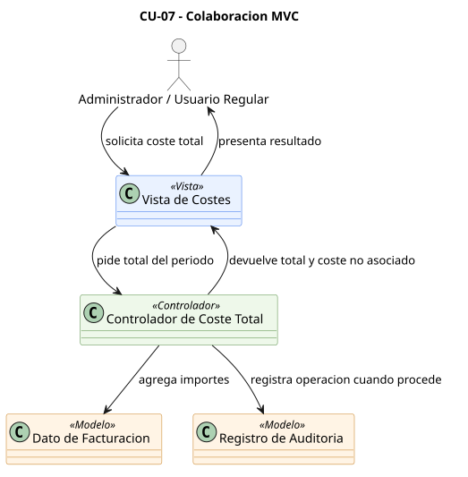 |

### 4.3.2 CU-08 — Consultar coste por agente de IA en AWS

CU-08 separa el coste atribuido del coste no asociado. El análisis no asume que AWS atribuya automáticamente el gasto al recurso agente; solo trabaja con una señal de atribución cuando esta existe y es visible en la información de costes.

| Elemento MVC | Responsabilidad |
| :--- | :--- |
| Vista | Vista de costes, ranking de agentes y bloque de coste no asociado. |
| Controlador | Controlador de atribución por agente. |
| Modelo | Agente de IA, dato de facturación y organización. |
| Decisión de análisis | La falta de atribución no bloquea CU-07; CU-08 informa la limitación y conserva el importe como no asociado. |
| Diagrama | 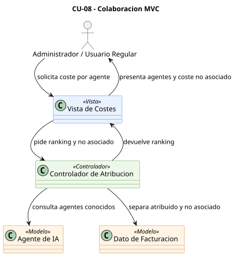 |

### 4.3.3 CU-09 — Detectar anomalías de gasto

CU-09 se analiza como una colaboración que puede ser iniciada por el administrador o por el Actor Tiempo. Su resultado debe ser revisable y auditable.

| Elemento MVC | Responsabilidad |
| :--- | :--- |
| Vista | Vista de costes con alertas, severidad y explicación del umbral. |
| Controlador | Controlador de anomalías. |
| Modelo | Dato de facturación, ejecución de anomalía y registro de auditoría. |
| Decisión de análisis | La línea base se construye con los catorce días anteriores al día observado. |
| Diagrama | 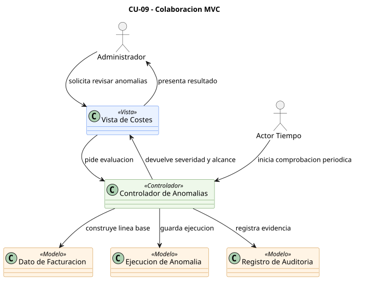 |

### 4.3.4 CU-10 — Coste LLM estimado del CAIO Virtual

CU-10 se separa de la factura oficial. El análisis lo trata como observabilidad interna de la plataforma, basada en registros de uso generados por la propia aplicación.

| Elemento MVC | Responsabilidad |
| :--- | :--- |
| Vista | Vista de costes, sección de coste LLM estimado. |
| Controlador | Controlador de observabilidad LLM. |
| Modelo | Registro de uso LLM y organización. |
| Decisión de análisis | El resultado se presenta como estimación, no como coste oficial de AWS ni factura. |
| Diagrama | 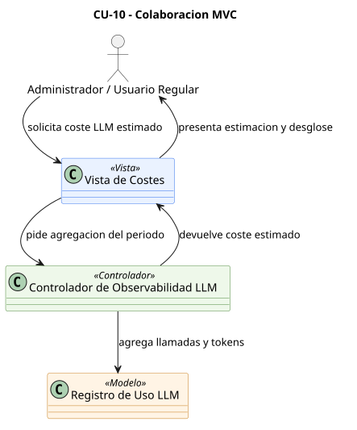 |

### 4.3.5 CU-11 — Optimizar recuperación RAG de agentes Bedrock

CU-11 se analiza como una optimización de invocación. Puede leer información del agente y de su base de conocimiento, y puede ejecutar una prueba controlada, pero no persiste cambios en la configuración del agente.

| Elemento MVC | Responsabilidad |
| :--- | :--- |
| Vista | Panel RAG dentro de la página de costes. |
| Controlador | Controlador de optimización RAG. |
| Modelo | Agente de IA, base de conocimiento y resultado de simulación. |
| Decisión de análisis | La recomendación reduce contexto potencial, pero no garantiza ahorro exacto. |
| Diagrama | 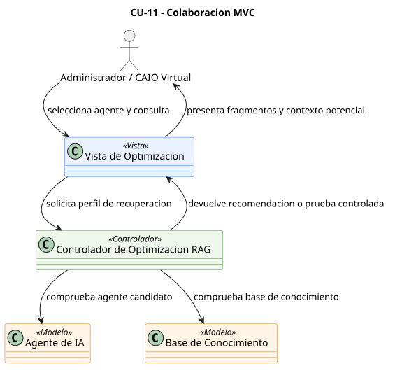 |

### 4.3.6 CU-12 — Optimizar agentes Bedrock mediante prompt caching controlado

CU-12 se analiza como una operación administrativa en dos fases: simulación previa y aplicación confirmada. La aplicación real depende de que el agente tenga una configuración avanzada compatible.

| Elemento MVC | Responsabilidad |
| :--- | :--- |
| Vista | Panel de prompt caching dentro de la página de costes, con elegibilidad, simulación previa y confirmación. |
| Controlador | Controlador de prompt caching. |
| Modelo | Agente de IA, configuración compatible y registro de auditoría. |
| Decisión de análisis | Sin compatibilidad real se conserva la simulación y se bloquea la mutación. |
| Diagrama | 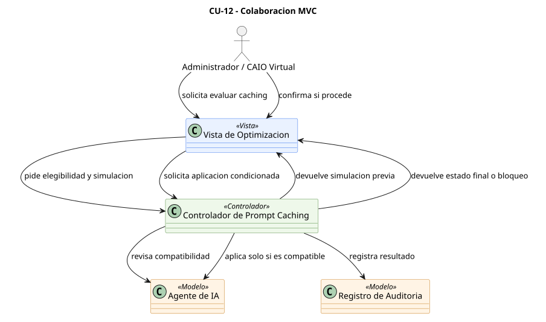 |

### 4.3.7 Trazabilidad de especificación a análisis

| Caso de uso | Especificación del capítulo 3 | Prototipo | Colaboración MVC |
| :--- | :--- | :--- | :--- |
| CU-07 | Coste total de IA | Bloque de resumen | Vista de costes, controlador de coste total, dato de facturación. |
| CU-08 | Coste por agente | Ranking por agente | Vista de costes, controlador de atribución, agente y dato de facturación. |
| CU-09 | Anomalías de gasto | Alertas y severidad | Vista de costes, controlador de anomalías, ejecución auditada. |
| CU-10 | Coste LLM estimado | Sección de coste LLM | Vista de costes, controlador LLM, registro de uso. |
| CU-11 | Optimización RAG | Panel de recuperación | Panel RAG de la vista de costes, controlador RAG, agente y base de conocimiento. |
| CU-12 | Prompt caching controlado | Panel de caching | Panel de prompt caching de la vista de costes, controlador de caching, agente y auditoría. |

## 4.4 Análisis de clases

### 4.4.1 Identificación de clases Modelo, Vista y Controlador

Las clases de análisis se derivan del vocabulario del dominio y de las colaboraciones anteriores. En esta sección se usan nombres conceptuales en castellano para mantener el nivel de análisis separado del diseño técnico.

### 4.4.2 Clases Modelo

| Clase conceptual | Responsabilidad |
| :--- | :--- |
| Organización | Aislar datos, usuarios y decisiones por cliente. |
| Credencial Cloud | Representar la autorización necesaria para consultar información externa. |
| Agente de IA | Representar el trabajador digital cuyo coste u optimización se analiza. |
| Dato de Facturación | Representar coste observado por periodo, servicio, moneda y posible atribución. |
| Registro de Uso LLM | Representar consumo interno de modelos por parte de la plataforma. |
| Ejecución de Anomalía | Representar una comprobación de desviaciones y evitar duplicados. |
| Registro de Auditoría | Representar evidencia de operaciones relevantes. |

### 4.4.3 Clases Vista

| Clase conceptual | Actores | Casos de uso |
| :--- | :--- | :--- |
| Vista de Costes | Administrador / Usuario Regular | CU-07, CU-08, CU-09, CU-10, CU-11, CU-12 |
| Vista de Catálogo FinOps | Administrador / Usuario Regular | CU-07 a CU-12 |
| Panel de Optimización de Agente | Administrador / Usuario Regular según operación | CU-11, CU-12 |
| Vista de Auditoría | Administrador | CU-09, CU-12 |

### 4.4.4 Clases Controlador

| Clase conceptual | Casos de uso | Responsabilidad |
| :--- | :--- | :--- |
| Controlador de Coste Total | CU-07 | Coordinar consulta y agregación del coste total. |
| Controlador de Atribución por Agente | CU-08 | Separar coste atribuido y coste no asociado. |
| Controlador de Anomalías | CU-09 | Construir línea base, evaluar desviaciones y registrar evidencia. |
| Controlador de Observabilidad LLM | CU-10 | Agregar coste LLM estimado de la plataforma. |
| Controlador de Optimización RAG | CU-11 | Evaluar perfiles de recuperación y pruebas controladas. |
| Controlador de Prompt Caching | CU-12 | Simular, validar compatibilidad y aplicar cambios confirmados. |

### 4.4.5 Diagrama de clases de análisis

El diagrama PlantUML del análisis se muestra a continuación. Mantiene las responsabilidades conceptuales que después se transforman en componentes técnicos.

| Diagrama | Código fuente |
| :--- | :--- |
| 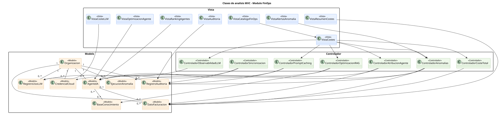 | [ClasesAnalisis.puml](./Analisis/ClasesAnalisis/ClasesAnalisis.puml) |

## 4.5 Inicio del diseño técnico

A partir de este punto se abandona el nivel puramente conceptual y se introducen los artefactos concretos de diseño. Por ello aparecen paquetes, contratos, tecnologías y modelos físicos que no formaban parte de la especificación de requisitos.

### 4.5.1 Paquetes backend implicados

| Paquete | Papel en el módulo FinOps |
|---------|---------------------------|
| `app/api/v1/` | Endpoints REST de costes, sincronización e insights |
| `app/services/` | Reglas de negocio, sincronización y análisis |
| `app/repositories/` | Acceso a datos financieros |
| `app/models/` | Entidades persistentes |
| `app/schemas/` | Contratos Pydantic de entrada/salida |

### 4.5.2 Paquetes frontend implicados

| Paquete | Papel en el módulo FinOps |
|---------|---------------------------|
| `src/app/(dashboard)/costs/page.tsx` | Pantalla principal de costes y composición visual de los seis casos de uso FinOps |
| `src/hooks/use-billing.ts` | Hooks de coste total, coste por agente, anomalías y sincronización |
| `src/hooks/use-llm-costs.ts` | Hook de coste LLM estimado |
| `src/hooks/use-agent-optimization.ts` | Hooks de optimización RAG y prompt caching |
| `src/lib/api-client.ts` | Cliente REST tipado y contratos consumidos por el frontend |

### 4.5.3 Dependencias con módulos existentes

El módulo FinOps depende de autenticación, credenciales, agentes, auditoría y LLM. Esa dependencia es natural: el coste solo tiene sentido dentro de una organización autenticada, asociado a agentes descubiertos y, opcionalmente, interpretado por el CAIO Virtual.

## 4.6 Introducción

La disciplina de diseño transforma el análisis anterior en una solución técnica concreta. El diseño define arquitectura, contratos, clases de diseño, modelo físico y paquetes, preparando la implementación y las pruebas.

El criterio principal es mantener bajo acoplamiento con la plataforma existente, siguiendo una separación de responsabilidades coherente con principios habituales de arquitectura limpia [16]. Las decisiones deben ser suficientemente concretas para guiar el desarrollo, pero sin prometer funcionalidades que dependan de datos o componentes todavía no validados.

## 4.7 Diseño de la arquitectura

### 4.7.1 Vista lógica del módulo FinOps

La vista lógica propuesta es:

```text
Frontend /costs
  -> hooks de datos
  -> API REST /api/v1/billing/*
  -> servicios FinOps
  -> repositorios
  -> modelos persistentes
  -> integraciones AWS / LLM
```

El frontend no calcula reglas de negocio financieras; solo presenta datos y estados. El backend concentra agregaciones, sincronización, control de acceso y trazabilidad.

### 4.7.2 Vista de despliegue

El despliegue mantiene la forma general del producto: frontend Next.js, backend FastAPI y base de datos relacional, ejecutados en contenedores Docker durante el desarrollo. Las APIs externas se consumen desde el backend para no exponer credenciales cloud al navegador.

El diagrama representa componentes desplegados y dependencias externas. Se omite el detalle de
contenedores para mantener la vista centrada en las responsabilidades del módulo.

| Diagrama | Código fuente |
|----------|---------------|
| 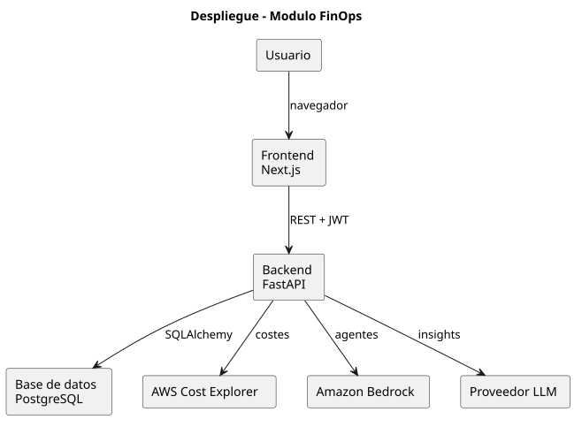 | [Despliegue.puml](./Diseño/Despliegue/Despliegue.puml) |

### 4.7.3 Decisiones tecnológicas principales

| Decisión | Justificación |
|----------|---------------|
| FastAPI para la API | Encaja con la plataforma existente y su sistema de dependencias [13] |
| SQLAlchemy async para persistencia | Mantiene el patrón de repositorios y sesiones por petición [14] |
| PostgreSQL como base objetivo | Permite restricciones únicas, índices y agregaciones fiables |
| SDK cloud directo para Cost Explorer | Lectura determinista de datos estructurados mediante `GetCostAndUsage`, coherente con la latencia de Cost Explorer [17] [19] |
| LLM solo para interpretación | Evita usar razonamiento generativo para extraer datos tabulares |
| TanStack Query en frontend | Coordina caché, estados de carga y refetch sin lógica manual excesiva [15] |

La siguiente tabla concreta las decisiones técnicas más relevantes para los casos CU-07 a CU-12. Se incluyen porque condicionan la interpretación correcta del módulo FinOps: qué datos son facturación oficial, qué datos son estimaciones internas y qué operaciones se mantienen como simulaciones o acciones confirmadas.

| Decisión | Motivo | Consecuencia |
|----------|--------|--------------|
| Usar AWS Cost Explorer para CU-07 y CU-08 | Es la fuente estructurada disponible para coste histórico de Amazon Bedrock. | El sistema obtiene coste agregado por periodo, pero no reconstruye tokens ni invocaciones individuales desde AWS Billing. |
| Conservar `unmatched_cost` | Cost Explorer puede devolver coste Bedrock sin señal de atribución por agente. | El coste no asociado sigue visible y no se fuerza una asignación artificial a un agente. |
| Ejecutar un detector local para CU-09 | Permite construir una línea base auditable a partir de los registros normalizados. | Las anomalías pueden evaluarse sin depender de crear monitores o suscripciones en AWS Cost Anomaly Detection. |
| Tratar CU-10 como coste LLM estimado | La plataforma registra tokens y coste operativo interno, no una factura oficial del proveedor. | La respuesta se presenta como estimación y se separa del coste AWS Bedrock de CU-07 y CU-08. |
| Simular CU-11 sin persistir cambios en AWS | La optimización RAG se aplica por invocación mediante configuración de sesión. | El usuario puede evaluar `numberOfResults` y perfiles RAG sin reconfigurar de forma permanente el agente. |
| Exigir dry-run y confirmación en CU-12 | Prompt caching modifica configuración sensible del agente Bedrock. | La aplicación real queda condicionada a compatibilidad, `promptConfigurations`, permisos y confirmación administrativa. |

### 4.7.4 Requisitos no funcionales y decisiones asociadas

| Requisito | Decisión de diseño |
|-----------|--------------------|
| Seguridad | Credenciales cifradas y nunca expuestas al frontend |
| Multi-tenancy | Todas las consultas financieras se acotan por `organization_id` |
| Idempotencia | Clave natural sobre organización, proveedor, recurso y periodo |
| Trazabilidad | Sincronizaciones y operaciones relevantes deben generar auditoría |
| Rendimiento | Llamadas externas con timeout; agregaciones por periodo acotado |
| Extensibilidad | Modelo con columna `provider` y servicios por proveedor |
| Robustez | Una incidencia del LLM no debe impedir ver datos numéricos |

## 4.8 Diseño de casos de uso

### 4.8.1 Diseño detallado de CU-07

CU-07 se diseña como una misión FinOps ligera que guía al usuario hacia el coste total dentro de la página `/costs`. La implementación prioriza una lectura fiable del coste total de Amazon Bedrock y conserva el gasto no asociado para no ocultar importes reales.

| Zona | Datos | Contrato de diseño |
|------|-------|--------------------|
| Catálogo FinOps | misión CU-07 visible | `cost-total-aws` |
| Página Costs | coste total del periodo efectivo | `GET /api/v1/billing/total` |
| Vista compuesta | resumen de coste, agentes y anomalías | `GET /api/v1/billing/dashboard` |
| Sincronización | lectura de Cost Explorer y persistencia idempotente | `POST /api/v1/billing/sync` |

El camino alternativo sin datos debe tratarse como estado esperado, no como error. La primera visita puede no tener registros de facturación todavía; el diseño debe informar de la ausencia de datos y permitir iniciar una sincronización.

El diagrama de secuencia resume el flujo principal de consulta. Las llamadas numéricas se agrupan
como lectura de costes para no duplicar el mismo recorrido API-servicio-repositorio en cada endpoint.

| Diagrama | Código fuente |
|----------|---------------|
| 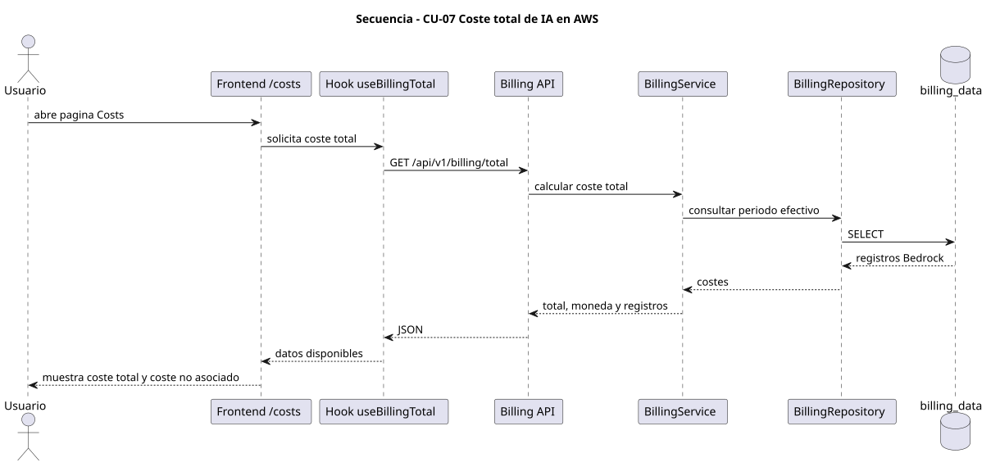 | [DS-CU07.puml](./Diseño/Secuencias/DS-CU07.puml) |
| 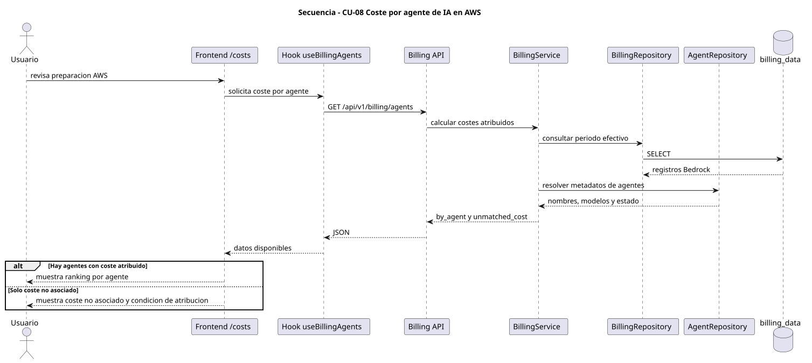 | [DS-CU08.puml](./Diseño/Secuencias/DS-CU08.puml) |
| 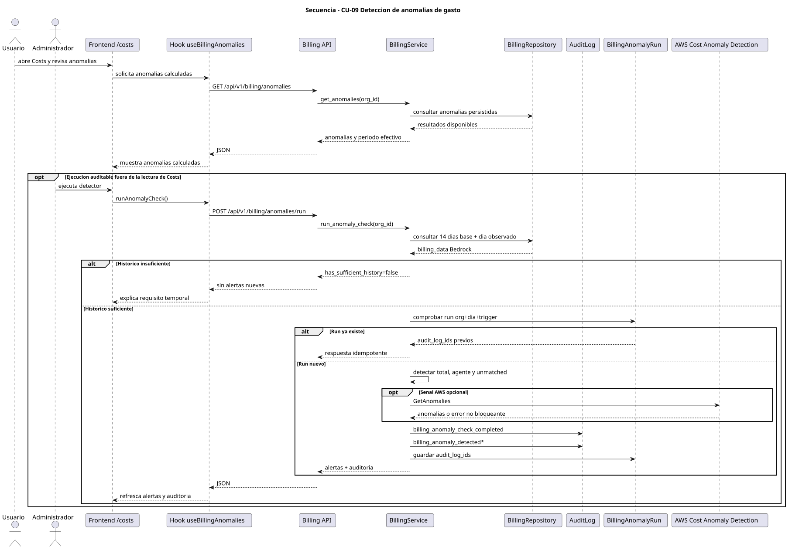 | [DS-CU09.puml](./Diseño/Secuencias/DS-CU09.puml) |
| 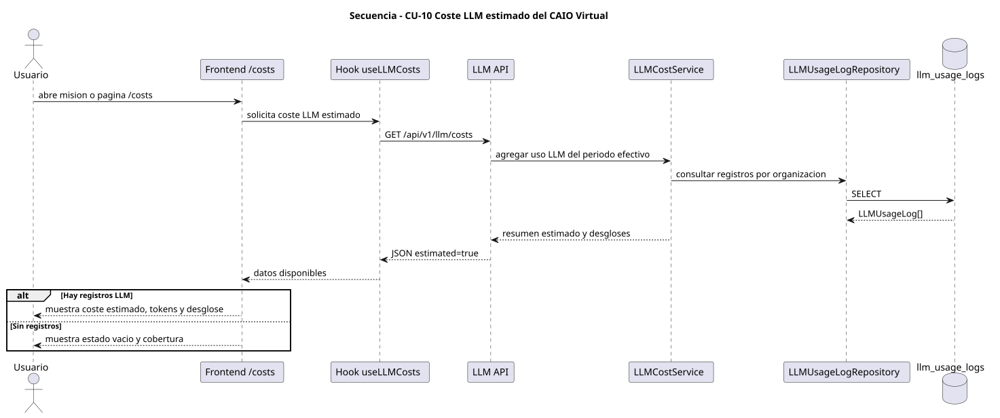 | [DS-CU10.puml](./Diseño/Secuencias/DS-CU10.puml) |
| 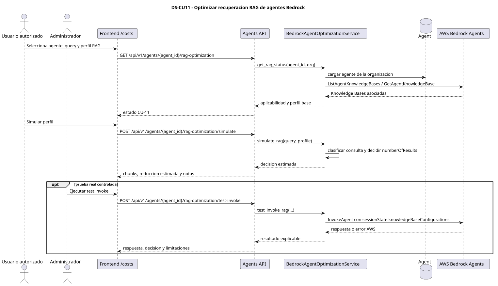 | [DS-CU11.puml](./Diseño/Secuencias/DS-CU11.puml) |
| 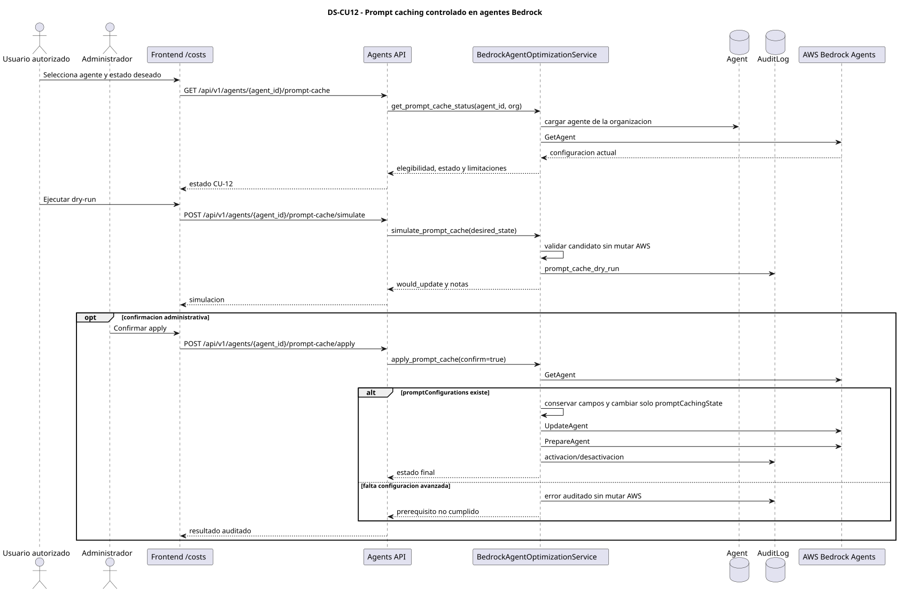 | [DS-CU12.puml](./Diseño/Secuencias/DS-CU12.puml) |

### 4.8.2 Diseño de la sincronización de costes

La sincronización es la operación que alimenta `BillingData`. Debe ser administrativa, auditable e idempotente.

Pasos de diseño:

1. Validar autenticación y permisos del usuario.
2. Recuperar credenciales cloud cifradas de la organización.
3. Descifrar credenciales solo en memoria.
4. Consultar Cost Explorer para un periodo acotado.
5. Normalizar registros de coste.
6. Intentar asociar cada coste con un agente conocido.
7. Persistir mediante update-or-insert.
8. Registrar auditoría.

| Diagrama | Código fuente |
|----------|---------------|
| 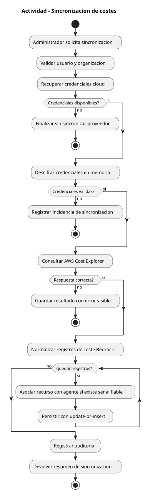 | [ActividadSync.puml](./Diseño/Actividad/ActividadSync.puml) |

### 4.8.3 Diseño detallado de CU-08

CU-08 se diseña como una misión separada para el coste por agente. Usa la misma tabla `BillingData`, pero su contrato principal es `GET /api/v1/billing/agents`.

| Zona | Datos | Contrato de diseño |
|------|-------|--------------------|
| Catálogo FinOps | misión CU-08 visible | `cost-by-agent-aws` |
| Panel por agente | coste agregado por agente | `GET /api/v1/billing/agents` |
| Coste no asociado | importe real sin atribución por agente | `GET /api/v1/billing/agents` |
| Compatibilidad | resumen compuesto para pantallas existentes | `GET /api/v1/billing/dashboard` |

CU-08 exige preparar AWS antes de verificar datos: señal de atribución estable, activación de `theia-agent-id` como `cost allocation tag` cuando se use esa clave y nuevo uso Bedrock para que Cost Explorer pueda exponer la información. El diseño evita afirmar que AWS atribuye automáticamente el coste al recurso agente Bedrock.

### 4.8.4 Tratamiento de CU-09 y dependencia de histórico

CU-09 no debe diseñarse como una simple llamada puntual. El diseño correcto es una tarea periódica que analiza series temporales acumuladas.

| Aspecto | Diseño propuesto |
|---------|------------------|
| Entrada | `BillingData` diario de Amazon Bedrock |
| Proceso | Línea base de 14 días y comparación del último día observado en ámbitos total, agente y no asociado |
| Salida | Resultado de anomalía, auditoría y visualización en `Costs` |
| Frecuencia | Diaria, coherente con la latencia de Cost Explorer |
| Riesgo | Falsos positivos si no hay histórico suficiente |

El diseño implementado exige 14 días previos más un día observado para calcular la línea base. Esta condición se documenta como dependencia temporal de Cost Explorer y del histórico disponible.

### 4.8.5 Impacto de CU-10 a CU-12 y evolución hacia CU-13 a CU-16

#### CU-10: coste LLM estimado del CAIO Virtual

CU-10 se diseña como una lectura local de observabilidad financiera de la plataforma. Reutiliza `LLMUsageLog` y agrega el coste estimado ya almacenado por `source`, proveedor, modelo y día. No consulta AWS ni afirma equivalencia con una factura oficial.

#### CU-11: optimización RAG

CU-11 se diseña como una optimización de invocación, no como una reconfiguración persistente del agente. El backend puede leer las Knowledge Bases asociadas al agente o usar datos ya sincronizados, y decide un valor `numberOfResults` para `InvokeAgent` en función del perfil elegido y de la consulta:

| Perfil | Rango orientativo | Uso |
|--------|-------------------|-----|
| `cost_saving` | 2-3 chunks | Consultas simples o factuales |
| `balanced` | 4-5 chunks | Consultas normales |
| `quality` | 6-8 chunks | Consultas comparativas o analíticas |
| `custom` | Valor elegido | Prueba controlada por administrador |

La salida expresa reducción de chunks/contexto frente al valor base y declara `estimated = true`. No calcula ahorro monetario exacto porque el coste final depende de modelo, tokens reales, calidad del retrieval y comportamiento de la respuesta.

#### CU-12: prompt caching controlado

CU-12 se diseña como una operación administrativa con dos fases. `simulate` evalúa elegibilidad y efecto esperado sin modificar AWS. `apply` requiere confirmación, lee `GetAgent`, conserva los campos existentes y solo continúa si existe `promptOverrideConfiguration.promptConfigurations`. Si falta esa configuración avanzada, bloquea la mutación real con un error auditado. Si existe, modifica solo `promptOverrideConfiguration.promptCachingState.cachingState`, llama a `UpdateAgent` y después a `PrepareAgent`.

El diseño no afirma ahorro automático. Prompt caching depende de soporte por modelo y región, prefijo estático reutilizable, mínimo de tokens cacheables, TTL de la caché y tráfico repetido. Por ello la UI muestra limitaciones y registra en auditoría dry-run, activación, desactivación, errores AWS y agentes no elegibles.

#### Impacto de diseño

| Caso | Impacto de diseño |
|------|-------------------|
| CU-10 | Reutiliza `LLMUsageLog`, agrega coste estimado almacenado y distingue estimación de factura oficial |
| CU-11 | Introduce optimización controlada de RAG por número de chunks recuperados y evita prometer ahorro exacto |
| CU-12 | Introduce cambio real de configuración Bedrock mediante `UpdateAgent` y `PrepareAgent`, siempre con dry-run y auditoría |
| CU-13 | Reutiliza tendencia histórica y añade modelo predictivo simple |
| CU-14 | Añade configuración persistente de umbrales y canal de notificación |

El diseño de datos de CU-07 debe permitir esta evolución sin rehacer la base financiera.

## 4.9 Diseño de clases

### 4.9.1 Transformación de análisis a diseño

Las clases de análisis se transforman en componentes técnicos:

| Análisis | Diseño backend/frontend |
|----------|-------------------------|
| Controlador de costes | Router + servicio + hooks |
| Vista de costes | Página `/costs` y componentes |
| Dato de facturación | Modelo ORM + schema Pydantic |
| Sistema externo AWS | Servicio de integración cloud |
| Insight CAIO | Servicio LLM aplicado a datos agregados |

### 4.9.2 Clases backend

| Clase / componente | Responsabilidad |
|--------------------|-----------------|
| `BillingData` | Persistir registros de coste |
| `BillingRepository` | Consultar y persistir costes |
| `BillingService` | Agregar costes y coordinar sincronización |
| `AWSBillingService` | Encapsular lectura de Cost Explorer |
| Schemas Pydantic | Definir contratos de salida |
| Router de billing | Exponer operaciones autenticadas bajo `/api/v1/billing` |

### 4.9.3 Componentes frontend

| Componente | Responsabilidad |
|------------|-----------------|
| `CostsPage` (`src/app/(dashboard)/costs/page.tsx`) | Componer la pantalla `Costs`, los periodos efectivos devueltos por las APIs, los estados de carga y los bloques de CU-07 a CU-12. |
| `useBillingTotal`, `useBillingAgents`, `useBillingAnomalies`, `useSyncBilling` | Encapsular las consultas y mutaciones de coste AWS Bedrock, coste por agente, anomalías y sincronización. |
| `useLLMCosts` | Consultar el coste LLM estimado de la plataforma para CU-10. |
| `useAgentRAGOptimization`, `useSimulateRAGOptimization`, `useTestInvokeRAGOptimization` | Consultar, simular y ejecutar la prueba controlada de RAG para CU-11. |
| `useAgentPromptCache`, `useSimulatePromptCache`, `useApplyPromptCache` | Consultar elegibilidad, ejecutar dry-run y aplicar prompt caching para CU-12. |
| `api-client.ts` | Centralizar las llamadas REST y los tipos consumidos por la página. |

### 4.9.4 Diagrama de clases de diseño

El diagrama agrupa los endpoints de lectura de costes bajo el router `/api/v1/billing`. Esa agrupación
permite que la vista `/costs` consuma el total, el desglose por agente, las anomalías y la
sincronización sin conocer el detalle interno de persistencia o cálculo. La ruta de compatibilidad
`GET /api/v1/billing/dashboard` reutiliza el servicio de resumen `get_costs`; no existe un método
de dominio separado para dashboard.

| Diagrama | Código fuente |
|----------|---------------|
| 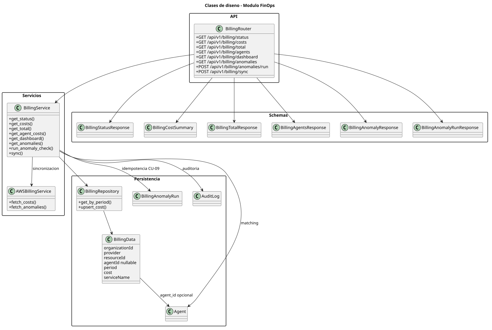 | [ClasesDiseño.puml](./Diseño/ClasesDiseño/ClasesDiseño.puml) |

## 4.10 Diseño de datos

### 4.10.1 Modelo físico

La entidad central del diseño es `billing_data`. No sustituye al modelo de agentes ni al de organizaciones; los complementa con una vista temporal de coste.

| Diagrama | Código fuente |
|----------|---------------|
| 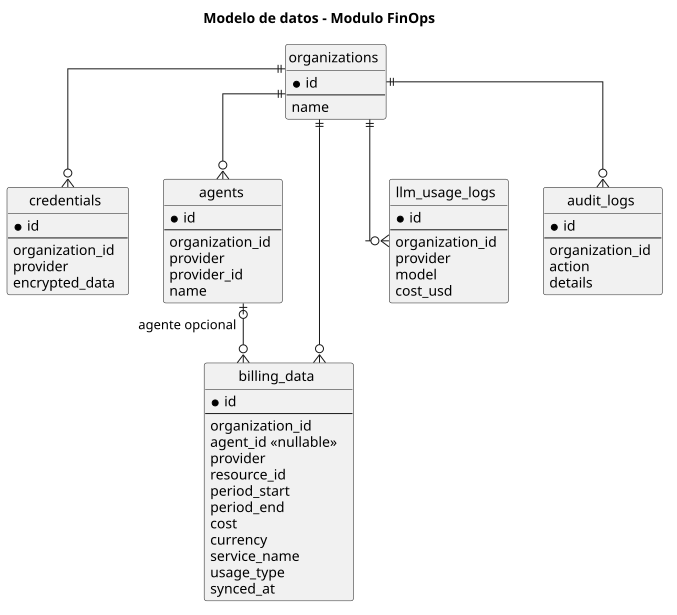 | [DER.puml](./Diseño/ModeloDatos/DER.puml) |

### 4.10.2 Tabla `billing_data`

| Campo | Papel de diseño |
|-------|-----------------|
| `organization_id` | Aislamiento multi-tenant |
| `provider` | Extensibilidad AWS/Azure/GCP |
| `resource_id` | Identificador cloud del recurso facturado |
| `agent_id` | Asociación opcional con agente conocido |
| `period_start`, `period_end` | Ventana temporal del coste |
| `cost`, `currency` | Valor financiero |
| `service_name`, `usage_type` | Desglose técnico |
| `synced_at` | Trazabilidad de sincronización |

### 4.10.3 Relaciones e idempotencia

La clave de idempotencia propuesta es:

```text
(organization_id, provider, resource_id, period_start, period_end)
```

Esto permite repetir una sincronización del mismo periodo sin crear duplicados. Si se aumenta la granularidad a nivel de token o invocación, será necesaria una ampliación del modelo porque Cost Explorer no proporciona ese detalle por sí solo.

## 4.11 Diseño de paquetes

### 4.11.1 Paquetes backend

| Diagrama | Código fuente |
|----------|---------------|
| 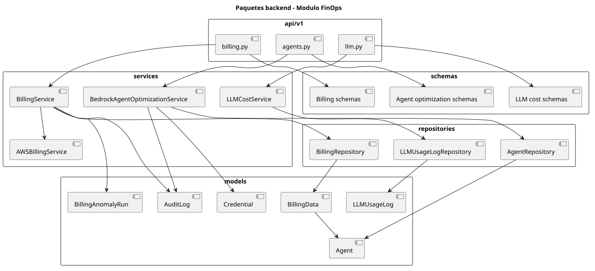 | [PaquetesBackend.puml](./Diseño/Paquetes/Backend/PaquetesBackend.puml) |

El backend mantiene cohesión separando API, servicios, repositorios, modelos y schemas. Las integraciones externas quedan fuera del router para evitar que la capa HTTP conozca detalles de AWS.

### 4.11.2 Paquetes frontend

| Diagrama | Código fuente |
|----------|---------------|
| 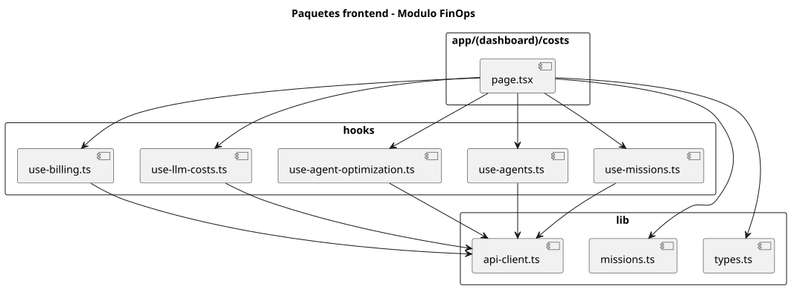 | [PaquetesFrontend.puml](./Diseño/Paquetes/Frontend/PaquetesFrontend.puml) |

El frontend agrupa la pantalla de costes, componentes visuales, hooks y cliente API. La lógica de obtención de datos se concentra en hooks para evitar duplicación en componentes.

### 4.11.3 Cohesión y acoplamiento

El diseño busca:

- alta cohesión en el paquete financiero;
- bajo acoplamiento con misiones generales de la plataforma;
- dependencia explícita de autenticación, agentes, credenciales y LLM;
- posibilidad de añadir CU-13 a CU-16 sin rehacer CU-07 a CU-12.

## 4.12 Diseño de interfaz

### 4.12.1 Estructura de la página Costs

La página `Costs` se organiza en zonas que cubren los seis casos de uso implementados:

| Zona | Contenido |
|------|-----------|
| Resumen AWS Bedrock | coste total de IA |
| Coste por agente | ranking de coste atribuido |
| Coste no asociado | gasto real que AWS no permite vincular a un agente |
| Anomalías | desviaciones respecto a la línea base disponible |
| Sección CAIO LLM cost | coste LLM estimado del propio CAIO, con desglose por fuente, proveedor, modelo y día |
| Optimización de agentes | simulación RAG, invocación de prueba y prompt caching controlado |

### 4.12.2 Estados de interfaz

| Estado | Diseño esperado |
|--------|-----------------|
| Cargando | Skeletons o placeholders, no bloqueo global |
| Sin datos | Mensaje claro y acción para sincronizar o revisar prerrequisitos |
| Error parcial | El panel mantiene la estructura y muestra la incidencia recuperable |
| Datos disponibles | Coste total, ranking por agente y coste no asociado si existe |
| Estimación LLM | Badge `Estimated` y nota de cobertura para no confundirlo con factura del proveedor |

### 4.12.3 Trazabilidad con prototipos del capítulo 3

El prototipo conceptual del capítulo 3 se refina concentrando la explicación en `Costs`. CU-07, CU-08, CU-09, CU-10, CU-11 y CU-12 reutilizan la misma pantalla para evitar saltos innecesarios en el recorrido de evaluación; CU-13 a CU-16 podrán ampliar la visualización cuando sus datos y reglas estén disponibles.

## 4.13 Trazabilidad inversa

La trazabilidad inversa comprueba que cada elemento diseñado procede de un requisito especificado y tiene una evidencia posterior en la solución implementada. Esta tabla sirve como puente entre requisitos, análisis, diseño y descripción final.

| Caso de uso | Especificación | Prototipo | Análisis MVC | Diseño técnico | Evidencia de solución |
| :--- | :--- | :--- | :--- | :--- | :--- |
| CU-07 | Capítulo 3, coste total de IA | Resumen de coste total | Vista de costes, controlador de coste total y dato de facturación | Contratos de billing total, sincronización y agregación | Capítulo 5, apartado CU-07 |
| CU-08 | Capítulo 3, coste por agente | Ranking de agentes y coste no asociado | Vista de costes, controlador de atribución y agente de IA | Contratos de coste por agente y señal de atribución | Capítulo 5, apartado CU-08 |
| CU-09 | Capítulo 3, anomalías de gasto | Alertas y severidad | Vista de costes, controlador de anomalías y auditoría | Detector local, línea base y ejecución auditable | Capítulo 5, apartado CU-09 |
| CU-10 | Capítulo 3, coste LLM estimado | Sección LLM | Vista de costes, controlador LLM y registro de uso | Agregación de tokens, llamadas y coste estimado | Capítulo 5, apartado CU-10 |
| CU-11 | Capítulo 3, optimización RAG | Panel RAG | Panel RAG de la vista de costes, controlador RAG y base de conocimiento | Simulación e invocación controlada por sesión | Capítulo 5, apartado CU-11 |
| CU-12 | Capítulo 3, prompt caching controlado | Panel de prompt caching | Panel de prompt caching de la vista de costes, controlador de caching y auditoría | Simulación previa, confirmación y actualización condicionada | Capítulo 5, apartado CU-12 |
