# 5. Descripción de la solución implementada

## 5.1 Introducción

Este capítulo presenta la solución implementada para la Misión FinOps. El objetivo no es describir cada archivo del repositorio, sino explicar cómo el usuario recorre la aplicación y cómo ese recorrido se materializa en pantallas, contratos de API, servicios de backend y datos persistidos.

La solución desarrollada constituye un prototipo funcional del módulo FinOps dentro de un producto existente. La plataforma actúa como CAIO Virtual: acompaña a una organización en tareas de gobierno de inteligencia artificial, y en este TFG se ha acotado el alcance demostrable a la visibilidad y optimización de costes asociados a agentes y modelos de IA.

El bloque FinOps implementado se organiza en seis casos de uso:

| Caso de uso | Propósito principal | Pantalla de revisión |
| --- | --- | --- |
| CU-07 | Consultar el coste total de IA en AWS Bedrock. | Costs |
| CU-08 | Consultar el coste por agente de IA. | Costs |
| CU-09 | Detectar anomalías de gasto. | Costs |
| CU-10 | Consultar el coste LLM estimado del CAIO Virtual. | Costs |
| CU-11 | Optimizar la recuperación RAG de agentes Bedrock. | Costs |
| CU-12 | Optimizar agentes Bedrock mediante prompt caching. | Costs |

La idea central de la implementación es separar claramente tres niveles de información. Primero, el coste cloud leído desde AWS y normalizado en la plataforma. Segundo, el coste interno estimado de uso LLM de la propia aplicación. Tercero, las acciones de optimización sobre agentes Bedrock, que pueden reducir contexto o habilitar mecanismos de ahorro, pero siempre de forma explícita y auditable.

## 5.2 Mapa de navegación de la solución

El flujo de uso parte del diagrama de contexto definido en los capítulos anteriores: un administrador o usuario autorizado entra en la plataforma, usa Misiones como guía del trabajo FinOps y revisa la evidencia consolidada en `Costs`. La vista `Costs` es la referencia final de la entrega, aunque el catálogo de Misiones siga actuando como punto de entrada y seguimiento:

```text
Acceso a la plataforma
  -> Misiones / FinOps
      -> CU-07, CU-08, CU-09, CU-10, CU-11, CU-12
  -> Página Costs
      -> API FastAPI
          -> Servicios de billing, LLM y optimización
              -> PostgreSQL y APIs externas
```

| Zona | Función dentro de la solución | Evidencia de implementación |
| --- | --- | --- |
| Acceso | Identifica al usuario y emite un JWT para proteger datos de organización. | `POST /api/v1/auth/login` y `POST /api/v1/auth/verify`. |
| Misiones | Ordena el trabajo FinOps en pasos verificables. | IDs `cost-total-aws`, `cost-by-agent-aws`, `cost-anomalies-aws`, `platform-llm-costs`, `agent-rag-retrieval-optimizer` y `agent-prompt-cache-optimizer`. |
| Costs | Muestra en una sola vista el total AWS Bedrock, coste por agente, anomalías, coste LLM, RAG y prompt caching. | Página `/costs` con los seis casos de uso del módulo FinOps. |
| Swagger/OpenAPI | Permite revisar el contrato backend durante la evaluación técnica. | `http://localhost:8000/docs`. |
| Código | Justifica las decisiones técnicas que no se aprecian solo en pantalla. | Algoritmo de anomalías y servicios de optimización. |

El recorrido está pensado para explicar una cosa cada vez. El usuario no empieza viendo una tabla técnica de registros, sino una misión que le indica qué comprobar. La evidencia funcional se revisa en `Costs`, que actúa como pantalla principal de la solución para los seis casos de uso. El contrato API y el código se emplean como evidencia técnica cuando ayudan a justificar una decisión de implementación.

## 5.3 Pantallas y evidencias principales

Las capturas de esta sección se obtuvieron en entorno local con datos deterministas de validación. Su función es mostrar de forma reproducible el recorrido completo de los casos de uso; el flujo real descrito se mantiene vinculado a AWS cuando existen credenciales, permisos e histórico suficientes.

### 5.3.1 Acceso

La aplicación mantiene un flujo de acceso passwordless. El usuario introduce un correo autorizado, el backend genera un código temporal y, tras verificarlo, el frontend almacena el JWT y puede acceder a las misiones y datos de la organización.

Esta parte se menciona como contexto de integración con la plataforma. No se incluye una figura específica del login porque no es el aporte central del TFG; lo relevante para este capítulo es que las misiones FinOps se ejecutan dentro de una aplicación autenticada y asociada a una organización.

### 5.3.2 Misiones FinOps

La pantalla de Misiones es el punto de entrada funcional del TFG. En la categoría FinOps aparecen los seis casos de uso implementados. Cada misión se presenta como una secuencia de hitos: conectar credenciales, verificar permisos, sincronizar datos, revisar resultados, ejecutar una prueba controlada o validar una acción de optimización.

La ventaja de usar misiones es metodológica y práctica. Metodológicamente, cada caso de uso queda conectado con un recorrido visible. En la práctica, el usuario no necesita conocer la API: la interfaz le guía hasta tener evidencia suficiente para completar la misión.

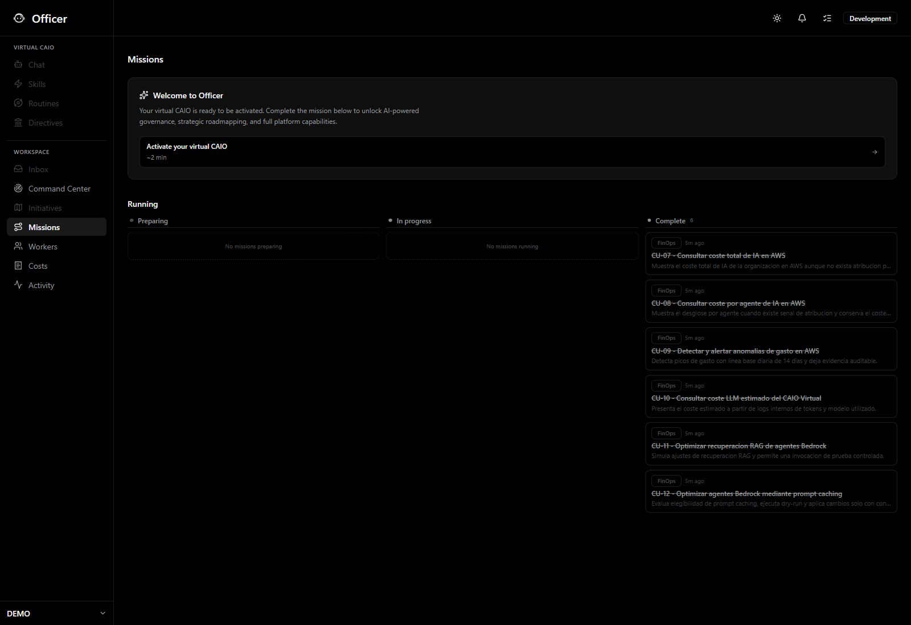

*Figura 5.1. Catálogo de misiones FinOps con los seis casos de uso de la entrega final agrupados en la categoría FinOps: CU-07, CU-08, CU-09, CU-10, CU-11 y CU-12. Captura tomada en entorno local con datos de validación.*

### 5.3.3 Página Costs

La página `Costs` es la vista principal para presentar la solución. En ella se revisan los seis casos de uso FinOps: coste total AWS Bedrock, coste por agente, anomalías, coste LLM estimado del CAIO Virtual, optimización RAG y prompt caching. Esta concentración facilita la explicación porque permite presentar el funcionamiento del módulo desde una misma vista.

La parte superior de la página resume los datos financieros principales: coste total, distribución por agente, coste no atribuido y anomalías detectadas. La parte inferior permite entrar en los aspectos más operativos: tokens y coste LLM, selección de agentes Bedrock, simulación RAG, invocación de prueba y estado de prompt caching.

Esta pantalla permite mostrar que el módulo no se limita a observar costes, sino que incorpora acciones de optimización controlada.

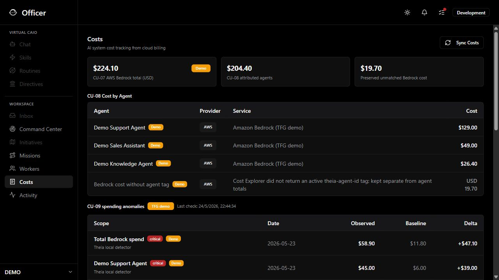

*Figura 5.2. Página Costs como pantalla principal de FinOps, con los bloques de coste AWS Bedrock, coste por agente, anomalías, coste LLM estimado, RAG y prompt caching. Captura tomada en entorno local con datos de validación.*

### 5.3.4 Evidencia técnica: API y código

La interfaz es la primera evidencia porque muestra el valor funcional para el usuario. Además, el capítulo incorpora dos evidencias técnicas: el contrato OpenAPI de los endpoints usados por la pantalla y varios listados de código de los puntos más relevantes. Estas evidencias conectan lo visible en la aplicación con la implementación backend, sin convertir el capítulo en una descripción archivo por archivo.

## 5.4 CU-07: coste total AWS Bedrock

### Objetivo

CU-07 responde a la pregunta: cuánto cuesta el uso de IA de la organización en AWS. En el alcance de este TFG, el análisis se acota a Amazon Bedrock porque es el servicio usado para agentes y modelos fundacionales en AWS.

El identificador interno de la misión es `cost-total-aws`.

### Recorrido del usuario

1. El usuario abre `Misiones -> FinOps`.
2. Selecciona la misión CU-07.
3. La aplicación verifica que existen credenciales AWS válidas.
4. El backend comprueba acceso a Cost Explorer.
5. Si hace falta refrescar datos, un administrador ejecuta la sincronización de costes.
6. La plataforma guarda los registros normalizados en `billing_data`.
7. El usuario revisa el total en la página `Costs`.

La figura 5.3 muestra el flujo funcional de CU-07. El código fuente del diagrama se conserva en [CU07-Flujo.puml](./Flujos/CU07-Flujo.puml).

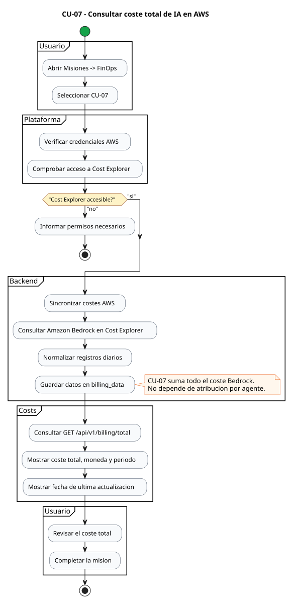

*Figura 5.3. Flujo funcional de CU-07: sincronización de coste AWS Bedrock, persistencia en `billing_data` y visualización del total en Costs.*

### Funcionamiento implementado

El backend consulta AWS Cost Explorer y filtra el servicio `Amazon Bedrock`. Los registros se obtienen mediante la API de coste y uso de AWS y se normalizan con campos comunes: organización, proveedor, recurso, periodo, coste, moneda y servicio [19]. Después, `GET /api/v1/billing/total` suma todos los registros Bedrock del periodo efectivo.

La decisión importante es que CU-07 no depende de `agent_id`. Si AWS devuelve gasto sin atribución por agente, ese gasto sigue formando parte del total. Esto evita ocultar coste real solo porque aún no se haya preparado la cuenta para atribución fina.

```text
coste_total = suma de billing_data.cost
              donde provider = aws
              y service_name corresponde a Amazon Bedrock
              y periodo pertenece al rango consultado
```

### API y datos

| Elemento | Implementación |
| --- | --- |
| Endpoint principal | `GET /api/v1/billing/total` |
| Sincronización | `POST /api/v1/billing/sync` |
| Servicio backend | `BillingService.get_total(...)` |
| Persistencia | `billing_data` |

Con datos sincronizados, la pantalla muestra el coste agregado del periodo efectivo devuelto por la API. Si Cost Explorer todavía no ha publicado datos recientes, el comportamiento esperado es que el total refleje el último estado disponible de la facturación.

## 5.5 CU-08: coste por agente de IA

### Objetivo

CU-08 responde a la pregunta: qué agente genera cada parte del coste. Es un caso más exigente que CU-07, porque AWS no siempre entrega el coste asociado a un agente concreto de negocio.

El identificador interno de la misión es `cost-by-agent-aws`.

### Recorrido del usuario

1. La misión comprueba que ya existe una base de billing procedente de CU-07.
2. La aplicación verifica que hay agentes Bedrock visibles.
3. El usuario prepara una señal de atribución de coste en AWS mediante una clave estable.
4. Se sincronizan los costes.
5. El backend cruza los registros atribuidos con la tabla interna de agentes.
6. La página `Costs` muestra el ranking por agente y el coste no asociado.

La figura 5.4 muestra el flujo funcional de CU-08. El código fuente del diagrama se conserva en [CU08-Flujo.puml](./Flujos/CU08-Flujo.puml).

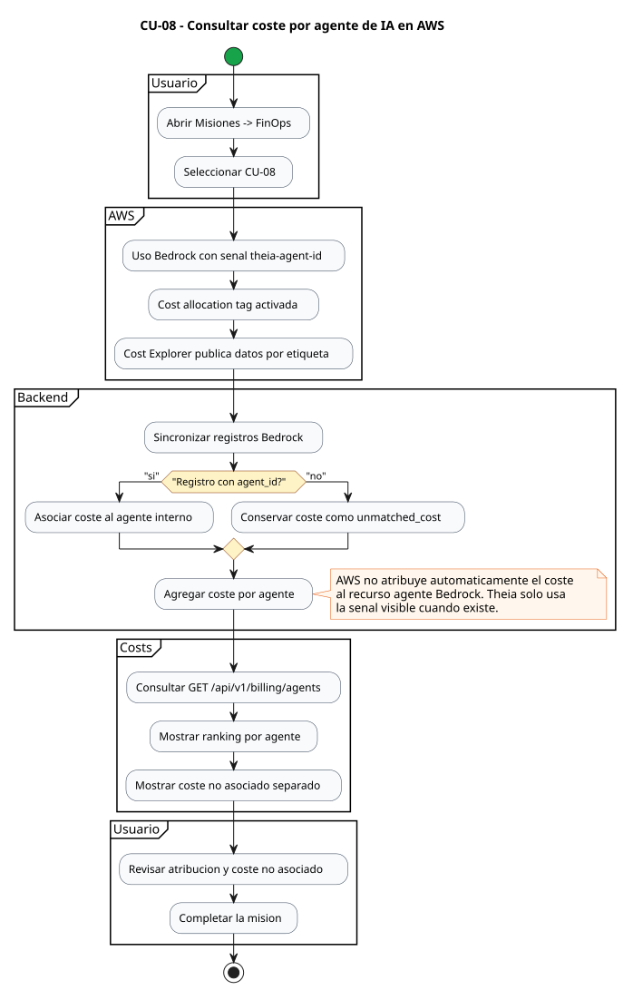

*Figura 5.4. Flujo funcional de CU-08: lectura de la señal de atribución, asociación con agentes internos y conservación del coste no asociado.*

### Funcionamiento implementado

La clave de atribución elegida es:

```text
theia-agent-id=<agent_id>
```

Esta clave se trata como una `cost allocation tag` que debe estar activada y visible en AWS Cost Explorer [18]. La señal no implica que AWS atribuya automáticamente el coste al recurso agente Bedrock: puede proceder de la identidad IAM, la sesión, el perfil de inferencia, el proyecto o el mecanismo de invocación que la organización use para generar consumo en Bedrock [20] [21].

Cuando Cost Explorer devuelve un registro agrupado por `theia-agent-id`, el backend lo asocia al agente correspondiente en el inventario interno de la plataforma. Cuando esa señal no existe, el coste no se descarta; se acumula como `unmatched_cost`.

Esta decisión es relevante porque muestra transparencia. El sistema no fuerza una atribución artificial ni convierte el gasto sin etiqueta en un agente ficticio.

### API y datos

| Elemento | Implementación |
| --- | --- |
| Endpoint principal | `GET /api/v1/billing/agents` |
| Vista compuesta | `GET /api/v1/billing/dashboard`, ruta de compatibilidad que reutiliza `BillingService.get_costs(...)` |
| Servicio backend | `BillingService.get_agent_costs(...)` |
| Persistencia de costes | `billing_data` |
| Inventario de agentes | `agents` |

El resultado de CU-08 muestra `by_agent`, `agent_count`, `record_count`, moneda, periodo y `unmatched_cost`.

## 5.6 CU-09: anomalías de gasto

### Objetivo

CU-09 detecta si el gasto diario de Amazon Bedrock se sale de una línea base razonable. No intenta explicar la causa raíz del pico, sino alertar de que existe una desviación relevante y dejar evidencia auditable.

El identificador interno de la misión es `cost-anomalies-aws`.

### Recorrido del usuario

1. El usuario abre la misión CU-09 o entra en `/costs`.
2. La página lee las anomalías ya calculadas mediante `GET /api/v1/billing/anomalies`.
3. Cuando un administrador o una tarea programada ejecuta el detector, el backend comprueba que existen registros diarios suficientes.
4. El backend construye una línea base con 14 días previos.
5. El día observado se compara contra esa línea base.
6. Si hay anomalía, se muestra en la página `Costs` tras refrescar la lectura.
7. La ejecución del detector queda registrada con auditoría.

La figura 5.5 muestra el flujo funcional de CU-09. El código fuente del diagrama se conserva en [CU09-Flujo.puml](./Flujos/CU09-Flujo.puml).

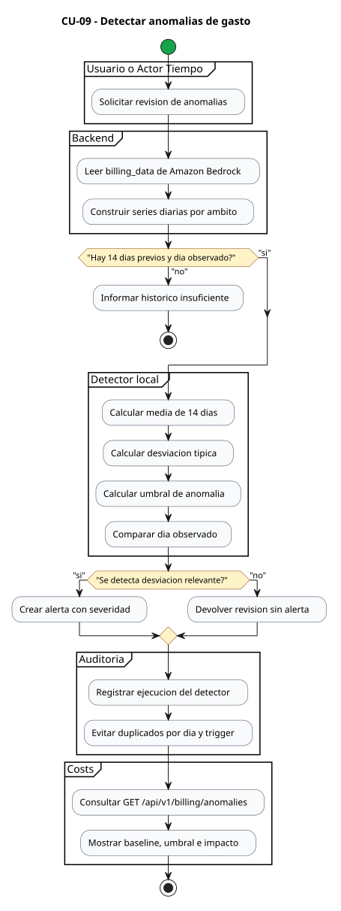

*Figura 5.5. Flujo funcional de CU-09: construcción de series diarias, cálculo del umbral local, detección de anomalías y registro auditable.*

### Funcionamiento implementado

El detector local trabaja sobre los datos ya guardados en `billing_data`. Para cada ámbito crea una serie diaria:

- `total`, para el coste Bedrock agregado;
- `agent:<id>`, para cada agente con coste atribuido;
- `unmatched`, para el coste sin agente asociado.

Para cada serie calcula:

```text
baseline_mean = media de los 14 días previos
baseline_stddev = desviación típica de los 14 días previos
threshold = max(
  baseline_mean + 2 * baseline_stddev,
  baseline_mean * 1.5,
  baseline_mean + 5 USD
)
```

Se registra anomalía cuando el día observado supera el umbral, el incremento es relevante en importe y el crecimiento relativo es suficiente cuando existe media positiva. Este enfoque es verificable porque es simple, auditable y no depende de crear monitores dentro de la cuenta AWS.

### API y datos

| Elemento | Implementación |
| --- | --- |
| Lectura de anomalías | `GET /api/v1/billing/anomalies` |
| Ejecución auditable | `POST /api/v1/billing/anomalies/run` |
| Servicio backend | `BillingService.get_anomalies(...)` y `BillingService.run_anomaly_check(...)` |
| Datos diarios | `billing_data` |
| Control de duplicados | `billing_anomaly_runs` |
| Auditoría | `audit_logs` |

AWS Cost Anomaly Detection se usa solo como señal opcional de lectura cuando hay permisos [22]. La lógica principal de CU-09 vive dentro de la plataforma.

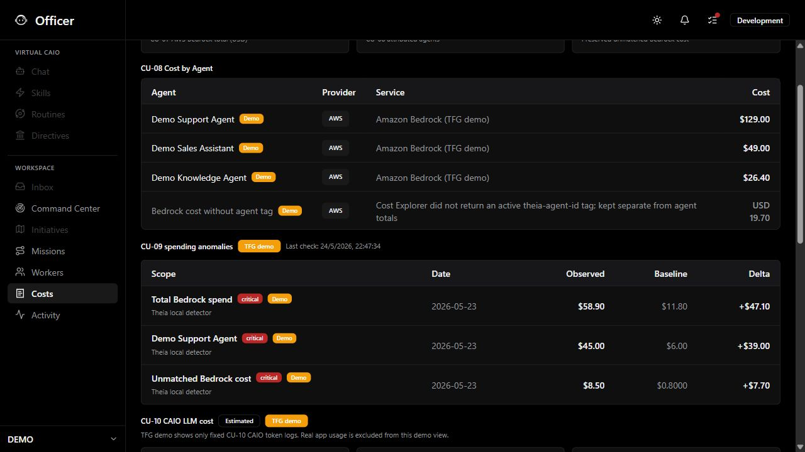

*Figura 5.6. Evidencia visual de CU-07, CU-08 y CU-09 en la página Costs: coste total de AWS Bedrock, coste atribuido por agente, coste no asociado y anomalías de gasto. Captura tomada en entorno local con datos de validación.*

## 5.7 CU-10: coste LLM estimado del CAIO Virtual

### Objetivo

CU-10 mide el coste estimado de las llamadas LLM realizadas por la propia plataforma. Es distinto de CU-07 y CU-08: aquí no se consulta AWS Billing, sino la telemetría interna de uso de modelos.

El identificador interno de la misión es `platform-llm-costs`.

### Recorrido del usuario

1. El usuario abre la misión CU-10 o entra en `/costs`.
2. El frontend consulta el resumen de coste LLM.
3. El backend agrega los registros por fuente, proveedor, modelo y día.
4. La página Costs muestra tokens de entrada, tokens de salida, coste estimado y número de llamadas.
5. El usuario revisa la evidencia y completa la misión.

La figura 5.7 muestra el flujo funcional de CU-10. El código fuente del diagrama se conserva en [CU10-Flujo.puml](./Flujos/CU10-Flujo.puml).

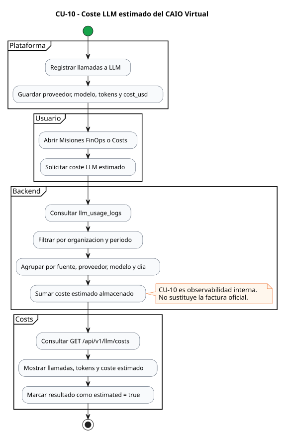

*Figura 5.7. Flujo funcional de CU-10: agregación de registros `llm_usage_logs` y presentación del coste LLM estimado.*

### Funcionamiento implementado

Cuando una funcionalidad de la plataforma llama a un LLM a través del servicio centralizado, puede persistir un registro en `llm_usage_logs`. Ese registro contiene proveedor, modelo, tokens, coste estimado, organización y fuente funcional.

CU-10 suma el campo `cost_usd` ya almacenado. No recalcula costes pasados con precios futuros y no afirma coincidir con una factura oficial. Su valor está en ofrecer observabilidad financiera interna: qué parte del uso del CAIO Virtual consume más tokens y coste estimado.

### API y datos

| Elemento | Implementación |
| --- | --- |
| Endpoint principal | `GET /api/v1/llm/costs` |
| Servicio backend | `LLMCostService.get_costs(...)` |
| Persistencia | `llm_usage_logs` |
| Agregaciones | fuente, proveedor, modelo y día |

La respuesta marca `estimated = true` y usa `pricing_basis = stored_estimated_cost_usd`, dejando claro que se trata de una estimación operativa.

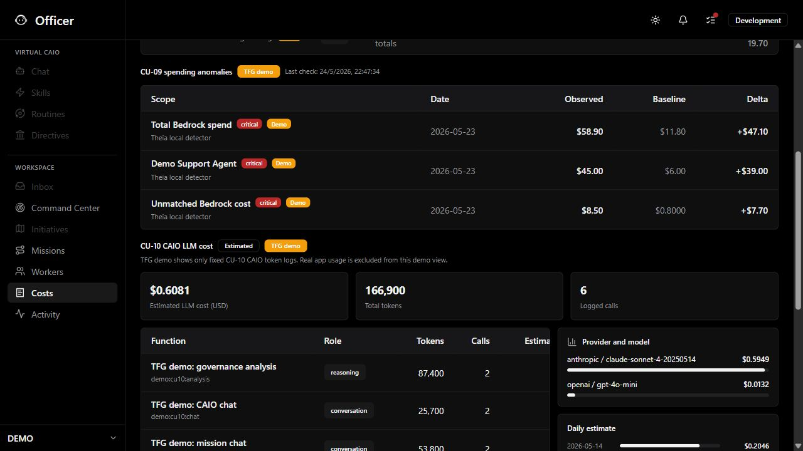

*Figura 5.8. Evidencia visual de CU-10 en la página Costs: llamadas LLM, tokens y coste estimado por fuente, proveedor y modelo. Captura tomada en entorno local con datos de validación.*

## 5.8 CU-11: optimización RAG de agentes Bedrock

### Objetivo

CU-11 permite simular y probar una configuración de recuperación RAG para agentes Bedrock con Knowledge Bases. La pregunta que responde es si una consulta puede resolverse recuperando menos fragmentos de contexto, controlando el posible impacto sobre la cobertura de la respuesta.

El identificador interno de la misión es `agent-rag-retrieval-optimizer`.

### Recorrido del usuario

1. El usuario abre la misión CU-11 o entra en `/costs`.
2. La página muestra agentes Bedrock candidatos.
3. El usuario selecciona un agente y escribe una consulta.
4. Elige un perfil: `auto`, `cost_saving`, `balanced` o `quality`.
5. El backend clasifica la consulta y decide cuántos chunks recuperar.
6. Opcionalmente se ejecuta una invocación de prueba.
7. El resultado se revisa en la página Costs.

La figura 5.9 muestra el flujo funcional de CU-11. El código fuente del diagrama se conserva en [CU11-Flujo.puml](./Flujos/CU11-Flujo.puml).

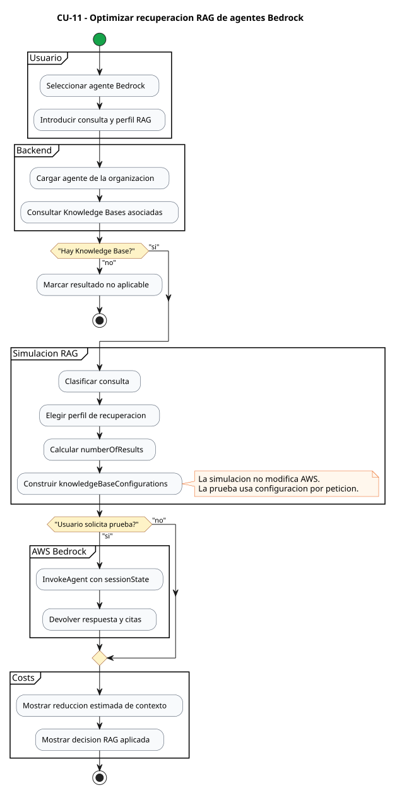

*Figura 5.9. Flujo funcional de CU-11: selección de agente, evaluación de Knowledge Bases, simulación RAG e invocación controlada por sesión.*

### Funcionamiento implementado

La optimización se centra en `numberOfResults`, el número de fragmentos recuperados desde la Knowledge Base. El sistema clasifica la consulta como simple, normal o compleja, y a partir de esa clasificación propone un perfil de recuperación.

La decisión se aplica de forma conservadora. La simulación no modifica AWS: puede leer Knowledge Bases desde AWS o usar datos ya sincronizados, pero no persiste cambios en la configuración del agente. La invocación de prueba, cuando se ejecuta, usa configuración por petición mediante `sessionState.knowledgeBaseConfigurations`. Por tanto, CU-11 no cambia de forma persistente la configuración del agente.

### API y datos

| Elemento | Implementación |
| --- | --- |
| Estado RAG | `GET /api/v1/agents/{agent_id}/rag-optimization` |
| Simulación | `POST /api/v1/agents/{agent_id}/rag-optimization/simulate` |
| Prueba controlada | `POST /api/v1/agents/{agent_id}/rag-optimization/test-invoke` |
| Servicio backend | `BedrockAgentOptimizationService` |
| Persistencia base | `agents` |

CU-11 no promete ahorro exacto. Presenta una reducción estimada de contexto, que puede traducirse en menor coste o latencia si el tráfico real y el modelo usado lo permiten.

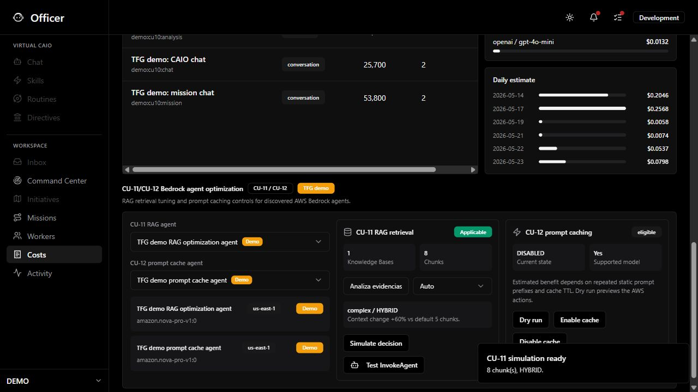

*Figura 5.10. Evidencia visual de CU-11 en la página Costs: agente seleccionado, perfil de recuperación, número de fragmentos y resultado de simulación. Captura tomada en entorno local con datos de validación.*

## 5.9 CU-12: prompt caching controlado

### Objetivo

CU-12 evalúa si un agente Bedrock es candidato a prompt caching y permite aplicar el cambio solo con confirmación administrativa. La pregunta que responde es si se puede reutilizar una parte estable del prompt para reducir procesamiento repetido en llamadas futuras.

El identificador interno de la misión es `agent-prompt-cache-optimizer`.

### Recorrido del usuario

1. El usuario abre la misión CU-12 o entra en `/costs`.
2. La página lista agentes Bedrock candidatos.
3. El backend comprueba modelo, región y estado actual de caching.
4. El usuario autorizado ejecuta un dry-run.
5. La interfaz muestra si haría falta `UpdateAgent` y `PrepareAgent`.
6. Si procede, el administrador confirma la aplicación.
7. El backend registra auditoría y muestra el estado resultante.

La figura 5.11 muestra el flujo funcional de CU-12. El código fuente del diagrama se conserva en [CU12-Flujo.puml](./Flujos/CU12-Flujo.puml).

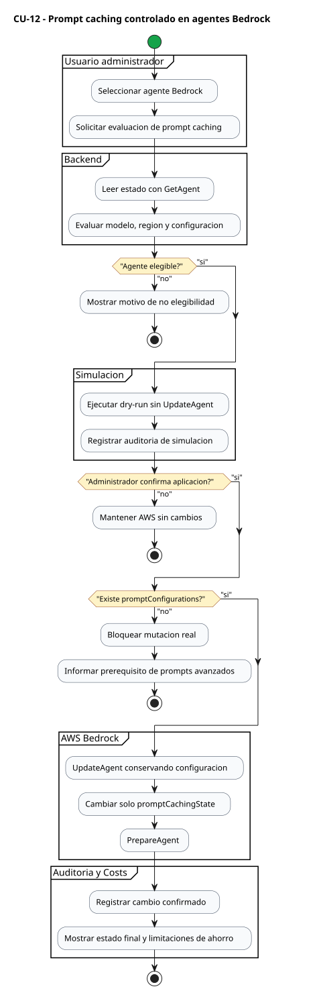

*Figura 5.11. Flujo funcional de CU-12: evaluación de elegibilidad, dry-run, confirmación administrativa y aplicación condicionada en Bedrock.*

### Funcionamiento implementado

CU-12 diferencia tres momentos: lectura de estado, simulación y aplicación. La lectura permite saber si el agente es elegible. La simulación registra un dry-run sin mutar AWS. La aplicación exige `confirm=true` y usuario administrador.

En agentes reales, el backend lee `GetAgent`, conserva la configuración existente, cambia solo `promptOverrideConfiguration.promptCachingState.cachingState`, llama a `UpdateAgent` y después a `PrepareAgent`. La aplicación real depende de que el agente tenga una configuración avanzada de prompts compatible, concretamente `promptOverrideConfiguration.promptConfigurations`. Si falta esa configuración, se bloquea la mutación real y se mantiene disponible la simulación.

### API y datos

| Elemento | Implementación |
| --- | --- |
| Estado de cache | `GET /api/v1/agents/{agent_id}/prompt-cache` |
| Dry-run | `POST /api/v1/agents/{agent_id}/prompt-cache/simulate` |
| Aplicación | `POST /api/v1/agents/{agent_id}/prompt-cache/apply` |
| Servicio backend | `BedrockAgentOptimizationService` |
| Persistencia y auditoría | `agents` y `audit_logs` |

El ahorro no se presenta como garantizado. Depende del modelo, la región, la longitud del prefijo cacheable, el TTL de la cache y la repetición real de tráfico.

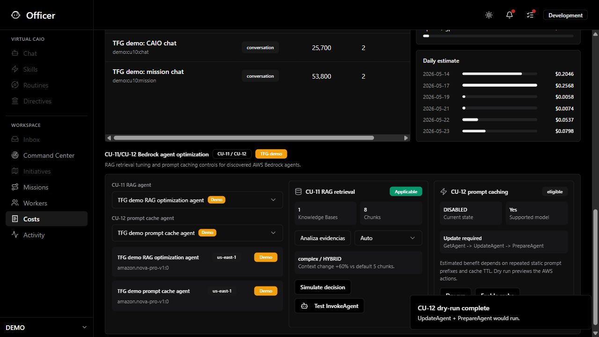

*Figura 5.12. Evidencia visual de CU-12 en la página Costs: elegibilidad, simulación previa, confirmación y estado del prompt caching. Captura tomada en entorno local con datos de validación.*

## 5.10 Evidencia de implementación y trazabilidad

La siguiente tabla resume la correspondencia entre caso de uso, pantalla, contrato y datos. Sirve como puente entre los capítulos de análisis/diseño y el código real.

| CU | Pantalla principal | Endpoint principal | Servicio backend | Datos usados |
| --- | --- | --- | --- | --- |
| CU-07 | Costs | `GET /api/v1/billing/total` | `BillingService.get_total` | `billing_data` |
| CU-08 | Costs | `GET /api/v1/billing/agents` | `BillingService.get_agent_costs` | `billing_data`, `agents` |
| CU-09 | Costs | `GET /api/v1/billing/anomalies`, `POST /api/v1/billing/anomalies/run` | `BillingService.get_anomalies`, `BillingService.run_anomaly_check` | `billing_data`, `billing_anomaly_runs`, `audit_logs` |
| CU-10 | Costs | `GET /api/v1/llm/costs` | `LLMCostService.get_costs` | `llm_usage_logs` |
| CU-11 | Costs | `GET /api/v1/agents/{agent_id}/rag-optimization`, `POST /api/v1/agents/{agent_id}/rag-optimization/simulate`, `POST /api/v1/agents/{agent_id}/rag-optimization/test-invoke` | `BedrockAgentOptimizationService.get_rag_status`, `BedrockAgentOptimizationService.simulate_rag`, `BedrockAgentOptimizationService.test_invoke_rag` | `agents` |
| CU-12 | Costs | `GET /api/v1/agents/{agent_id}/prompt-cache`, `POST /api/v1/agents/{agent_id}/prompt-cache/simulate`, `POST /api/v1/agents/{agent_id}/prompt-cache/apply` | `BedrockAgentOptimizationService.get_prompt_cache_status`, `BedrockAgentOptimizationService.simulate_prompt_cache`, `BedrockAgentOptimizationService.apply_prompt_cache` | `agents`, `audit_logs` |

La figura 5.13 muestra un extracto del contrato OpenAPI de la aplicación, centrado en los endpoints de `billing`. Esta evidencia, junto con la trazabilidad de la tabla anterior, permite comprobar que la pantalla `Costs` no es una maqueta aislada, sino una vista conectada con endpoints reales de `billing`, `llm` y `agents`.

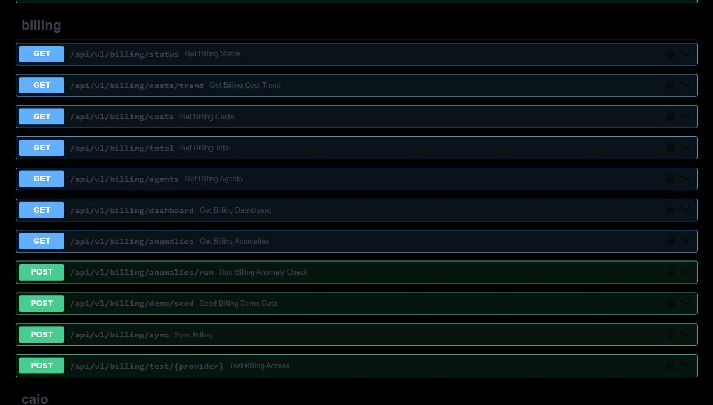

*Figura 5.13. Swagger/OpenAPI con endpoints de soporte para los casos CU-07, CU-08 y CU-09.*

El listado 5.1 muestra cómo CU-08 separa el coste atribuido por agente del coste no asociado. El fragmento abreviado procede de `backend/app/services/billing_service.py` y resume una decisión central del TFG: si un registro no contiene `agent_id`, el importe no se descarta ni se asigna artificialmente.

*Listado 5.1. Agregación por agente y conservación de `unmatched_cost` en CU-08.*

```python
# Aggregate by matched agent. Unmatched provider costs are kept separate
# because Cost Explorer does not always expose Bedrock agent attribution.
agent_costs: dict[str, dict[str, object]] = {}
unmatched_cost = 0.0
for r in records:
    if not r.agent_id:
        unmatched_cost += float(r.cost)
        continue
    key = r.agent_id
    if key not in agent_costs:
        agent_costs[key] = {
            "agent_id": r.agent_id,
            "agent_name": None,
            "provider": r.provider,
            "total_cost": 0.0,
            "service_name": r.service_name,
        }
    current_cost = self._safe_float(agent_costs[key]["total_cost"])
    agent_costs[key]["total_cost"] = current_cost + float(r.cost)
```

El listado 5.2 muestra el fragmento central del detector local de anomalías, también ubicado en `backend/app/services/billing_service.py`. Se incluye este código porque CU-09 contiene una decisión técnica relevante: no basta con leer un valor de coste, sino que se construye una línea base, se calcula un umbral y se clasifica la desviación.

*Listado 5.2. Cálculo del umbral local de anomalía en CU-09.*

```python
baseline_mean = statistics.fmean(baseline_values) if baseline_values else 0.0
baseline_stddev = (
    statistics.pstdev(baseline_values)
    if len(baseline_values) > 1
    else 0.0
)
threshold_cost = max(
    baseline_mean + (2 * baseline_stddev),
    baseline_mean * 1.5,
    baseline_mean + _ANOMALY_MIN_IMPACT_USD,
)
delta_cost = observed_cost - baseline_mean
delta_percent = (delta_cost / baseline_mean) * 100 if baseline_mean > 0 else None

passes_percent = (
    baseline_mean <= 0
    or (delta_percent is not None and delta_percent >= _ANOMALY_MIN_DELTA_PERCENT)
)
if (
    observed_cost < threshold_cost
    or delta_cost < _ANOMALY_MIN_IMPACT_USD
    or not passes_percent
):
    return None

severity = (
    "critical"
    if delta_cost >= _ANOMALY_CRITICAL_IMPACT_USD
    or (delta_percent is not None and delta_percent >= _ANOMALY_CRITICAL_DELTA_PERCENT)
    else "warning"
)
```

El listado 5.3 procede de `backend/app/services/bedrock_agent_optimization_service.py` y muestra cómo CU-11 transforma una consulta y un perfil en una configuración de recuperación RAG por petición. La decisión se expresa como `numberOfResults` y `overrideSearchType`, y después se materializa en `knowledgeBaseConfigurations`.

*Listado 5.3. Decisión RAG y construcción de `knowledgeBaseConfigurations` en CU-11.*

```python
def _decide_rag(self, request: AgentRAGSimulationRequest) -> RAGRetrievalDecision:
    query_class = _classify_query(request.query)
    selected_profile = request.profile
    if selected_profile == "auto":
        selected_profile = (
            "cost_saving"
            if query_class == "simple"
            else "quality" if query_class == "complex" else "balanced"
        )

    if selected_profile == "custom":
        number_of_results = request.custom_number_of_results or DEFAULT_KB_RESULTS
    elif selected_profile == "cost_saving":
        number_of_results = 2 if query_class == "simple" else 3
    elif selected_profile == "quality":
        number_of_results = 8 if query_class == "complex" else 6
    elif query_class == "simple":
        number_of_results = 3
    elif query_class == "complex":
        number_of_results = 5
    else:
        number_of_results = 4

    search_type = request.override_search_type
    if search_type is None:
        search_type = (
            "HYBRID"
            if query_class == "complex" and selected_profile == "quality"
            else "SEMANTIC"
        )

    return RAGRetrievalDecision(
        requested_profile=request.profile,
        selected_profile=selected_profile,
        query_classification=query_class,
        number_of_results=number_of_results,
        override_search_type=search_type,
        estimated_context_change_percent=round(
            ((number_of_results - DEFAULT_KB_RESULTS) / DEFAULT_KB_RESULTS) * 100,
            1,
        ),
    )

def _retrieval_configuration(
    self,
    knowledge_bases: list[AgentKnowledgeBaseInfo],
    decision: RAGRetrievalDecision,
) -> dict[str, object]:
    return {
        "knowledgeBaseConfigurations": [
            {
                "knowledgeBaseId": kb.knowledge_base_id,
                "retrievalConfiguration": {
                    "vectorSearchConfiguration": {
                        "numberOfResults": decision.number_of_results,
                        "overrideSearchType": decision.override_search_type,
                    }
                },
            }
            for kb in knowledge_bases
        ]
    }
```

El listado 5.4 pertenece al mismo servicio y muestra la comprobación principal de CU-12. Para aplicar prompt caching de forma real, el agente debe exponer `promptOverrideConfiguration.promptConfigurations`; si esta configuración avanzada no existe, la aplicación bloquea la mutación y mantiene la simulación como alternativa segura.

*Listado 5.4. Validación de configuración avanzada y construcción de `UpdateAgent` en CU-12.*

```python
def _build_update_agent_kwargs(agent: dict[str, Any], desired_state: str) -> dict[str, Any]:
    prompt_override = dict(agent.get("promptOverrideConfiguration") or {})
    prompt_configurations = prompt_override.get("promptConfigurations")
    if not isinstance(prompt_configurations, list):
        raise ValueError(
            "CU-12 real apply requires an existing Bedrock "
            "promptOverrideConfiguration.promptConfigurations value. "
            "Configure advanced prompts on the agent first; simulate remains available."
        )
    prompt_override["promptCachingState"] = {"cachingState": desired_state}
    update_keys = {
        "agentCollaboration",
        "agentName",
        "agentResourceRoleArn",
        "customerEncryptionKeyArn",
        "customOrchestration",
        "description",
        "foundationModel",
        "guardrailConfiguration",
        "idleSessionTTLInSeconds",
        "instruction",
        "memoryConfiguration",
        "orchestrationType",
    }
    kwargs = {
        key: value
        for key, value in agent.items()
        if key in update_keys and value is not None
    }
    kwargs["agentId"] = agent.get("agentId")
    kwargs["promptOverrideConfiguration"] = prompt_override
    return kwargs
```

El listado 5.5 completa la evidencia de permisos con un fragmento abreviado de los routers. Las consultas y simulaciones pueden revisarse desde la vista de costes, pero las operaciones con efecto administrativo quedan protegidas mediante `require_admin`: ejecutar el detector persistido de CU-09, invocar un agente Bedrock de prueba en CU-11 y aplicar prompt caching real en CU-12.

*Listado 5.5. Controles administrativos en operaciones sensibles de CU-09, CU-11 y CU-12.*

```python
@router.post("/anomalies/run", response_model=BillingAnomalyRunResponse)
async def run_billing_anomaly_check(
    session: AsyncSession = Depends(get_session),
    admin: User = Depends(require_admin),
    org_id: str = Depends(get_current_org_id),
):
    ...

@router.post("/{agent_id}/rag-optimization/test-invoke", response_model=AgentRAGTestInvokeResponse)
async def test_invoke_agent_rag_optimization(
    agent_id: str,
    body: AgentRAGTestInvokeRequest,
    _admin: User = Depends(require_admin),
    org_id: str = Depends(get_current_org_id),
):
    ...

@router.post("/{agent_id}/prompt-cache/apply", response_model=PromptCacheApplyResponse)
async def apply_agent_prompt_cache(
    agent_id: str,
    body: PromptCacheApplyRequest,
    _admin: User = Depends(require_admin),
    org_id: str = Depends(get_current_org_id),
):
    ...
```

En conjunto, el capítulo demuestra que los casos de uso FinOps no quedan como especificación aislada: tienen una ruta de navegación, pantallas de revisión, APIs, servicios y persistencia asociada.
